# TASK-003 Feedback — Contracts: milestones, donor voting, Guardian freeze/resolve

**Branch:** `feat/TASK-003-contracts-milestones-voting`
**Status:** Implementation complete, all tests passing. Review round 1 applied.

## 1. Summary

Implemented MILESTONES 3-tranche payout, weighted donor voting, evidence submission,
Guardian freeze/unfreeze/resolve (including REJECTED pro-rata refund path), and
`releaseDelay` for SINGLE mode. Removed `NotImplemented` and `ZeroAmount` errors from TASK-002.

### Review round 1 changes
1. **closeVote() per ADR-008**: quorum not met → NEEDS_REVIEW; quorum met + approval met → atomic tranche release; quorum met + approval not met → REJECTED (via `_reject()`).
2. **Atomic release**: `closeVote(approved)` and `resolve(true)` from NEEDS_REVIEW call `_releaseNextTranche()` internally. `release()` is only valid in SUCCEEDED (SINGLE or MILESTONES T1). Removed `voteEnd == 0` gate.
3. **`_reject()` internal**: Shared by `closeVote()` and `resolve(false)`. Sets `rejectedRemainder`, `settlementStart`, state to REJECTED.
4. **`resolve()` is now `nonReentrant`**: Required because `resolve(true)` from NEEDS_REVIEW calls `_releaseNextTranche()` which transfers USDC.
5. **6 new tests**: Reject at round 1/2 by donor vote, approval boundary (exact 51.00% vs one unit less), release reverts in PAYING/VOTING/NEEDS_REVIEW, blacklisted beneficiary recovery.
6. **Granular invariant counters**: 17 separate counters verified > 0 in `test_allCountersPositive`.

## 2. State Machine

```mermaid
stateDiagram-v2
    [*] --> LIVE : createCampaign
    LIVE --> SUCCEEDED : donate (target reached) / finalize (>= threshold)
    LIVE --> FAILED : finalize (< threshold)
    SUCCEEDED --> PAYING : release() [MILESTONES T1]
    SUCCEEDED --> COMPLETED : release() [SINGLE, after releaseDelay]
    PAYING --> VOTING : submitEvidence(bundleHash)
    VOTING --> PAYING : closeVote() [quorum met + approval met, releases T2]
    VOTING --> COMPLETED : closeVote() [quorum met + approval met, releases T3]
    VOTING --> NEEDS_REVIEW : closeVote() [quorum not met]
    VOTING --> REJECTED : closeVote() [quorum met + approval not met]
    NEEDS_REVIEW --> PAYING : resolve(true) [Guardian override, releases T2]
    NEEDS_REVIEW --> COMPLETED : resolve(true) [Guardian override, releases T3]
    NEEDS_REVIEW --> REJECTED : resolve(false)
    LIVE --> FROZEN : freeze()
    SUCCEEDED --> FROZEN : freeze()
    PAYING --> FROZEN : freeze()
    VOTING --> FROZEN : freeze()
    NEEDS_REVIEW --> FROZEN : freeze()
    FROZEN --> prevState : resolve(true) [restore; if VOTING, voteEnd extended]
    FROZEN --> REJECTED : resolve(false)
    REJECTED --> [*] : claimRefund / settleToPool / sweepUnclaimed
    FAILED --> [*] : claimRefund / settleToPool / sweepUnclaimed
```



## 3. Tranche Math (no dust)

- `fee = totalRaised * snapFeeBps / 10_000`
- `net = totalRaised - fee`
- T1 = `net / 3` (fee paid alongside T1)
- T2 = `net / 3`
- T3 = `net - T1 - T2` (absorbs rounding)
- Invariant: `T1 + T2 + T3 + fee == totalRaised` (fuzz-proven)

## 4. Vote Mechanics (ADR-008)

- Weight = `donated[voter]` (snapshot-locked at donate time)
- Double-vote prevention: `hasVoted[voter][round]` mapping
- Quorum: `(yes + no) * 10_000 >= totalRaised * snapQuorumBps`
- Approval: `yes * 10_000 >= (yes + no) * snapApprovalBps`
- No division — pure integer multiplication comparison per ADR-008
- closeVote outcomes:
  - **quorum not met** → NEEDS_REVIEW (Guardian can override or reject)
  - **quorum met + approval met** → atomic tranche release (T2 → PAYING, T3 → COMPLETED)
  - **quorum met + approval not met** → REJECTED (via `_reject()`)

## 5. Guardian Freeze/Resolve

- `freeze()`: GUARDIAN_ROLE only. Stores `prevState` and `frozenAt`. Allowed from LIVE, SUCCEEDED, PAYING, VOTING, NEEDS_REVIEW.
- `resolve(true)` from FROZEN: restores `prevState`. If VOTING, extends `voteEnd` by frozen duration.
- `resolve(true)` from NEEDS_REVIEW: releases next tranche atomically (Guardian override).
- `resolve(false)`: → REJECTED via `_reject()`. Sets `rejectedRemainder = totalRaised - released - feePaid`. Sets `settlementStart = block.timestamp`.
- REJECTED recovery: pro-rata refunds (`donated[d] * rejectedRemainder / totalRaised`), settle, sweep after `snapRefundSweepDelay`.
- **USDC blacklist recovery**: If beneficiary is blacklisted, `closeVote` reverts on transfer. Guardian `freeze()` from VOTING → `resolve(false)` → REJECTED → donors claim pro-rata.

## 6. Storage Additions (append-only from TASK-002)

Slot 11 extended: `tranchesReleased`, `currentRound`, `prevState`, `frozenAt`, `voteEnd`, `snapReleaseDelay`, `settlementStart`.
Slots 12-14 added: `yesVotes`, `noVotes`, `rejectedRemainder`.
New mapping: `hasVoted[address][uint8]`.

## 7. PlatformConfig Addition

- `releaseDelay` (default 72h, bounds 0..7 days via `MAX_RELEASE_DELAY`)
- `setReleaseDelay(uint32)`, `ReleaseDelayUpdated(uint32,uint32)`, `ReleaseDelayOutOfRange()`

## 8. Events (from source)

### Campaign.sol
| Event | Fields |
|-------|--------|
| Donated | address indexed donor, uint256 amount, uint8 preference, uint32 subPoolId |
| PreferenceSet | address indexed donor, uint8 preference, uint32 subPoolId |
| Finalized | CampaignState indexed newState |
| PayoutModeSet | uint8 mode |
| TrancheReleased | address indexed beneficiary, uint256 amount, uint256 fee |
| Refunded | address indexed donor, uint256 amount |
| SentToPool | address indexed donor, uint256 amount, uint32 subPoolId |
| Swept | uint256 amount |
| EvidenceSubmitted | uint8 indexed round, bytes32 bundleHash, uint64 voteEnd |
| Voted | uint8 indexed round, address indexed voter, bool approve, uint256 weight |
| VoteClosed | uint8 indexed round, uint256 yesVotes, uint256 noVotes, CampaignState outcome |
| Frozen | CampaignState indexed prevState |
| Resolved | bool approve, CampaignState indexed newState |

### PlatformConfig.sol (new in TASK-003)
| Event | Fields |
|-------|--------|
| ReleaseDelayUpdated | uint32 oldDelay, uint32 newDelay |

## 9. Errors (from source)

### Campaign.sol — new in TASK-003
NotBeneficiary, NotGuardian, NotPaying, NotVoting, VoteNotEnded, VoteEnded,
AlreadyVoted, CannotFreeze, CannotResolve, ReleaseDelayNotReached, NotFailedOrRejected

### Campaign.sol — removed from TASK-002
NotImplemented, ZeroAmount, NotFailed (replaced by NotFailedOrRejected)

### PlatformConfig.sol — new in TASK-003
ReleaseDelayOutOfRange

## 10. Coverage

| File | Lines | Statements | Branches | Funcs |
|------|-------|------------|----------|-------|
| Campaign.sol | 100.00% (221/221) | 98.23% (277/282) | 93.51% (72/77) | 100.00% (20/20) |
| CampaignFactory.sol | 100.00% (22/22) | 100.00% (31/31) | 100.00% (7/7) | 100.00% (4/4) |
| PlatformConfig.sol | 100.00% (44/44) | 100.00% (56/56) | 100.00% (11/11) | 100.00% (11/11) |

## 11. Test Summary

**170 tests passing** (97 unit, 49 PlatformConfig, 15 CampaignFactory, 6 fuzz, 1 invariant suite with 9 invariants + 1 directed counter test, 1 placeholder).

### Invariant handler execution (256 runs, 32768 calls, 0 reverts):
| Handler | Calls |
|---------|-------|
| handler_donate | 2499 |
| handler_finalize | 2412 |
| handler_setPayoutMode | 2467 |
| handler_setPayoutModeMilestones | 2602 |
| handler_release | 2534 |
| handler_submitEvidence | 2507 |
| handler_vote | 2516 |
| handler_closeVote | 2507 |
| handler_freeze | 2560 |
| handler_resolve | 2582 |
| handler_claimRefund | 2515 |
| handler_settleToPool | 2515 |
| handler_sweepUnclaimed | 2552 |

### Granular success counters (all verified > 0 via `test_allCountersPositive`):
| Counter | Flow |
|---------|------|
| exec_releaseT1 | MILESTONES T1 via `release()` |
| exec_releaseT2 | MILESTONES T2 via `closeVote()` or `resolve(true)` |
| exec_releaseT3 | MILESTONES T3 via `closeVote()` → COMPLETED |
| exec_releaseSingle | SINGLE via `release()` |
| exec_closeVote_paying | closeVote: quorum+approval met → PAYING |
| exec_closeVote_completed | closeVote: quorum+approval met → COMPLETED |
| exec_closeVote_needsReview | closeVote: quorum not met → NEEDS_REVIEW |
| exec_closeVote_rejected | closeVote: quorum met, approval not met → REJECTED |
| exec_resolve_approve | resolve(true): Guardian approve |
| exec_resolve_reject | resolve(false): Guardian reject |
| exec_claimRefund | claimRefund in FAILED |
| exec_claimRefund_rejected | claimRefund in REJECTED |
| exec_settleToPool | settleToPool in FAILED |
| exec_settleToPool_rejected | settleToPool in REJECTED |
| exec_sweepUnclaimed | sweepUnclaimed total |
| exec_sweepUnclaimed_failed | sweepUnclaimed in FAILED |
| exec_sweepUnclaimed_rejected | sweepUnclaimed in REJECTED |

## 12. Risks

1. **USDC blacklist on beneficiary**: `closeVote()` or `release()` reverts if USDC blacklists the beneficiary. Recovery path: Guardian `freeze()` from VOTING → `resolve(false)` → REJECTED → pro-rata donor refunds. Covered by `test_closeVote_blacklistedBeneficiary_guardianRecovers`.
2. **Stray USDC**: Tokens sent directly to a COMPLETED campaign stay locked forever.
3. **Pro-rata rounding**: With many donors, integer division in `donated[d] * remainder / totalRaised` may leave up to 1 unit per donor uncollected. `sweepUnclaimed` collects the residual after `snapRefundSweepDelay`.

## 13. Deviations

- `settlementStart` for FAILED is set to `endTime` (in `finalize()`), not `block.timestamp`, since `endTime` is the canonical end-of-campaign timestamp.

## 14. Suggested Commit Message

```
feat(contracts): TASK-003 milestones, voting, guardian freeze/resolve

- 3-tranche MILESTONES payout (T1+fee, T2, T3 with exact rounding)
- closeVote per ADR-008: quorum→NEEDS_REVIEW, approved→atomic release, rejected→REJECTED
- Atomic tranche release in closeVote() and resolve(true) from NEEDS_REVIEW
- release() restricted to SUCCEEDED only (SINGLE or MILESTONES T1)
- _reject() shared by closeVote and resolve(false)
- USDC blacklist recovery: freeze(VOTING)→resolve(false)→REJECTED→donor refunds
- Guardian freeze/unfreeze/resolve with REJECTED pro-rata refunds
- SINGLE mode release delay (snapReleaseDelay from PlatformConfig)
- 170 tests (97 unit, 6 fuzz, 9 invariants + 17 granular counters all >0)
- 100% line/func coverage on all source contracts
```
