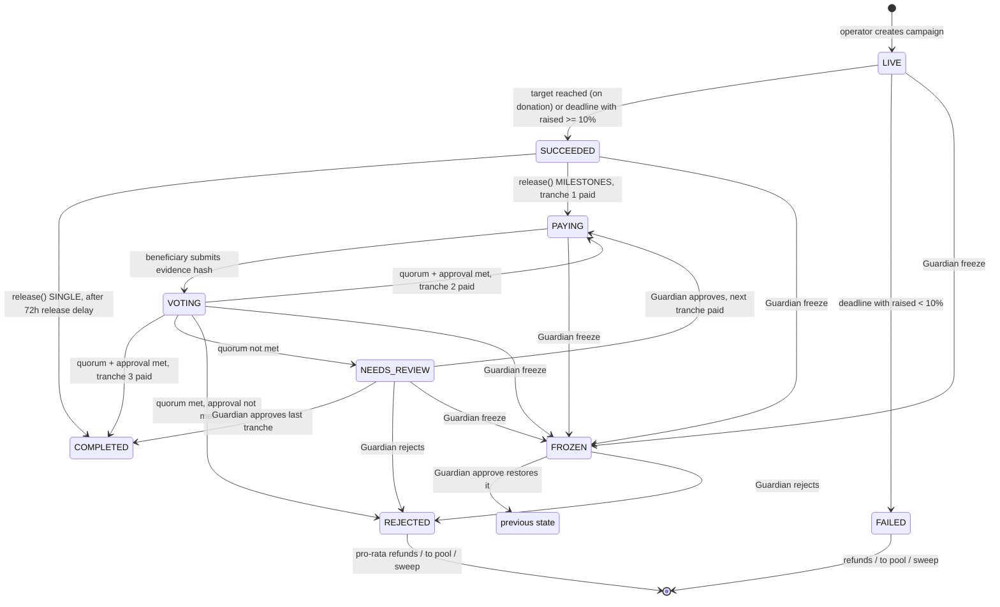
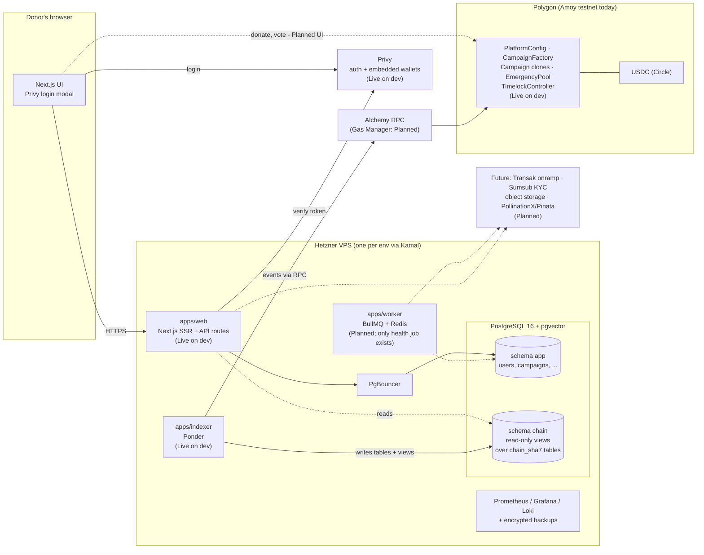

# CHERR.IO — System overview

CHERR.IO is a charitable-donation platform on the Polygon blockchain. Donors give **USDC** (a US-dollar stablecoin; campaign targets are set in EUR and converted to USDC once, at approval). Every campaign has its own smart-contract escrow: the money sits in that contract, not in a CHERR.IO bank or wallet, and the contract code decides where it may go — to the beneficiary (all at once or in three donor-approved steps), back to donors, or to a shared Emergency Pool. The web app, database and indexer around the contracts make this usable for ordinary donors (email/Google login, later card payments) while every money movement stays publicly verifiable on-chain. Today the smart contracts are written, tested and deployed to the Polygon **Amoy testnet** (dev environment), and the web app with login and the indexer that copies contract events into the database are live on the dev environment; donation, campaign and payout screens are not built yet.

Last updated: 2026-10-02

**Status labels used in this document**

| Label | Meaning |
|---|---|
| **Live on dev** | Running on https://dev.cherr.io or deployed to the Amoy testnet for the dev environment. Not production; no real money. |
| **Built (code, not deployed)** | Code exists in the repository with tests, but is not running on any server. |
| **Planned** | Specified in the product/architecture documents or task list; no code yet. |

Production (Polygon mainnet, https://cherr.io) is **not live**. The uat environment is not deployed yet.

Sources: docs/00-MANIFEST.md, docs/CHEATSHEET.md §1 and §7, docs/tasks/README.md

---

## 1. What the product is

| Element | Description | Status |
|---|---|---|
| Campaigns with on-chain escrow | One smart contract (a cheap "clone") per campaign holds the donated USDC. | Contracts: Live on dev (Amoy). UI: Planned (TASK-010, TASK-011) |
| Donations in USDC on Polygon | Wallet donations; card donations via Transak onramp to the donor's own wallet. | Contract function: Live on dev. Donation UI: Planned (TASK-011). Card: Planned (TASK-012) |
| SINGLE or MILESTONES payout with donor voting | Contract-enforced release rules, see §4. | Contracts: Live on dev. UI: Planned (TASK-013) |
| Emergency Pool with sub-pools | Shared pool for funds from failed/rejected campaigns (by donor choice) and direct donations; reallocated by vote. | Contract: Live on dev. UI: Planned (TASK-014) |
| Charity Market Cap + Trust Score | Public ranking of organisations (registered and imported from SI/UK/US registries), Trust Score 0–100, versioned formula. | Planned (TASK-016, TASK-017). DB tables exist (TASK-005) |
| Proof of Charity points | Off-chain points ledger and levels; no conversion to CHR in Phase 1. | Planned (TASK-015). DB tables exist |
| Login and account | Privy login (email, Google, external wallet such as MetaMask), account page, GDPR account deletion. | Live on dev (TASK-025) |
| Public API, llms.txt, widget, MCP server | Read-only REST API with OpenAPI, embeddable donate widget, read-only MCP server. | Planned (TASK-018–020) |
| CHR token activation/locking, 4% reward model | Uses the existing CHR token. | Phase 2 — out of scope for Phase 1 |

Sources: docs/00-MANIFEST.md §1, §7; docs/01-PRODUCT-SPEC.md §6; docs/03-DECISIONS.md (ADR-002, ADR-006, ADR-010); docs/tasks/README.md; docs/tasks/TASK-025.feedback.md

---

## 2. Actors

| Actor | Who | What they can do | How they are verified | Status |
|---|---|---|---|---|
| Visitor | Anyone | Browse campaigns and Charity Market Cap. | – | Landing page and "coming soon" pages Live on dev |
| Donor | Logged-in user | Donates USDC; sets a **failure preference** (refund or Emergency Pool); votes on milestones with weight = USDC donated; may rate the organisation 1–5 after a campaign. | None required to donate | Login Live on dev; donating/voting UI Planned |
| Cherrion | Any registered user | Earns Proof of Charity points, rates, votes. | None (Level 1 on registration) | Registration via Privy Live on dev; points Planned |
| Beneficiary — verified organisation | A registered charity | Runs campaigns (Phase 1: admin-set limit, default 5 parallel); receives payouts; submits evidence for milestones. | **Manual KYB** by the Data Vallis team (ADR-012) | Applying — registering an organisation or claiming an imported one, with encrypted document upload, and seeing the status of the application — is **Built** (TASK-008a/008b, not confirmed on dev yet). The review by an admin is Planned (TASK-008c); campaigns Planned (TASK-010) |
| Beneficiary — verified individual ("Cherrion" starting a campaign) | A person raising for themselves or someone else | Same as above. Always **MILESTONES** payout in Phase 1 (also enforced in the contract). | **Sumsub KYC** + admin approval (ADR-011). CHERR.IO never stores ID documents. | Planned (TASK-009) |
| Platform admin | Data Vallis staff | Reviews KYB and campaigns, admin panel. | `PLATFORM_ADMIN` role in the database, re-read from the DB on every admin action. Spec adds Privy MFA for admin actions. | Role check and `/en/admin` placeholder Live on dev; MFA and admin panel Planned (TASK-021) |
| Guardian (on-chain role) | Testnet: one testnet wallet. Mainnet: the Safe. | `freeze` a campaign immediately; `resolve` (approve/reject) a FROZEN or NEEDS_REVIEW campaign; resolve NEEDS_REVIEW pool allocations. **Cannot** send funds to arbitrary addresses. Not delayed by the timelock. | Holder of `GUARDIAN_ROLE` in `PlatformConfig` | Live on dev (Amoy) |
| Operator (on-chain role) | Testnet: same testnet wallet. Mainnet deploy script grants it to the Safe. | Creates approved campaigns on-chain, sets payout mode after success, creates Emergency Pool sub-pools, proposes pool allocations. | Holder of `OPERATOR_ROLE` | Live on dev (Amoy) |
| Admin (on-chain `DEFAULT_ADMIN_ROLE`) | The TimelockController (delay 5 min on testnet, 48 h on mainnet), whose proposer/executor is the Safe (testnet: the testnet wallet). | Changes platform parameters (fee, thresholds, vote window, treasury, Emergency Pool address) and grants/revokes roles — only after the timelock delay. | — | Live on dev (Amoy) |

Who holds the keys today vs at mainnet: see docs/technical/10-investor-technical-faq.md.

Sources: docs/01-PRODUCT-SPEC.md §1, §2.1, §2.6; docs/02-ARCHITECTURE.md §2.2; docs/03-DECISIONS.md (ADR-009, ADR-011, ADR-012, ADR-017, ADR-024, ADR-025); packages/contracts/src/PlatformConfig.sol; packages/contracts/src/Campaign.sol; packages/contracts/src/EmergencyPool.sol; packages/contracts/script/DeployPolygon.s.sol; docs/tasks/TASK-025.feedback.md; docs/CHEATSHEET.md §7

---

## 3. Campaign lifecycle

### 3.1 Off-chain part (before the contract exists) — Planned (TASK-010)

`DRAFT → PENDING_REVIEW → (admin approves) → deployed on-chain as LIVE`, or `→ REJECTED` by admin. On approval the backend fixes `targetUSDC = targetEUR × EUR/USD rate` and stores the rate, its source and timestamp. CHR "activation" between approval and LIVE is Phase 2; in Phase 1 approval goes straight to LIVE.

### 3.2 On-chain states (exact, from `Campaign.sol`) — Live on dev (Amoy)

The contract has nine states: `LIVE, SUCCEEDED, FAILED, PAYING, COMPLETED, VOTING, NEEDS_REVIEW, REJECTED, FROZEN`.

("previous state" = whatever state the campaign was frozen from; if that was VOTING, the vote end is extended by the time spent frozen.)

| State | Meaning | Who moves it on |
|---|---|---|
| LIVE | Accepting donations until the deadline (1–90 days after creation, enforced by the factory). | Anyone calls `finalize()` after the deadline; reaching the target ends it immediately. |
| SUCCEEDED | Raised ≥ 10% of target (or target fully reached). Waiting for the operator to set payout mode, then for `release()`. | Operator: `setPayoutMode`; anyone: `release()` |
| FAILED | Raised < 10% at deadline. Each donor's money goes back to them or to the Emergency Pool, per their preference. | Donor: `claimRefund()`; anyone: `settleToPool(donor)`, `sweepUnclaimed()` after 180 days |
| PAYING | MILESTONES: a tranche has been paid; waiting for the beneficiary's evidence. | Beneficiary: `submitEvidence(hash)` |
| VOTING | Donors vote for 24 h on the evidence. | Donors: `vote()`; anyone: `closeVote()` after the window |
| NEEDS_REVIEW | Turnout below 50% quorum. | Guardian: `resolve(approve/reject)` |
| REJECTED | Donors (or the Guardian) rejected; the unreleased remainder returns pro-rata to donors' chosen destination. | Same as FAILED, but pro-rata |
| FROZEN | Guardian stopped the campaign (suspected fraud). Blocks all payouts. | Guardian: `resolve()` |
| COMPLETED | All money paid out. | – |

Sources: packages/contracts/src/Campaign.sol; packages/contracts/src/CampaignFactory.sol; docs/tasks/TASK-003.feedback.md §2; docs/01-PRODUCT-SPEC.md §2; docs/03-DECISIONS.md (ADR-008)

---

## 4. Payout: SINGLE vs MILESTONES

| | SINGLE | MILESTONES |
|---|---|---|
| When (business rule) | Organisation rating ≥ 4.0, or the organisation's first campaign (no rating yet), "under supervision". | Organisation rating < 4.0; **always** for individual beneficiaries. |
| Who decides | The operator calls `setPayoutMode` once, after success, based on the off-chain rating. The contract refuses SINGLE for individual beneficiaries. | Same. |
| Money flow | `release()` (callable by anyone) pays 100% minus the fee in one transaction, **but only 72 hours after the campaign ended** (`releaseDelay`), which gives the Guardian a window to freeze. | Net amount (after fee) is split into **3 equal tranches** (the last absorbs rounding). Tranche 1 + the whole fee are paid by `release()`. Tranches 2 and 3 are paid automatically when a donor vote passes. |
| Donor vote | None | After each tranche, the beneficiary submits a SHA-256 hash of the evidence bundle (invoices, proofs, video report; files themselves in private storage). Donors vote for **24 h**. **Weight = USDC donated.** Passes if turnout ≥ **50%** of donated weight **and** ≥ **51%** of cast weight approves. Turnout below 50% → NEEDS_REVIEW (Guardian decides). Quorum met but approval below 51% → REJECTED. |
| Fraud response | Guardian can freeze during the 72 h delay (or any time before release) and reject → full pro-rata return. | Guardian can freeze at any non-final stage; rejection returns the not-yet-released remainder pro-rata. |

Notes:
- Money given to a campaign by the Emergency Pool is excluded from the quorum base; a campaign funded only by the pool always goes to NEEDS_REVIEW.
- Vote, fee, threshold and delay values are **snapshotted into each campaign when it is created**, so later admin changes do not affect running campaigns.
- The 72 h `releaseDelay` for SINGLE was added in TASK-003; it is in the contract but not in the Product Spec or an ADR.

Sources: packages/contracts/src/Campaign.sol (`setPayoutMode`, `release`, `_releaseNextTranche`, `closeVote`); packages/contracts/src/PlatformConfig.sol; docs/01-PRODUCT-SPEC.md §2.4; docs/03-DECISIONS.md (ADR-008, ADR-011); docs/tasks/TASK-003.feedback.md §3–§5, §7; docs/tasks/TASK-004.feedback.md

---

## 5. The 10% success threshold, refunds and the Emergency Pool

- **Success threshold = 10% of target** (`successThresholdBps = 1000`). At the deadline a campaign with raised ≥ 10% of target is SUCCEEDED (and pays out what it raised); below 10% it is FAILED. Reaching 100% ends the campaign immediately; a donation that would overshoot the target is **clipped** to the remaining amount.
- **Minimum donation:** 1 USDC. **Minimum campaign target:** 100 USDC (factory rule).
- **Failure preference:** every donor chooses `REFUND` (default) or `EMERGENCY_POOL` (optionally a sub-pool) when donating, and can change it while the campaign is LIVE.
- **Refunds are pull-based:** the donor claims them (`claimRefund`). Pool-preference money can be pushed to the pool by anyone (`settleToPool`).
- **After 180 days** (`refundSweepDelay`), anyone can sweep unclaimed money to the general Emergency Pool (pool 0).
- **REJECTED campaigns:** each donor gets `donated × remainder / totalRaised`, where remainder = raised − already released − fee already paid. Integer rounding can leave at most 1 micro-USDC per donor, which the sweep collects.
- **Emergency Pool** (`EmergencyPool.sol`): one general pool (id 0) plus sub-pools created by the operator. Inflows: direct donations, settled failed/rejected-campaign money, sweeps. Outflow ("Quick Realisation") only to a LIVE campaign created by the CHERR.IO factory: the operator proposes an amount, the pool's contributors vote for 24 h with weight = what they contributed **before** the proposal block (prevents vote-buying), same 50% / 51% rule; no quorum → Guardian decides. The pool has no function to withdraw money anywhere else.

Sources: packages/contracts/src/PlatformConfig.sol; packages/contracts/src/Campaign.sol; packages/contracts/src/CampaignFactory.sol; packages/contracts/src/EmergencyPool.sol; docs/01-PRODUCT-SPEC.md §2.2, §2.3, §2.5; docs/tasks/TASK-003.feedback.md §12; docs/tasks/TASK-004.feedback.md

---

## 6. Fees

| Item | Value | Where enforced |
|---|---|---|
| Platform fee (Phase 1) | **1%** of the amount raised, taken at payout and sent to the treasury address. MILESTONES: the whole fee is paid together with tranche 1. | `PlatformConfig.feeBps = 100`, snapshotted per campaign |
| Maximum fee the admin can ever set | 5% (`MAX_FEE_BPS = 500`), only through the timelock, and only for campaigns created after the change. | `PlatformConfig.sol` |
| Failed campaigns | No fee. | `Campaign.sol` (fee only in `release`/tranches) |
| Rejected after tranche 1 | The fee already paid with tranche 1 is not returned. | `Campaign._reject()` |
| Phase 2 reward model | 4% of raised (1.5% CHR lockers, 1.5% activators, 1% platform). Until Phase 2 the extra 3% stays with the beneficiary. | Planned (Phase 2, ADR-010) |
| Gas | Donors with Privy smart accounts: gas sponsored by CHERR.IO via Alchemy Gas Manager (Planned, TASK-011). External-wallet users pay their own small POL gas. | docs/02-ARCHITECTURE.md §3 |
| Card onramp | Transak fees — not documented in the repo. | Not decided yet |

Sources: packages/contracts/src/PlatformConfig.sol; packages/contracts/src/Campaign.sol; docs/03-DECISIONS.md (ADR-010); docs/01-PRODUCT-SPEC.md §2.4, §5.4; docs/02-ARCHITECTURE.md §3

---

## 7. What is on-chain vs off-chain

| On-chain (Polygon; public, permanent) | Off-chain (Postgres schema `app`, private storage; erasable) |
|---|---|
| Campaign escrow contracts and their USDC balances | Campaign drafts: title, story, images metadata, EUR target, EUR/USD rate snapshot |
| Campaign parameters: beneficiary address, USDC target, deadline, beneficiary type (org/individual), a 32-byte off-chain ID | User accounts: display name, email, Privy ID, linked wallet addresses (the link person ↔ address) |
| Every donation: donor address, amount, failure preference, sub-pool | KYC check reference (Sumsub applicant ID and status only — no documents) |
| Payout mode, every tranche release and fee | KYB submissions, organisation members |
| Evidence **hash** (SHA-256 of the bundle) | Evidence files, invoices, KYB documents → encrypted private object storage (KYB documents **Built**, TASK-008a; evidence and invoices Planned) |
| Every vote (address, yes/no, weight) and outcome | Ratings (1–5, signed), Proof of Charity points, levels |
| Guardian freezes and resolutions | Trust Scores, registry imports, audit log, onramp orders |
| Refunds, transfers to the pool, sweeps; Emergency Pool balances, allocations and votes | Public images → PollinationX / Pinata (non-personal content only; Planned) |

Rules: **no personal data on-chain or on IPFS/PollinationX** (ADR-014). The web app never writes chain state into the database; the **indexer** reads contract events and writes them into Postgres (`chain_<sha7>` tables, read through stable views in schema `chain`, ADR-026).

Sources: docs/00-MANIFEST.md §6; docs/03-DECISIONS.md (ADR-014, ADR-026); docs/02-ARCHITECTURE.md §2.3, §4.4, §4.5; docs/tasks/TASK-005.feedback.md; packages/contracts/src/Campaign.sol; packages/contracts/src/CampaignFactory.sol

---

## 8. Components

| Component | Role | Status |
|---|---|---|
| Browser + `apps/web` (Next.js App Router, Tailwind, shadcn/ui restyled to the CHERR.IO design system, next-intl EN) | UI, server-side rendering, API routes (`/api/auth/*`, `/api/health`), future public REST API and admin panel | Live on dev: landing page (sample data), login, account page, admin placeholder, coming-soon pages |
| PostgreSQL 16 + pgvector, schema `app` (Drizzle ORM, 18 tables) | Off-chain data | Live on dev (migrations run on deploy) |
| PgBouncer | Connection pooling for app traffic | Live on dev |
| `apps/indexer` (Ponder 0.17) | Reads all contract events (23 events) into `chain_<sha7>` tables, exposes stable views in `chain`; reconcile and prune tools | Live on dev since 2026-10-01 (TASK-026); uat/prod not deployed |
| Smart contracts on Polygon | Escrow, rules, voting, pool | Live on dev (Amoy, deployed 2026-10-01); addresses in `packages/contracts/deployments/amoy-dev.json`. uat and mainnet: not deployed |
| Privy | Single login system (email, Google, external wallets; embedded wallet created on login) | Live on dev. ERC-4337 smart accounts + gas sponsorship: Planned (TASK-011) |
| `apps/worker` (BullMQ + Redis) | Registry imports, trust score, points, KYC/onramp webhooks, emails | Planned (only a health queue exists) |
| `apps/mcp` | Read-only MCP server | Planned (TASK-020) |
| Transak, Sumsub, Hetzner Object Storage, PollinationX/Pinata | Card onramp, KYC, private files, public files | Planned (TASK-008, -009, -012) |
| Infra: Hetzner CX33, Docker, Kamal 2 + kamal-proxy, GitHub Actions → GHCR, Prometheus/Grafana/Loki, encrypted off-site `pg_dump` | Hosting, deploys, monitoring, backups | Live (shared server; dev environment deployed) |

Sources: docs/02-ARCHITECTURE.md §1, §4, §5; docs/03-DECISIONS.md (ADR-020, ADR-021, ADR-024, ADR-026); docs/CHEATSHEET.md §1, §6, §7, §9, §10; docs/tasks/TASK-005.feedback.md; docs/tasks/TASK-006.feedback.md; docs/tasks/TASK-022.feedback.md; docs/tasks/TASK-024.feedback.md; docs/tasks/TASK-025.feedback.md; docs/tasks/TASK-026.feedback.md; apps/worker/src/

---

## 9. Environments

| Env | URL | Chain | Status |
|---|---|---|---|
| dev | https://dev.cherr.io | Polygon Amoy (own contract deployment `amoy-dev`) | Live; auto-deploys on push to `dev`; not indexed by search engines |
| uat | https://uat.cherr.io | Polygon Amoy (separate contracts) | Not deployed yet |
| prod | https://cherr.io | Polygon mainnet | Not live; manual deploy only, at launch |

Contracts are never deployed by CI; David deploys them manually with Foundry scripts.

Sources: docs/CHEATSHEET.md §1, §7; docs/03-DECISIONS.md (ADR-020); docs/02-ARCHITECTURE.md §5.1

---

## Glossary

| Term | Meaning |
|---|---|
| **USDC** | A US-dollar stablecoin issued by Circle. CHERR.IO uses native USDC on Polygon (6 decimals), not bridged USDC.e. |
| **Polygon / Amoy** | Polygon PoS is the blockchain used. Amoy (chain id 80002) is its testnet, used for dev and uat; no real value. |
| **Smart contract** | Program on the blockchain that holds funds and enforces rules; CHERR.IO's are non-upgradeable. |
| **Escrow** | The per-campaign contract that holds donations until the rules release them. |
| **Clone (EIP-1167)** | A cheap copy of the Campaign contract; one per campaign, all sharing the same audited code. |
| **Campaign** | Fundraising with a EUR target (converted to a USDC target at approval) and a deadline. |
| **Beneficiary** | The verified organisation or verified individual receiving the funds. |
| **Cherrion** | Any registered user of CHERR.IO. |
| **KYB / KYC** | Know Your Business (manual review of organisations) / Know Your Customer (identity check of individuals via Sumsub). |
| **Success threshold** | 10% of the target. Below it at the deadline, the campaign fails. |
| **Failure preference** | Donor's choice for their money if a campaign fails or is rejected: refund or Emergency Pool. |
| **Payout mode** | SINGLE (all at once, after a 72 h delay) or MILESTONES (3 equal tranches, released by donor vote). |
| **Tranche** | One of the three milestone payments. |
| **Evidence bundle / hash** | Invoices, proofs and video report for a milestone; files stay private, only their SHA-256 fingerprint goes on-chain. |
| **Quorum / approval** | Votes need ≥ 50% of donated weight to take part (quorum) and ≥ 51% of cast weight saying yes (approval). |
| **NEEDS_REVIEW** | State when too few donors voted; the Guardian decides. |
| **FROZEN** | State after the Guardian stops a campaign for suspected fraud. |
| **Guardian** | On-chain role that can freeze and resolve, but never send money to arbitrary addresses. |
| **Operator** | On-chain role that creates approved campaigns, sets payout mode and proposes pool allocations. |
| **Timelock** | Contract that delays admin configuration changes (48 h on mainnet, 5 min on testnet) so they are visible before they take effect. |
| **Safe** | Multi-signature wallet contract. Planned holder of admin/guardian/operator powers on mainnet; currently 1 owner (David) with 2 keys, threshold 1-of-2. |
| **Emergency Pool / sub-pool** | Shared pool (with thematic sub-pools) holding money from failed/rejected campaigns by donor choice and direct donations. |
| **Quick Realisation** | Moving Emergency Pool money to an approved live campaign after a contributor vote. |
| **Sweep** | After 180 days, moving unclaimed refunds to the general Emergency Pool. |
| **Indexer (Ponder)** | Service that reads contract events and stores them in Postgres for fast display. |
| **Privy** | Third-party login and embedded-wallet provider. |
| **Embedded wallet / smart account (ERC-4337)** | A wallet created for the user at login, so non-crypto users can donate and vote; smart accounts allow gas sponsorship (Planned). |
| **Transak** | Card-to-USDC onramp; delivers USDC to the donor's own wallet (Planned). |
| **Trust Score** | Public, versioned 0–100 score per organisation on the Charity Market Cap (Planned). |
| **Charity Market Cap** | Public directory/ranking of charities ("CoinMarketCap for charities") (Planned). |
| **Proof of Charity** | Off-chain points and levels for community actions (Planned; no token conversion in Phase 1). |
| **CHR** | The existing CHERR.IO ERC-20 token (Ethereum + Polygon). Used only in Phase 2. |
| **bps** | Basis points; 100 bps = 1%. |

Sources: docs/00-MANIFEST.md §8; docs/01-PRODUCT-SPEC.md; docs/02-ARCHITECTURE.md §2.4; docs/03-DECISIONS.md; packages/contracts/src/*.sol
