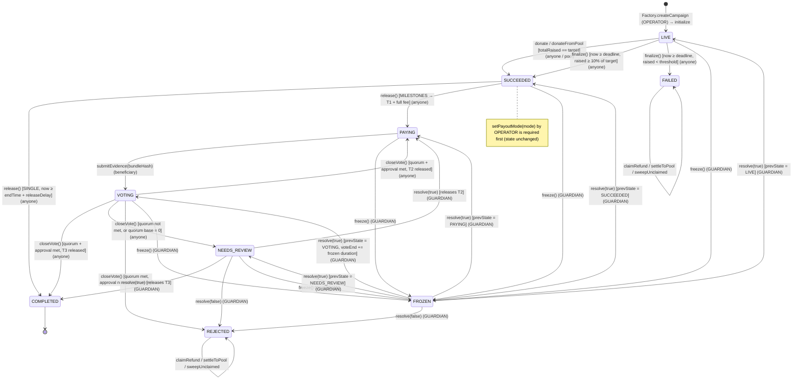
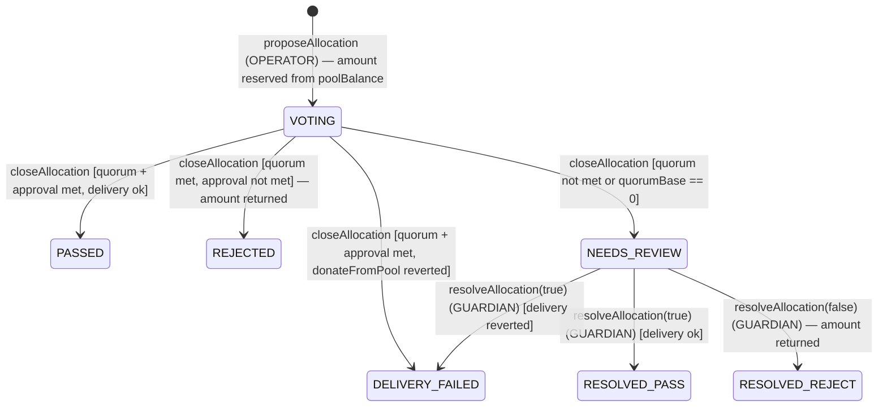

# 02 — Smart contracts

CHERR.IO keeps every donation in on-chain escrow on Polygon. The contracts live in `packages/contracts` (Foundry, Solidity `0.8.24`, OpenZeppelin v5). There are four of our own: a singleton **PlatformConfig** that holds parameters and roles, a **CampaignFactory** that deploys one **Campaign** escrow per campaign as an EIP-1167 clone, and a singleton **EmergencyPool** that collects funds from failed or rejected campaigns and from direct donations. The pool can pass that money on to live campaigns after a contributor vote. An OpenZeppelin **TimelockController** holds the admin role. Donations are native USDC (6 decimals). A campaign succeeds at 10 % of its target and pays out either at once (SINGLE) or in three tranches (MILESTONES). In MILESTONES mode, donors vote on tranches 2 and 3, and the vote is weighted by the USDC they gave. A Guardian can freeze campaigns and decide unresolved votes, but it can never pick who receives funds. None of the contracts can be upgraded.

Last updated: 2026-10-10

---

## 1. Contract inventory

| Contract | Kind | Holds | Source |
|---|---|---|---|
| `PlatformConfig` | Singleton, OZ `AccessControl` | Roles; `usdc` (immutable); `treasury`; `emergencyPool`; all economic and voting parameters | `src/PlatformConfig.sol` |
| `CampaignFactory` | Singleton | `config` and `campaignImplementation` (both immutable); `campaigns[offchainId] → clone`; private `_isCampaign[addr]` | `src/CampaignFactory.sol` |
| `Campaign` | EIP-1167 clone per campaign (`Initializable`, `ReentrancyGuard`) | The campaign's USDC escrow, donor ledger, preferences, payout and vote state, and a snapshot of config values | `src/Campaign.sol` |
| `EmergencyPool` | Singleton (`ReentrancyGuard`) | USDC of every pool and sub-pool; per-pool balance; checkpointed contributions; allocations | `src/EmergencyPool.sol`, `src/IEmergencyPool.sol` |
| `TimelockController` | OpenZeppelin, unmodified | Holds `DEFAULT_ADMIN_ROLE` on `PlatformConfig` and delays admin calls | deployed by `script/DeployAmoy.s.sol` / `script/DeployPolygon.s.sol` |

Sources: `packages/contracts/src/*.sol`, `packages/contracts/script/*.s.sol`, `docs/02-ARCHITECTURE.md` §2.1.

### 1.1 Roles

All roles are stored in `PlatformConfig`. The other contracts check them with `config.hasRole(...)` at call time, so a role change takes effect immediately everywhere.

| Role (exact name) | Holder after deploy | Powers |
|---|---|---|
| `DEFAULT_ADMIN_ROLE` | `TimelockController` | Every `PlatformConfig` setter; grant and revoke roles |
| `OPERATOR_ROLE` (`keccak256("OPERATOR_ROLE")`) | Safe on mainnet; the testnet EOA on Amoy (ADR-025) | `CampaignFactory.createCampaign`, `Campaign.setPayoutMode`, `EmergencyPool.createSubPool`, `EmergencyPool.proposeAllocation` |
| `GUARDIAN_ROLE` (`keccak256("GUARDIAN_ROLE")`) | Safe on mainnet; the testnet EOA on Amoy | `Campaign.freeze`, `Campaign.resolve`, `EmergencyPool.resolveAllocation`. These calls go **directly**, not through the timelock. |
| Timelock `PROPOSER_ROLE` / `EXECUTOR_ROLE` (and `CANCELLER_ROLE`, which OZ grants to proposers) | Safe on mainnet; the testnet EOA on Amoy | Schedule, execute and cancel admin operations |
| Deployer | **No roles.** The script renounces `DEFAULT_ADMIN_ROLE` at the end. | — |

Two more callers are not roles but are gated by address:

- `Campaign.donateFromPool` may be called only by `config.emergencyPool()`. Otherwise it reverts with `NotPool`.
- `EmergencyPool.receiveFromCampaign` may be called only by an address where `factory.isCampaign(msg.sender)` is true. Otherwise it reverts with `NotCampaign`.
- `Campaign.submitEvidence` may be called only by the campaign's `beneficiary`.

The architecture doc plans for `OPERATOR_ROLE` to move later to a backend relayer whose key is held in a KMS (**Planned**). Phase 1 uses the Safe.

Sources: `PlatformConfig.sol` L12–13, `CampaignFactory.sol` L68, `Campaign.sol` L224, L283, L375, L450, L470, `EmergencyPool.sol` L113, L138, L157, L253; `script/DeployAmoy.s.sol`; `docs/02-ARCHITECTURE.md` §2.2; ADR-009, ADR-025.

### 1.2 PlatformConfig parameters

| Parameter | Default | Setter bounds | Snapshotted by Campaign? |
|---|---|---|---|
| `usdc` | constructor argument (immutable) | — | n/a (immutable) |
| `treasury` | unset (0) | non-zero | **No, read at payout time** |
| `emergencyPool` | unset (0) | non-zero; can be changed again later | **No, read at call time** |
| `feeBps` | `100` (1 %) | `≤ MAX_FEE_BPS = 500` | Yes (`snapFeeBps`) |
| `successThresholdBps` | `1000` (10 %) | `1..10_000` | Yes |
| `voteWindow` | `7 days` (ADR-045; was 24 hours) | `MIN_VOTE_WINDOW = 1 hours` .. `MAX_VOTE_WINDOW = 14 days` | Yes (Campaign); the pool reads it when an allocation is proposed |
| `quorumBps` | `2500` (25 %, ADR-045; was 5000) | `1..10_000` | Yes (Campaign and each Allocation) |
| `approvalBps` | `5100` (51 %) | `5001..10_000` | Yes (Campaign and each Allocation) |
| `refundSweepDelay` | `180 days` | `30 days..365 days` | Yes |
| `minDonation` | `1e6` (1 USDC) | `> 0` | **No, read at call time** |
| `releaseDelay` | `72 hours` | `≤ MAX_RELEASE_DELAY = 7 days` | Yes (`snapReleaseDelay`) |

Every setter is `onlyRole(DEFAULT_ADMIN_ROLE)` and emits an `…Updated(old, new)` event (see §5).

**Deployed values vs. source defaults (ADR-045).** The defaults above apply to a *new* deployment. The `PlatformConfig` already deployed on Amoy (`amoy-dev.json`) was created with the old defaults and still holds `voteWindow = 24 hours` and `quorumBps = 5000` until the timelock executes `setVoteWindow(604800)` and `setQuorumBps(2500)` (David, through the Safe). Campaigns snapshot the values at creation, so campaigns created before those calls keep 24 h / 50 % for their whole life. Status: source defaults **Built** (TASK-033a); Amoy values **Planned** (David's timelock calls).

Sources: `PlatformConfig.sol` L16–34, L67–126; ADR-045; `docs/tasks/TASK-033a.feedback.md`.

---

## 2. CampaignFactory

- `createCampaign(CreateParams p) returns (address)` may be called only by `OPERATOR_ROLE`; otherwise it reverts with `Unauthorized`. `CreateParams` is `{bytes32 offchainId, address beneficiary, uint256 target, uint64 deadline, uint8 beneficiaryType}`, where `0 = ORG` and `1 = INDIVIDUAL`.
- The function checks:
  - `beneficiary ≠ 0`, else `InvalidBeneficiary`
  - `beneficiaryType ≤ 1`, else `InvalidBeneficiaryType`
  - `target ≥ 100e6` (100 USDC), else `TargetTooLow`
  - `now + 1 day ≤ deadline ≤ now + 90 days`, else `DeadlineOutOfRange`
  - `offchainId` is unique, else `DuplicateOffchainId`
- It deploys the clone with `Clones.cloneDeterministic(campaignImplementation, offchainId)`, records it, emits `CampaignCreated`, then calls `Campaign.initialize(...)`. The event is emitted before the external call; the code documents this ordering.
- `predictCampaignAddress(offchainId)` returns the clone address before deployment. `isCampaign(addr)` reports whether an address is a clone from this factory.
- The `Campaign` implementation contract calls `_disableInitializers()` in its constructor, so it cannot be initialized itself.

**Who calls `createCampaign` (Phase 1, ADR-035; **Live on dev**, TASK-010c).** A platform admin publishes an approved campaign from `/en/admin/campaigns/[id]`. The steps:
1. **Server prepares the parameters.** `offchainId` is the campaign's 32 random bytes from approval. `beneficiary` is the organisation's KYB-verified payout address. `target` is the USDC target from the ECB snapshot. `deadline` = now + duration in whole seconds. `beneficiaryType = 0`. The server also computes the clone address with CREATE2 of the EIP-1167 bytecode (`predictCampaignAddress` in `@cherrio/shared`, unit-tested against independently computed vectors for amoy-dev).
2. **Browser checks before signing.** Through the admin's own wallet provider (MetaMask via Privy; no RPC key in the web app) it checks: the chain id; `PlatformConfig.hasRole(OPERATOR_ROLE, account)`; that the factory's `predictCampaignAddress` equals the server's; that `campaigns(offchainId)` is still empty; and that an earlier transaction of this campaign is not still pending.
3. **Browser sends `createCampaign`** from the operator wallet (on Amoy the testnet EOA, which pays the gas in POL).
4. **Server links the campaign** once the indexer's `chain.campaign` row matches address, beneficiary, target and deadline.

A second campaign with the same `offchainId` is impossible (`DuplicateOffchainId`), so sending again after a failed transaction is safe. The browser sets EIP-1559 fees itself: a priority fee of at least 30 gwei (Polygon refuses under 25 gwei; viem's generic default of 1.5 gwei failed on dev on 2026-10-02) and `maxFeePerGas = 2 × base fee + tip`. **Gas of `createCampaign` on Amoy (measured 2026-10-02):** 332,349 gas used (wallet limit 339,960). At 30 gwei that is 0.00997 POL; the base fee on Amoy was negligible (0.000000063 gwei). The first campaign on amoy-dev is clone `0xf397a197d96426f44b1c236c28049ced4d3691c7`, created in block 49147789 by the operator EOA. Tx: `0x4c9c52df7e1956749974189f5e984c9017faaa5bb179903bb5032597b86d9f03`. On mainnet the cost is the same gas × the Polygon gas price at the time (a few cents at typical prices), paid by the treasury through the Safe (ADR-035).

Sources: `CampaignFactory.sol` L16–99, `Campaign.sol` L157–159, `apps/web/src/lib/campaigns/publish.ts`, `publish-client.ts`, `packages/shared/src/campaign-address.ts`.

---

## 3. Campaign

### 3.1 Snapshot at creation

`initialize` stores the config address, `offchainId`, `beneficiary`, `target`, `deadline` and `beneficiaryType`, and sets `state = LIVE`. It also copies the following values into the clone, so that later config changes never affect a running campaign: `feeBps`, `successThresholdBps`, `refundSweepDelay`, `voteWindow`, `quorumBps`, `approvalBps` and `releaseDelay`. Values the campaign still reads **live** are `usdc` (immutable anyway), `treasury`, `emergencyPool`, `minDonation` and all role checks.

Sources: `Campaign.sol` L162–186.

### 3.2 State machine

States, from the `CampaignState` enum: `LIVE, SUCCEEDED, FAILED, PAYING, COMPLETED, VOTING, NEEDS_REVIEW, REJECTED, FROZEN`.

Notes on the diagram:

- `FAILED`, `REJECTED` and `COMPLETED` are terminal. In `FAILED` and `REJECTED`, only settlement actions remain (§3.9). `freeze()` reverts with `CannotFreeze` in `FAILED`, `REJECTED`, `COMPLETED` and `FROZEN`.
- `release()` is valid only in `SUCCEEDED`. Tranches T2 and T3 are paid **inside** `closeVote()` or `resolve(true)`; there is no separate call for them.
- A freeze from `LIVE` does not stop the deadline clock. Donations revert while the campaign is `FROZEN`, because `donate` requires `LIVE`.
- `docs/02-ARCHITECTURE.md` §2.3 shows the same nine states in short form (aligned in TASK-027).

Sources: `Campaign.sol` L38–48, L193–325, L374–502; `docs/tasks/TASK-003.feedback.md` §2.

### 3.3 Donations and clipping

`donate(uint256 amount, uint8 pref, uint32 subPoolId)` (anyone, `nonReentrant`):

- It requires `state == LIVE` (`NotLive`), `block.timestamp < deadline` (`PastDeadline`), `amount ≥ config.minDonation()` (`AmountTooLow`) and `pref ≤ 1` (`InvalidPreference`).
- **Clipping:** the amount is cut to `target − totalRaised`, and only that clipped amount is pulled with `safeTransferFrom`. `Donated` reports the clipped amount. The `minDonation` check applies to the requested amount, not the clipped one.
- The function updates `donated[msg.sender]` and `totalRaised`. It **overwrites** `preference[msg.sender]` and `donorSubPoolId[msg.sender]` on every donation, so the most recent preference applies to the donor's whole balance.
- When `totalRaised == target`, it sets `endTime = now` and `state = SUCCEEDED` and emits `Finalized(SUCCEEDED)` in the same transaction.

`donateFromPool(uint256 amount) returns (uint256 actual)` may be called only by `config.emergencyPool()`. It requires `LIVE` and a time before the deadline, clips the same way, and has **no** `minDonation` check. The amount is credited to `donated[pool]` and added to `poolDonated`. The pool's preference is forced to `0` (REFUND), so the pool can get its money back if the campaign fails. The function emits `Donated(pool, actual, 0, 0)`.

Sources: `Campaign.sol` L193–246.

### 3.4 Preferences

- `0 = REFUND`: the donor pulls a refund with `claimRefund()`.
- `1 = EMERGENCY_POOL`: anyone can push the donor's share to the pool with `settleToPool(donor)`, into sub-pool `donorSubPoolId[donor]`. An unknown sub-pool id is credited to pool 0 on the pool side.
- `setPreference(uint8 pref, uint32 subPoolId)` may be called only by an existing donor (`donated > 0`, else `NotDonor`) while the state is `LIVE`. It emits `PreferenceSet`. The check is on state, not on the deadline, so a preference can still change after the deadline until someone calls `finalize()`.
- The campaign does not validate `subPoolId`.

Sources: `Campaign.sol` L102–105, L250–257, L534–557; `EmergencyPool.sol` L139.

### 3.5 Finalize and the success threshold

`finalize()` may be called by anyone, only in `LIVE` and only when `block.timestamp ≥ deadline` (`DeadlineNotReached`). It sets `endTime = now`.

- If `totalRaised * 10_000 ≥ target * snapSuccessThresholdBps`, the state becomes `SUCCEEDED`. With the default of `1000` bps, that means at least 10 % of target.
- Otherwise the state becomes `FAILED`, and `settlementStart = endTime`.

The fuzz test checks the boundary: exactly 10 % succeeds, and 10 % minus one unit fails.

Sources: `Campaign.sol` L262–276; `docs/tasks/TASK-002-contracts-core.md` (Tests); `test/CampaignFuzz.t.sol` `testFuzz_successThreshold`.

### 3.6 Payout modes

`setPayoutMode(uint8 mode)` may be called only by `OPERATOR_ROLE`, only in `SUCCEEDED`, and only once (`PayoutModeAlreadySet`). Valid modes are `0 = SINGLE` and `1 = MILESTONES`. An `INDIVIDUAL` campaign (`beneficiaryType == 1`) reverts on SINGLE with `IndividualCannotBeSingle` (ADR-011). The off-chain rating decides the mode: rating ≥ 4.0 gives SINGLE, rating < 4.0 gives MILESTONES, and a first campaign gets SINGLE under Guardian supervision (Product Spec §2.4).

`release()` may be called by anyone (`nonReentrant`), but only in `SUCCEEDED` and only after the payout mode is set (`PayoutModeNotSet`).

- **SINGLE:** the call requires `now ≥ endTime + snapReleaseDelay` (72 h by default; `ReleaseDelayNotReached`). This window lets the Guardian `freeze()` before funds leave. The call computes `fee = totalRaised * snapFeeBps / 10_000`, sends the fee to `treasury` and `totalRaised − fee` to the beneficiary, sets `COMPLETED`, and emits `TrancheReleased(beneficiary, amount, fee)`.
- **MILESTONES:** the net amount `net = totalRaised − fee` is split as follows:
  - T1 = `net / 3`, paid together with the **entire** fee. Once the operator has set the mode, anyone can trigger T1 with `release()`, with no vote and no release delay. State → `PAYING`.
  - T2 = `net / 3`, paid by `closeVote()` or `resolve(true)`. State → `PAYING`.
  - T3 = `net − T1 − T2`, which absorbs the rounding dust. State → `COMPLETED`.
  - The fuzz test `testFuzz_trancheMath` checks that `T1 + T2 + T3 + fee == totalRaised`.

Sources: `Campaign.sol` L282–368; ADR-008, ADR-010, ADR-011; `docs/01-PRODUCT-SPEC.md` §2.4; `docs/tasks/TASK-003.feedback.md` §3.

### 3.7 Fees

- **Rate:** `snapFeeBps`, which defaults to 100 bps (1 %, ADR-010) and is capped at 500 bps.
- **When:** SINGLE pays it once inside `release()`. MILESTONES pays it all with T1. No fee is charged on refunds, pool settlement or sweeps.
- **To whom:** `config.treasury()`, read at payout time. If the fee is greater than 0 and the treasury is unset, the call reverts with `TreasuryNotSet`.
- A fee already paid is **not** returned on rejection, because `rejectedRemainder` excludes `feePaid`.
- The 4 % reward split (1.5/1.5/1) is **Planned** for Phase 2 together with CHR. Until then, that 3 % stays with the beneficiary (ADR-010).

Sources: `Campaign.sol` L304–318, L333–365, L498; ADR-010.

### 3.8 Evidence, voting, quorum and approval

- `submitEvidence(bytes32 bundleHash)` may be called only by the beneficiary, only in `PAYING`. It sets `currentRound = tranchesReleased − 1`, giving round 0 after T1 and round 1 after T2. It resets `yesVotes` and `noVotes` to 0, sets `voteEnd = now + snapVoteWindow` (7 days by default, ADR-045), sets the state to `VOTING`, and emits `EvidenceSubmitted(round, bundleHash, voteEnd)`. `bundleHash` is the SHA-256 of the evidence manifest; the files themselves stay off-chain (ADR-014).
- `vote(bool approve)` requires `VOTING` and `now < voteEnd` (`VoteEnded`). The caller must have donated (`NotDonor`), and each address may vote once per round (`hasVoted[voter][round]`, else `AlreadyVoted`).
  - **Weight = `donated[voter]`**, the voter's total USDC donated, which no longer changes once the campaign has left `LIVE` (ADR-008).
  - The pool's donation counts toward `totalRaised`, but the pool contract has no code path that votes.
- `closeVote()` may be called by anyone once `now ≥ voteEnd` (`VoteNotEnded`).
  - `quorumBase = totalRaised − poolDonated`. If `quorumBase == 0`, the result is `NEEDS_REVIEW`.
  - Quorum: `(yes + no) * 10_000 ≥ quorumBase * snapQuorumBps`. The default is 2500, meaning 25 % of donated human weight (ADR-045).
  - Approval: `yes * 10_000 ≥ (yes + no) * snapApprovalBps`. The default is 5100, meaning 51 % of cast weight.
  - If quorum is not met, the state becomes `NEEDS_REVIEW`. If quorum and approval are both met, the next tranche is paid atomically (T2 → `PAYING`, T3 → `COMPLETED`). If quorum is met but approval is not, the state becomes `REJECTED`.
  - The function emits `VoteClosed(round, yes, no, outcome)`.
- The math uses only integer cross-multiplication. Tests check the boundaries: exactly 25.00 % turnout passes and 24.9 % goes to `NEEDS_REVIEW` (`test_closeVote_quorumExactly25Percent_passes`, `test_closeVote_failsQuorum_needsReview`), no votes at all goes to `NEEDS_REVIEW` (`test_closeVote_noVotes_needsReview`), and exactly 51.00 % approval is checked against one unit less.

Sources: `Campaign.sol` L374–444; ADR-008; `docs/tasks/TASK-003-contracts-milestones-voting.md` (Acceptance).

### 3.9 NEEDS_REVIEW, Guardian freeze and resolve

- `freeze()` may be called only by `GUARDIAN_ROLE`, from `LIVE`, `SUCCEEDED`, `PAYING`, `VOTING` or `NEEDS_REVIEW`. It stores `prevState` and `frozenAt`, sets `FROZEN`, and emits `Frozen(prevState)`. While frozen, `donate`, `release`, `submitEvidence`, `vote` and `closeVote` all revert on their state checks.
- `resolve(bool approve)` may be called only by `GUARDIAN_ROLE` (`nonReentrant`), only in `FROZEN` or `NEEDS_REVIEW`:
  - `approve = true` from `FROZEN` restores `prevState`. If `prevState == VOTING`, it also adds the frozen time to `voteEnd`, so donors lose no voting time.
  - `approve = true` from `NEEDS_REVIEW` is a Guardian override: it pays the next tranche atomically.
  - `approve = false`, from either state, calls `_reject()` and the campaign becomes `REJECTED`.
  - The function emits `Resolved(approve, newState)`.
- The Guardian never chooses a recipient. Funds can go only to the beneficiary, to donors, to the treasury (fee) or to the EmergencyPool (Product Spec §2.6).
- If Circle blacklists the beneficiary, `release` or `closeVote` reverts on the transfer. The recovery path is `freeze()`, then `resolve(false)`, then pro-rata refunds. The test `test_closeVote_blacklistedBeneficiary_guardianRecovers` covers it.

Sources: `Campaign.sol` L449–502; `docs/tasks/TASK-003.feedback.md` §5, §12.

### 3.10 Rejection and the pro-rata remainder

`_reject()` sets `rejectedRemainder = totalRaised − released − feePaid`, `settlementStart = now` and `state = REJECTED`. Each donor's share is then `donated[d] * rejectedRemainder / totalRaised`, rounded down. Rounding dust stays in the contract and goes to the pool with `sweepUnclaimed`.

Sources: `Campaign.sol` L497–502, L517–523, L545–550.

### 3.11 Refunds, settleToPool, sweepUnclaimed and delays

All three functions are `nonReentrant`, valid only in `FAILED` or `REJECTED` (`NotFailedOrRejected`), and revert with `AlreadySwept` once a sweep has happened.

| Function | Caller | Rule |
|---|---|---|
| `claimRefund()` | the donor (pull) | Requires preference `0` and not yet `settled`. Pays the full `donated` amount if `FAILED`, or the pro-rata share if `REJECTED`. Emits `Refunded`. |
| `settleToPool(address donor)` | anyone | Requires preference `1`, not yet `settled`, and `config.emergencyPool() ≠ 0` (`PoolNotConfigured`). Uses the same amount rule. Transfers to the pool, then calls `pool.receiveFromCampaign(donorSubPoolId, amount, donor)`. Emits `SentToPool`. |
| `sweepUnclaimed()` | anyone | Requires `now ≥ settlementStart + snapRefundSweepDelay` (180 days by default). Sends the **entire** remaining USDC balance to the pool, crediting general pool 0 with `donor = address(0)`, which gives no contributor credit. Sets `swept`. Emits `Swept(amount)`. |

`settlementStart` is `endTime` for `FAILED` and the rejection timestamp for `REJECTED`. After a sweep, unclaimed refunds can no longer be claimed.

Sources: `Campaign.sol` L509–578, L595–598.

### 3.12 Views

`state`, `totalRaised`, `released`, `feePaid`, `totalRefunded`, `totalSentToPool`, `poolDonated`, `donated(addr)`, `preferenceOf(addr)`, `remaining()`, all `snap*` getters, `tranchesReleased`, `currentRound`, `voteEnd`, `yesVotes`, `noVotes`, `rejectedRemainder`, `settled(addr)`, `hasVoted(addr, round)`.

---

## 4. EmergencyPool

### 4.1 Pools and inflows

- Pool `0` is the general pool and exists from construction. `createSubPool(uint32 poolId)` may be called only by `OPERATOR_ROLE` and reverts with `PoolAlreadyExists` for an existing id.
- **`donate(uint32 poolId, uint256 amount)`** may be called by anyone and requires `amount ≥ minDonation`. An unknown `poolId` is credited to pool 0. The call increases `poolBalance` and pushes a contribution checkpoint for the donor, then emits `PoolDonated`.
- **`receiveFromCampaign(uint32 poolId, uint256 amount, address donor)`** may be called only by factory campaigns. The campaign transfers the USDC first; this call only records the accounting.
  - An unknown `poolId` is credited to pool 0.
  - If `donor ≠ 0` (from `settleToPool`), the donor is credited as a contributor.
  - If `donor == 0` (from `sweepUnclaimed`), only the balance increases; nobody is credited.
  - The call emits `CampaignInflow`.

Sources: `EmergencyPool.sol` L103–148.

### 4.2 Contribution checkpoints (vote weight)

Contributions are stored as OZ `Checkpoints.Trace256` keyed by block number, both per `(poolId, donor)` and per pool total. When an allocation is proposed, its `proposalBlock` is recorded. Voting weight is `contributedAt(poolId, voter, proposalBlock − 1)`, and the quorum base is `totalContributedAt(poolId, proposalBlock − 1)`. Contributions made in the proposal block or later therefore carry no weight on that allocation, which blocks buying votes after a proposal. The test `test_voteAllocation_postProposalContributor_zeroWeight` covers this. Public views: `contributedAt`, `totalContributedAt`, `getAllocation`, `poolBalance`, `poolExists`, `allocationCount`, `hasVotedAllocation`, `fundingPool`, `hasFundingPool`.

Sources: `EmergencyPool.sol` L54–56, L203, L223, L295–313.

### 4.3 Allocation lifecycle (Quick Realisation)

`AllocationState` values: `VOTING, PASSED, REJECTED, NEEDS_REVIEW, RESOLVED_PASS, RESOLVED_REJECT, DELIVERY_FAILED`.

- **`proposeAllocation(poolId, campaign, amount, reasonHash)`** may be called only by `OPERATOR_ROLE`. It checks:
  - the pool exists
  - `amount > 0`
  - the target is a factory campaign in `LIVE` state
  - `amount ≤ poolBalance[poolId]`
  - the campaign deadline is **after** `voteEnd = now + config.voteWindow()` (`CampaignDeadlineTooSoon`)

  The amount is deducted from `poolBalance` right away, which reserves it. `snapQuorumBps` and `snapApprovalBps` are snapshotted per allocation.
- **`fundingPool`:** a campaign's first allocation fixes its funding pool. Every later allocation to the same campaign must come from that pool (`PoolIdMismatch`).
- **`voteAllocation(id, approve)`** requires `VOTING` and a time before `voteEnd`, allows one vote per address, and requires weight greater than 0 (`NoVotingWeight`).
- **`closeAllocation(id)`** may be called by anyone after `voteEnd`. It applies the same quorum and approval formulas as `Campaign` against the checkpointed quorum base.
- **Delivery** (`_deliverAllocation` / `_deliverAllocationResolve`) works as follows:
  1. `forceApprove(campaign, amount)`, then `try Campaign.donateFromPool(amount)`.
  2. The allowance is reset to 0 afterwards on both the success path and the failure path.
  3. **Clipping:** if the campaign accepted less than the full amount (`actual < amount`), the difference goes back to `poolBalance[poolId]`.
  4. On revert, the full amount goes back to the pool and the state becomes `DELIVERY_FAILED`.
- **`resolveAllocation(id, approve)`** may be called only by `GUARDIAN_ROLE`, only in `NEEDS_REVIEW`. Rejecting returns the amount to the pool.

Sources: `EmergencyPool.sol` L22–44, L153–264, L316–352.

### 4.4 reclaimFromCampaign

`reclaimFromCampaign(address campaign)` is permissionless and `nonReentrant`.

- The campaign must be a factory campaign in `FAILED` or `REJECTED`.
- The pool calls `Campaign.claimRefund()` as a donor; it has preference REFUND. It receives the full amount if the campaign failed, or a pro-rata share if it was rejected.
- The amount received, measured as the change in the pool's balance, is credited to `fundingPool[campaign]`, or to pool 0 if none is set. It is a balance credit only: no contributor checkpoint is pushed.
- The call emits `ReclaimedFromCampaign`.
- If the pool never donated to the campaign, the call reverts inside `claimRefund` with `NotDonor`.

Sources: `EmergencyPool.sol` L270–287.

---

## 5. Events

| Contract | Event | Arguments |
|---|---|---|
| PlatformConfig | `TreasuryUpdated` | `address indexed oldTreasury, address indexed newTreasury` |
| PlatformConfig | `EmergencyPoolUpdated` | `address indexed oldPool, address indexed newPool` |
| PlatformConfig | `FeeBpsUpdated` | `uint16 oldBps, uint16 newBps` |
| PlatformConfig | `SuccessThresholdBpsUpdated` | `uint16 oldBps, uint16 newBps` |
| PlatformConfig | `VoteWindowUpdated` | `uint32 oldWindow, uint32 newWindow` |
| PlatformConfig | `QuorumBpsUpdated` | `uint16 oldBps, uint16 newBps` |
| PlatformConfig | `ApprovalBpsUpdated` | `uint16 oldBps, uint16 newBps` |
| PlatformConfig | `RefundSweepDelayUpdated` | `uint32 oldDelay, uint32 newDelay` |
| PlatformConfig | `MinDonationUpdated` | `uint256 oldMin, uint256 newMin` |
| PlatformConfig | `ReleaseDelayUpdated` | `uint32 oldDelay, uint32 newDelay` |
| PlatformConfig | OZ `RoleGranted` / `RoleRevoked` / `RoleAdminChanged` | inherited from `AccessControl` |
| CampaignFactory | `CampaignCreated` | `address indexed campaign, bytes32 indexed offchainId, address indexed beneficiary, uint256 target, uint64 deadline, uint8 beneficiaryType` |
| Campaign | `Donated` | `address indexed donor, uint256 amount, uint8 preference, uint32 subPoolId` (amount after clipping; from the pool: `pref 0, subPool 0`) |
| Campaign | `PreferenceSet` | `address indexed donor, uint8 preference, uint32 subPoolId` |
| Campaign | `Finalized` | `CampaignState indexed newState` (SUCCEEDED or FAILED) |
| Campaign | `PayoutModeSet` | `uint8 mode` |
| Campaign | `TrancheReleased` | `address indexed beneficiary, uint256 amount, uint256 fee` |
| Campaign | `Refunded` | `address indexed donor, uint256 amount` |
| Campaign | `SentToPool` | `address indexed donor, uint256 amount, uint32 subPoolId` |
| Campaign | `Swept` | `uint256 amount` |
| Campaign | `EvidenceSubmitted` | `uint8 indexed round, bytes32 bundleHash, uint64 voteEnd` |
| Campaign | `Voted` | `uint8 indexed round, address indexed voter, bool approve, uint256 weight` |
| Campaign | `VoteClosed` | `uint8 indexed round, uint256 yesVotes, uint256 noVotes, CampaignState outcome` |
| Campaign | `Frozen` | `CampaignState indexed prevState` |
| Campaign | `Resolved` | `bool approve, CampaignState indexed newState` |
| EmergencyPool | `SubPoolCreated` | `uint32 indexed poolId` |
| EmergencyPool | `PoolDonated` | `uint32 indexed poolId, address indexed donor, uint256 amount` |
| EmergencyPool | `CampaignInflow` | `uint32 indexed poolId, address indexed campaign, address indexed donor, uint256 amount` (`donor = 0` for sweeps) |
| EmergencyPool | `AllocationProposed` | `uint256 indexed id, uint32 indexed poolId, address campaign, uint256 amount, bytes32 reasonHash, uint64 voteEnd` |
| EmergencyPool | `AllocationVoted` | `uint256 indexed id, address indexed voter, bool approve, uint256 weight` |
| EmergencyPool | `AllocationClosed` | `uint256 indexed id, AllocationState state` (PASSED, REJECTED or NEEDS_REVIEW) |
| EmergencyPool | `AllocationDeliveryFailed` | `uint256 indexed id` |
| EmergencyPool | `AllocationResolved` | `uint256 indexed id, bool approve, AllocationState state` (RESOLVED_PASS or RESOLVED_REJECT) |
| EmergencyPool | `ReclaimedFromCampaign` | `address indexed campaign, uint256 amount` |
| TimelockController | OZ `CallScheduled`, `CallExecuted`, `Cancelled`, `MinDelayChange`, … | inherited |

Some state changes have no dedicated state event. The state has to be derived from these:

- SINGLE `release` → `COMPLETED`, and MILESTONES T1 → `PAYING`: derive from `TrancheReleased`.
- `submitEvidence` → `VOTING`: derive from `EvidenceSubmitted`.

Sources: `PlatformConfig.sol` L37–46, `CampaignFactory.sol` L38–45, `Campaign.sol` L109–121, `EmergencyPool.sol` L68–78.

---

## 6. Governance and upgradeability

- **Non-upgradeable.** There are no proxies with an admin. A campaign is a minimal clone of a fixed implementation. A new version means a new factory and new addresses, and old campaigns finish on their old code (ADR-009, Architecture §2.1). Campaign storage is packed and documented in `Campaign.sol` L16–33. New fields were appended across TASK-002 to TASK-004.
- **Timelock.** OZ `TimelockController` with the Safe as the only proposer and executor and `admin = address(0)`, so the timelock administers itself. It holds `DEFAULT_ADMIN_ROLE` on `PlatformConfig`, so every parameter or role change is scheduled and then executed after `minDelay`.

  | Network | `minDelay` | Proposer / executor | Source |
  |---|---|---|---|
  | Amoy (dev; uat Planned) | `TIMELOCK_DELAY` env, default **300 s (5 min)** | One testnet EOA (`0x4326…B5a7`). No Safe. The script logs a warning when `SAFE_ADDRESS` has no code. | ADR-025, `DeployAmoy.s.sol` |
  | Polygon mainnet (Planned) | **48 hours**, hard-coded. The script reverts with `TimelockDelayOverrideNotAllowed` if `TIMELOCK_DELAY` is set. | Gnosis Safe. The script reverts with `SafeMustBeContract` if the address has no code. | ADR-009, ADR-025, `DeployPolygon.s.sol` |

- **Safe (mainnet, Planned):** 1 owner (David) with 2 keys, threshold 1-of-2, until more signers join (ADR-017, Architecture §2.2).
- **Guardian exemption:** `GUARDIAN_ROLE` actions (`freeze`, `resolve`, `resolveAllocation`) are called directly, without the timelock, so the Guardian can react quickly (ADR-009). The Guardian's powers are limited to moving between states; it cannot choose where funds go.
- **External audit** before mainnet and a bug bounty after it are both **Planned** (Architecture §6).
- **Admin console (ADR-046, TASK-034).** Platform admins change `PlatformConfig` values from **Admin → Contracts** in human units. The console never calls a setter: it signs `scheduleBatch(targets = [PlatformConfig…], values = 0, payloads = setter calls, predecessor = 0, salt = 32 random bytes, delay = getMinDelay())` with the connected wallet that holds `PROPOSER_ROLE`, and after the delay `executeBatch(…)` with the same arguments (or `cancel(id)`). The operation id is OZ's `hashOperationBatch` = `keccak256(abi.encode(targets, values, payloads, predecessor, salt))` (`apps/web/src/lib/contracts/timelock.ts`, pinned by a test against a `cast`-computed value). Human ↔ raw conversions and the contract's bounds live in `apps/web/src/lib/contracts/config-params.ts` (percent ↔ bps with ≤ 2 decimals, whole minutes/hours/days ↔ seconds, USDC ↔ 6-decimal units, non-zero addresses). For a multisig Safe (mainnet) the console exports a Safe Transaction Builder JSON instead of sending. Status: libraries and the record API **Live on dev** after the deploy of PR #70 (TASK-034a); the page `/en/admin/contracts` **Live on dev** (TASK-034b, PR #71, Deploy run 37187348761). The owner-facing explanation of every setting, role and delay is the PDF guide `docs/guides/owner/` (source `contracts-owner-guide.md`).

Sources: `script/DeployAmoy.s.sol`, `script/DeployPolygon.s.sol`, ADR-009, ADR-017, ADR-025, ADR-046, `docs/02-ARCHITECTURE.md` §2.1–2.2, §6, `docs/tasks/TASK-034-contract-console.md`.

---

## 7. Money

- **Token:** native Circle USDC, 6 decimals (ADR-002). On Polygon mainnet it is `0x3c499c542cEF5E3811e1192ce70d8cC03d5c3359` (**not** USDC.e). On Amoy it is `0x41E94Eb019C0762f9Bfcf9Fb1E58725BfB0e7582`. Local tests use `MockUSDC`. Every amount is in raw units: `1e6` = 1 USDC, the minimum target is `100e6` and the minimum donation is `1e6`.
- **Transfers:** all of them use `SafeERC20`, and every state-changing external function that moves USDC is `nonReentrant`. The contracts use pull payments for refunds.
- **Allowed recipients:** USDC can leave a campaign only to the beneficiary, the treasury (fee), a donor (refund) or `emergencyPool` (TASK-002 acceptance criterion).

Invariants enforced by the Foundry invariant suites (`test/invariant/`, 256 runs × depth 128):

| Invariant | Rule |
|---|---|
| `invariant_balanceEquality` | `usdc.balanceOf(campaign) == totalRaised − released − feePaid − totalRefunded − totalSentToPool` (Architecture §2.3) |
| `invariant_raisedNeverExceedsTarget` | `totalRaised ≤ target` |
| `invariant_completedBalanceIsZero` | Balance is 0 when `COMPLETED` |
| `invariant_sweptBalanceIsZero` | Balance is 0 after a sweep |
| `invariant_singlePayoutExact` | SINGLE: `released + feePaid == totalRaised` |
| `invariant_milestonesPayoutExact` | MILESTONES `COMPLETED`: `released + feePaid == totalRaised` |
| `invariant_owedEqualsBalance` | `FAILED` and not swept: the sum of `donated` over unsettled donors equals the balance |
| `invariant_ghostMatchesOnChain` | Handler ghost accounting matches contract state |
| `PoolInvariant.invariant_balanceConservation` | `usdc.balanceOf(pool) == poolBalance(0) + ghost_inflightAmount` (amounts reserved in open allocations) |
| `PoolInvariant.invariant_poolBalanceNonNegative` | `poolBalance(0) ≤ usdc.balanceOf(pool)` |

Fuzz tests (1000 runs each, `foundry.toml`): `testFuzz_donationClipping`, `testFuzz_feeMath`, `testFuzz_successThreshold`, `testFuzz_refundsSum`, `testFuzz_trancheMath` (`T1+T2+T3+fee == totalRaised`), `testFuzz_proRataRemainder` (sum of shares ≤ remainder).

Sources: `test/invariant/CampaignInvariant.t.sol`, `test/invariant/PoolInvariant.t.sol`, `test/CampaignFuzz.t.sol`, `foundry.toml`, `docs/02-ARCHITECTURE.md` §2.4.

---

## 8. Testing

| Milestone | Foundry tests | Notes |
|---|---|---|
| TASK-002 | 120 passed | 4 fuzz, 7 invariants; 32,768 invariant calls with 0 reverts |
| TASK-003 | 170 passed | 97 unit, 49 PlatformConfig, 15 Factory, 6 fuzz, 9 invariants plus 17 per-flow counters, all > 0 |
| TASK-004 | 234 passed | Pool: 43 unit tests; deploy layout: 14; Pool invariant: 32,768 calls with 0 reverts; 14 pool execution counters all > 0 |
| DEPLOY-AMOY (latest) | **241 passed**, 0 failed | Includes 21 deployment-script tests: role layout with the deployer holding no roles, dry run writes no JSON, wrong-chain revert, mainnet guards |

Test files: `Campaign.t.sol`, `CampaignFactory.t.sol`, `CampaignFuzz.t.sol`, `EmergencyPool.t.sol`, `PlatformConfig.t.sol`, `Deploy.t.sol`, `invariant/{Campaign,Pool}{Handler,Invariant}`, and mocks `MockUSDC`, `MockEmergencyPool`, `MaliciousERC20` (reentrancy).

What the tests cover, besides the invariants and fuzz tests above:

- every revert path and role check
- reentrancy against `claimRefund`, `release` and `closeAllocation`
- vote boundaries at exactly 50.00 % and 51.00 %
- reject at round 1 and at round 2
- Guardian approve and reject
- a freeze in each state
- the blacklisted-beneficiary recovery path
- allocation `PASSED`, `REJECTED`, `NEEDS_REVIEW`, `quorumBase == 0`, `DELIVERY_FAILED` and clipped delivery
- allowance reset to 0 after delivery
- reclaim from `FAILED` and from `REJECTED`
- an end-to-end flow: campaign fails, donor chose the pool, pool allocates to a new campaign, that campaign succeeds and releases

**Coverage** (TASK-004 feedback):

| File | Lines | Other measures |
|---|---|---|
| `Campaign.sol` | 100 % | 100 % functions; branch figures reported as 98.06 % / 92.68 % |
| `EmergencyPool.sol` | 98.52 % | 95.15 % statements, 80.49 % branches, 100 % functions |
| `CampaignFactory.sol` | 100 % | 100 % on all measures |
| `PlatformConfig.sol` | 100 % | 100 % on all measures |

**Slither** was run manually during TASK-004 (`slither src/ … --filter-paths "lib/|test/|script/"`): **High 0, Medium 4, Low 14, Informational 16**. All four Medium findings were judged false positives or by-design:

- `reentrancy-no-eth` ×2 in the internal delivery helpers, whose callers are `nonReentrant`
- `unused-return` ×2 on `Checkpoints.push`

The Low findings are `reentrancy-benign` and `timestamp`. The Informational findings are naming conventions.

**CI** (`.github/workflows/ci.yml`) runs `forge fmt --check`, `forge build`, `forge test -vv` and, since TASK-023a, **Slither 0.11.6** (`slither . --config-file slither.config.json --fail-high`; **Built**, PR pending): the job fails on any High result. The 2026-10-10 run gave the same figures as TASK-004 (High 0, Medium 4, Low 14, Informational 16), all triaged in the security review.

**Security review (TASK-023a, Built):** `docs/audit/SMART-CONTRACT-SECURITY-REVIEW.md` (PDF in `docs/audit/dist/`) is an internal, AI-assisted pre-audit review of commit `a70d53d`, **not** an independent audit. It found 0 Critical, 0 High, 2 Medium (trust concentration: one Safe holds every role; live-read `emergencyPool`/`treasury`), 6 Low and 10 Informational. Evidence tests are in `test/audit/ReviewFindings.t.sol` (6 tests). Suite total: 260 tests.

Sources: `docs/tasks/TASK-002.feedback.md`, `TASK-003.feedback.md`, `TASK-004.feedback.md`, `DEPLOY-AMOY.feedback.md`; `packages/contracts/test/**`; `.github/workflows/ci.yml`.

---

## 9. Deployments

| Env | Network (chain id) | Status | Address file |
|---|---|---|---|
| dev | Polygon Amoy (80002) | **Deployed 2026-10-01**, start block 49017092 | `packages/contracts/deployments/amoy-dev.json` |
| uat | Polygon Amoy (80002) | **Planned.** Gets its own deployment at the first dev → uat promotion (ADR-020, ADR-025). | `deployments/amoy-uat.json` |
| prod | Polygon mainnet (137) | **Planned.** Safe plus 48 h timelock; follows the external audit. | `deployments/polygon.json` |

amoy-dev addresses (from `amoy-dev.json`):

| Contract | Address |
|---|---|
| PlatformConfig | `0x4d2570ccB2a6653D62a002027C0d383FfB193A16` |
| Campaign implementation | `0x6F6A9F54cC48a13bC5bFc127d16D874D07ccEA8F` |
| CampaignFactory | `0xd5Ca76A8FC6E15C6cC3F3C691A2b6c70D9715a00` |
| EmergencyPool | `0xFa7Fd0253813E196d74575A8F93ABB91cd009517` |
| TimelockController (5 min) | `0x52ba2090E62c9155c04E7E5f28DB9Af00A6AAede` |

- **JSON schema** (as written by the scripts): `{ chainId, deployedAt (unix seconds, string), commitSha, deployer, contracts: { platformConfig | campaignFactory | campaignImplementation | emergencyPool | timelockController: { address, startBlock } } }`.
- `deployments/index.ts` parses and checksums these files and exports `deployments["amoy-dev" | "amoy-uat" | "polygon"]`.
- `packages/shared` resolves addresses by `APP_ENV` through `getChainConfig` and `requireContracts`. The indexer uses `startBlock`.
- ABIs are exported to `packages/contracts/abis/*.json` and `abis/index.ts` (`pnpm run export-abis`).

**Deploy procedure** (summary of CHEATSHEET §7.2, `packages/contracts/README.md` and DEPLOY-AMOY feedback):

Contracts are deployed manually by David and **never by CI** (ADR-020).

1. **Prepare.** Run from `packages/contracts` on a branch where `forge test` passes, in a fresh terminal with `HISTFILE` unset.
2. **Set the environment.** Export `ALCHEMY_AMOY_URL`, `SAFE_ADDRESS`, `TREASURY_ADDRESS`, `DEPLOY_NAME=dev|uat`, `TIMELOCK_DELAY=300`, `POLYGONSCAN_API_KEY` (Etherscan v2 key) and `COMMIT_SHA`. Read the deployer key with `read -s` so it never lands in shell history or on disk.
3. **Check the key and balance** with `cast wallet address` and `cast balance`. Keep at least 0.5 POL; a deploy costs about 0.3 POL.
4. **Dry run.** Run `forge script script/DeployAmoy.s.sol --rpc-url $ALCHEMY_AMOY_URL`. It simulates the deploy and writes no JSON.
5. **Broadcast.** Run the same command with `--broadcast --slow --with-gas-price 35gwei --priority-gas-price 30gwei --verify --chain 80002 --etherscan-api-key …`. The script:
   - checks that `chainid == 80002`
   - deploys, in order, PlatformConfig (with the deployer as temporary admin), the Campaign implementation, CampaignFactory, EmergencyPool and TimelockController
   - sets the treasury and pool, grants `OPERATOR_ROLE` and `GUARDIAN_ROLE` to `SAFE_ADDRESS` and `DEFAULT_ADMIN_ROLE` to the timelock, and renounces the deployer's admin role
   - writes `deployments/amoy-<DEPLOY_NAME>.json`, but only on a real broadcast
6. **Close the terminal** so the key leaves memory.
7. **Verify on amoy.polygonscan.com.** Check that the sources are verified and that the timelock holds `DEFAULT_ADMIN_ROLE` while the deployer does not. Fall back to `forge verify-contract` for any contract that is still unverified.
8. **Commit** only the deployments JSON, never `broadcast/` or `cache/`. Open a PR to `dev` and update the CHEATSHEET §7 table.

The amoy-dev deploy cost 0.27 POL (CHEATSHEET §7). `DeployCore.s.sol` is for local Anvil only and uses MockUSDC, no pool and no timelock. `DeployPolygon.s.sol` applies the mainnet guards from §6.

Sources: `packages/contracts/deployments/amoy-dev.json`, `deployments/index.ts`, `script/*.s.sol`, `packages/contracts/README.md`, `docs/CHEATSHEET.md` §7 and §7.2, `docs/tasks/DEPLOY-AMOY.feedback.md`, ADR-020, ADR-025.

---

## 10. Known limitations

1. **No on-chain list of campaigns.** `CampaignFactory` has `campaigns[offchainId]` and `isCampaign(addr)` but no array and no counter. To list campaigns you must index `CampaignCreated` events with the Ponder indexer.
2. **Delivery failures emit only `AllocationDeliveryFailed`.** If `donateFromPool` reverts (for example because the campaign was frozen or its deadline passed), the allocation becomes `DELIVERY_FAILED` and the money returns to the pool. That happens after a passing vote (no `AllocationClosed`) and after a Guardian approval (no `AllocationResolved`). Indexers must treat `AllocationDeliveryFailed` as the closing event in both cases. `DELIVERY_FAILED` is terminal; the only way forward is a new proposal.
3. **A sweep before a reclaim misroutes the pool's share.** If nobody calls `reclaimFromCampaign` before `sweepUnclaimed`, the pool's own share is swept into **pool 0** instead of `fundingPool[campaign]`. The same thing happens to the share of any EMERGENCY_POOL donor who was never settled: it goes to pool 0, the donor gets no contributor credit, and therefore no vote weight in the pool (TASK-004 feedback, Risk 3).
4. **Vote weight can be zero.** Sweep inflows and reclaims credit balance only, never contributors. A pool funded only that way has `quorumBase == 0`, so every allocation goes to `NEEDS_REVIEW` and the Guardian decides. For the same reason, a fully pool-funded campaign always goes to `NEEDS_REVIEW` in `closeVote`.
5. **Pool funding lowers the human quorum.** Pool-donated USDC is excluded from the quorum base, so a campaign with a lot of pool funding needs fewer human votes to reach quorum (TASK-004 feedback, Risk 2).
6. **Preference is last-write-wins.** Each `donate` call overwrites the donor's preference and sub-pool for their whole balance. `setPreference` also stays open after the deadline until someone calls `finalize()`.
7. **Pro-rata rounding dust.** The rounding left by `donated * rejectedRemainder / totalRaised` stays in the contract until `sweepUnclaimed`, at least 30 days and 180 days by default (TASK-003 feedback, Risk 3).
8. **Stray USDC is locked.** USDC sent directly to a `COMPLETED` campaign cannot be recovered. In FAILED or REJECTED campaigns it is swept to the pool (TASK-002 and TASK-003 feedback).
9. **A beneficiary blacklisted by USDC blocks payouts.** The release reverts, and recovery is only through Guardian `freeze`, then `resolve(false)`, then refunds (TASK-003 feedback, Risk 1).
10. **Some config values are read live.** `treasury`, `emergencyPool` and `minDonation` are not snapshotted. If the pool is unset, `settleToPool` and `sweepUnclaimed` revert with `PoolNotConfigured` (TASK-002 feedback). Changing `emergencyPool` later also changes which address can call `donateFromPool` on existing campaigns.
11. **The pool trusts campaigns' accounting.** `receiveFromCampaign` credits `amount` without measuring the actual transfer; it relies on the code of factory campaigns.
12. **The fee is not refunded on rejection.** The full fee is paid with T1, and a later rejection does not return it to donors.
13. **No dedicated state event for some transitions.** SINGLE release → `COMPLETED`, T1 → `PAYING` and `submitEvidence` → `VOTING` have to be derived from `TrancheReleased` and `EvidenceSubmitted` (§5).
14. **Slither runs in CI since TASK-023a** and fails on High only; Medium and Low results are triaged by hand in the security review.
15. **Findings of the security review (TASK-023a).** Sub-pool money is swept to the general pool if nobody reclaims it first (L-01). A campaign stays bound to the sub-pool of its first proposal (L-02). A freeze during fundraising does not extend the deadline (L-06). Unknown allocation ids read as VOTING (I-01). Each one is pinned by a test in `test/audit/ReviewFindings.t.sol`; the fixes are proposed as one contract batch before mainnet.

Sources: `CampaignFactory.sol`, `Campaign.sol`, `EmergencyPool.sol` (line refs above); `docs/tasks/TASK-002.feedback.md`, `TASK-003.feedback.md` §12, `TASK-004.feedback.md` (Open questions); `.github/workflows/ci.yml`.

### 10.1 Where code and docs disagree (the code is authoritative)

| Doc (location) | Says | Code / newer ADR |
|---|---|---|
| `docs/tasks/TASK-002-contracts-core.md` | `emergencyPool` "settable once" | It can be set again any number of times (non-zero, admin only), by design per TASK-002 feedback. |
