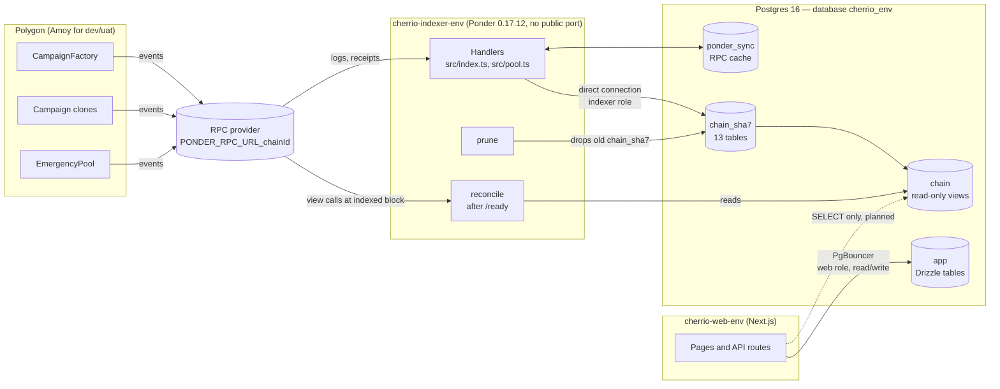

# 03 — Data and indexer

CHERR.IO keeps two kinds of data in one Postgres 16 (+ pgvector) server. **Off-chain application data** (users, organisations, campaign drafts, ratings, points, audit log) lives in schema `app`, managed with Drizzle by the web app. **On-chain state** (campaigns, donations, votes, refunds, Emergency Pool balances and allocations) is copied from the smart contracts by the **Ponder indexer**, which writes it to a per-deploy schema `chain_<sha7>` and publishes stable read-only views in schema `chain`. The web app reads chain data only through those views and never writes chain state. Each environment (dev, uat, prod) has its own database, its own web role and its own indexer role. This page describes both halves, how they are deployed and how they are kept honest (reconcile).

Last updated: 2026-10-09

Status legend: **Live on dev** = running on https://dev.cherr.io · **Built (not deployed)** = code merged, not running on a server · **Planned** = described in docs, no code yet.

| Part | Status |
|---|---|
| `app` schema, migrations, seed, `eraseUser` | Live on dev |
| Ponder indexer (handlers, reconcile, prune, image, Kamal config, deploy job) | Live on dev since 2026-10-01 (TASK-026) |
| Indexer DB role `cherrio_indexer_<env>` and the new connection budget | Live on dev — applied on the server by David with `ensure-databases.sh` before the first indexer deploy (TASK-026); uat/prod roles not created yet |
| Web app reading `chain.*` views | Live on dev for campaign linking (TASK-010c); public campaign pages Live on dev (TASK-011a, PR #50) |
| Worker consuming indexed events: vote points and lifecycle emails (TASK-033e, ADR-048 — Postgres outbox, no Redis) | Built (TASK-033e; schema `0009` Live on dev, PR #86); trust score Planned |

---

## 1. Postgres layout

One Postgres 16 instance with the pgvector extension serves all three environments, with one database per environment: `cherrio_dev`, `cherrio_uat`, `cherrio_prod`. Inside each database (ADR-026):

| Schema | Written by | Owner | Read by | Content |
|---|---|---|---|---|
| `app` | web app (Drizzle migrations + route handlers) | web role `cherrio_<env>` | web app (and later the worker) | Off-chain application tables (§2) and the Drizzle journal `app.__drizzle_migrations` |
| `chain_<sha7>` | Ponder, one schema per deployed indexer commit | indexer role `cherrio_indexer_<env>` | nobody directly except Ponder, reconcile and prune | The 13 indexer tables (§4.4) plus Ponder's internal `_ponder_meta` / `_ponder_checkpoint` |
| `chain` | Ponder (`--views-schema chain`) | indexer role | web role (SELECT only), reconcile | Stable views pointing at the live `chain_<sha7>` |
| `ponder_sync` | Ponder | indexer role | Ponder only | RPC cache (blocks, logs, receipts), kept across deploys so a re-index is fast |

Why per-deploy schemas: Ponder refuses to reuse a schema written by different code, so a fixed `chain` schema would break on the second deploy. Each code-changing deploy re-indexes from `startBlock` into a new `chain_<sha7>`; the `chain` views switch to it when it is ready, so readers have a stable contract and zero-downtime switches (ADR-026).

Connections:

- Web app traffic goes through **PgBouncer** in transaction mode (`DATABASE_URL`). `createDb()` therefore uses `prepare: false`.
- Migrations, seed, `grant-admin` and GDPR erasure use a **direct** connection (`DATABASE_URL_DIRECT`) because they need session features (advisory locks, transactions).
- Ponder connects **directly** to Postgres and never through PgBouncer (it uses LISTEN/NOTIFY). `lib/env.ts` refuses a URL on port 6432 or with `pgbouncer` in the host name.

Sources: `docs/03-DECISIONS.md` (ADR-021, ADR-026), `docs/02-ARCHITECTURE.md` §5, `infra/README.md`, `packages/db/src/index.ts`, `packages/db/src/migrate.ts`, `apps/indexer/lib/env.ts`, `docs/CHEATSHEET.md` §3 and §10.

---

## 2. The `app` schema (Drizzle)

Status: **Live on dev** for 18 tables and 17 Postgres enums, all in schema `app`. A 19th table, `private_files`, with its enum `private_file_kind` is **Built** (TASK-008a-1, migration `0001`) and reaches dev with the next web deploy.

Conventions used by every table:

- Primary key `id` is a **UUID v7** generated in TypeScript (`uuidPk()`, package `uuid`), so ids sort by time. Postgres 16 has no native `uuidv7()`.
- USDC amounts are `numeric(78,0)` mapped to TypeScript `bigint` (`numeric78`), enough for the full `uint256` range. EUR amounts are integer cents. Never floats.
- Hashes and 32-byte ids are `bytea` (`Buffer` in TS).
- Ethereum addresses are `varchar(42)` with a CHECK `^0x[0-9a-f]{40}$` (lowercase).
- Most tables have `created_at` / `updated_at` (`timestamptz`); append-only tables have only `created_at`.

### 2.1 Tables

**Users and access**

| Table | Purpose | Key columns |
|---|---|---|
| `users` | One row per person who logged in | `display_name` (default pseudonym "Supporter XXXX"), `email` (nullable), `privy_did` (unique; null after erasure), `locale` (default `en`), `anonymous_donations`; **Built** (TASK-031): `display_currency` (nullable; the display currency the user chose, ADR-040, written back into the cookie at login); **`is_demo`** (**Built**, TASK-040a, migration `0011`, ADR-053): the synthetic member of a demo organisation — no Privy DID, never logs in through Privy |
| `user_addresses` | Links a person to on-chain addresses — personal data | `user_id`, `address` (unique, lowercase), `kind` (`EMBEDDED` / `SMART_ACCOUNT` / `EXTERNAL`), `is_primary` |
| `user_roles` | Platform-level roles only | `user_id`, `role` (only `PLATFORM_ADMIN`); unique (`user_id`, `role`) |

**Organisations and verification**

| Table | Purpose | Key columns |
|---|---|---|
| `organizations` | Registered or imported charities (Charity Market Cap) | `source` (`REGISTERED` / `IMPORTED`), `name`, `legal_name`, `country`, `registry` (`SI_AJPES`, `SI_MJU`, `UK_CC`, `US_IRS`, `NONE`), `registry_id` (unique with `registry`), `causes[]`, `kyb_status`, `claimed_by_user_id`, `payout_address`, `logo_cid`; **`is_demo`** (**Built**, TASK-040a, migration `0011`, ADR-053): a made-up organisation created by Admin → Demo on local/dev |
| `org_members` | The only source of organisation membership | `org_id`, `user_id`, `role` (`ORG_ADMIN` / `ORG_MEMBER`); unique (`org_id`, `user_id`) |
| `kyb_submissions` | Manual KYB reviews of an organisation (ADR-012) | `org_id`, `submitted_by`, `status`, `reviewer_id`, `review_note`, `reviewed_at` (**Built**: set on approve and reject; the 90-day retention of rejected documents counts from here), `private_file_keys[]` (unused), `application` (jsonb, **Built**: the validated form data of that submission — name, legal name, country, website, description, causes, payout address; no file data, nothing about the applicant). Partial unique index (**Built**): at most one `PENDING` submission per `submitted_by` |
| `private_files` (**Built**) | One row per encrypted object in private storage (ADR-033); no file name, no personal data | `storage_key` (unique, `kyb/<orgId or "unassigned">/<id>`, or `evidence/<campaignId>/<id>` for evidence, TASK-033c), `kind` (KYB kinds, or `EVIDENCE`), `mime_type` (from the server's magic-byte check), `size_bytes` (1 byte – 10 MB, checked), `sha256` of the plaintext (64 lowercase hex, checked), `key_version` (default 1), `uploaded_by` → users, `kyb_submission_id` → kyb_submissions (null until submitted), `deleted_at` |
| `kyc_checks` | Sumsub applicant status only — no document data (ADR-014) | `user_id`, `provider` (default `SUMSUB`), `applicant_id`, `status`, `level`, `reviewed_at` |

**Campaigns**

| Table | Purpose | Key columns |
|---|---|---|
| `campaigns` | Off-chain campaign record from draft to deployment | `offchain_id` (32 bytes, unique), `org_id`, `starter_user_id`, `beneficiary_type`, `beneficiary_address` (required once `APPROVED`/`DEPLOYED`), `title`, `slug` (unique), `story` (jsonb), `cause`, `country`, **`goal_currency`** (`EUR`/`USD`, default `EUR`) and **`goal_amount_minor`** (the goal in cents of that currency, > 0; **Live on dev** since migration `0021`, TASK-060, ADR-060), (the legacy `target_eur_cents` and its sync trigger from `0021` were dropped by migration `0022`, TASK-060 contract step), rate snapshot `eur_usd_rate` / `rate_source` / `rate_at`, `target_usdc`, `duration_days`, `status` (`DRAFT` → `PENDING_REVIEW` → `APPROVED` / `REJECTED` → `DEPLOYED`), `review_note`, `onchain_address` (unique; the clone address); **Live on dev** (TASK-010a): `submitted_at`, `reviewed_at`, `reviewer_id`, `publish_tx_hash` (0x + 64 hex, checked), `deadline`, `deployed_at`. `story` holds `{ "format": "plain", "text": … }` (plain text, rendered escaped); `goal_amount_minor` is whole units × 100; `offchain_id`, the rate fields, `target_usdc` and `beneficiary_address` stay empty until approval. **At approval** (**Live on dev**, TASK-010b): for a EUR goal `eur_usd_rate` = the ECB USD rate with 8 decimals (e.g. `1.17340000`), `rate_source = 'ECB'`, `rate_at` = the ECB rate date (00:00 UTC), `target_usdc = floor(goal_amount_minor × rate × 10⁴)` in micro-USDC; for a USD goal (TASK-060) `eur_usd_rate` stays NULL, `rate_source = 'USD_PEG'`, `rate_at` = the approval time and `target_usdc = goal_amount_minor × 10⁴` (1 USD = 1 USDC, no ECB request); `beneficiary_address` = the organisation's verified `payout_address` (lowercase), `offchain_id` = 32 random bytes (kept if a campaign is ever approved again), `reviewer_id`, `reviewed_at`; `review_note` is cleared. A rejection sets `REJECTED`, `review_note`, `reviewer_id`, `reviewed_at` and leaves the snapshot empty. **Publishing** (**Live on dev**, TASK-010c): preparing the call sets `deadline` (whole seconds; again on every new attempt); the sent transaction sets `publish_tx_hash`; linking sets `status = DEPLOYED`, `onchain_address`, `deployed_at` (the block time) and overwrites `publish_tx_hash` with the hash the indexer saw. **`is_demo`** (boolean, default `false`; **Live on dev**, TASK-038a, migration `0010`, PR #98, ADR-052): a made-up campaign for testing, created by Admin → Demo campaigns on local/dev only; shown with a "Demo" tag and notice. Since TASK-040a (ADR-053) demo campaigns are started by the demo organisation's synthetic member, never by an admin |
| `fx_rates` | Display-only exchange rates (**Built**, TASK-031; ADR-040). Never used for money logic; not personal data | `currency` (PK, e.g. `CHF`, `BTC`), `usd_per_unit` (numeric(38,18): USD per one unit, 1 USDC = 1 USD), `source` (`ECB` / `COINGECKO`, checked), `rate_at` (ECB rate date, or CoinGecko's last-updated time), `fetched_at`. One row per currency, overwritten on each refresh (no history). Fiat: `USD per X = (USD per EUR) ÷ (X per EUR)` from the ECB daily file; EUR = USD per EUR. Refresh and staleness rules: `04-web-app-and-auth.md` §2a |
| `campaign_media` | Public images, video links and PDFs of a campaign | `campaign_id`, `kind` (`COVER` / `GALLERY` / `VIDEO` / `DOCUMENT`), `cid`, `storage` (`POLLINATIONX` / `PINATA` / `HETZNER_PUBLIC` — **Live on dev**, ADR-037; `cid` then holds the object key in the public bucket / `EXTERNAL`), `sort`; **Built** (TASK-030, ADR-039): `label` (PDF title shown on the page, from the file name), `size_bytes`, `created_by` (→ `users`, who added it). A video row has `storage = EXTERNAL` and `cid = youtube:<id>` or `vimeo:<id>` — only the video id is stored, nothing is downloaded. Limits per campaign (10 gallery images, 3 videos, 5 documents) are checked in the app under a per-campaign advisory lock (`pg_advisory_xact_lock`), not by a constraint |
| `evidence_bundles` | Milestone evidence per round (**Built**, TASK-033c, ADR-047; migration `0008`) | `campaign_id`, `round` (0 after payment 1, 1 after payment 2; unique with campaign), `note` (public, ≤ 2,000 characters, checked), `manifest` (the exact canonical JSON text, set when sealed), `bundle_hash` (32 bytes = SHA-256 of `manifest`), `sealed_at` — a check keeps the three null or set together; `created_by` → users. `private_file_keys[]`, `public_cids[]` and `status` are unused (left from the first schema); whether a bundle is on chain is read from `chain.vote_round` (same round, same hash), not stored |
| `evidence_files` (**Built**, TASK-033c) | One file of an evidence bundle | `bundle_id` → evidence_bundles, `visibility` (`PRIVATE` / `PUBLIC`), `private_file_id` → private_files (unique; PRIVATE only) or `public_key` (unique object key in the public bucket; PUBLIC only) — a check enforces exactly one —, `mime_type`, `size_bytes` (≤ 10 MB), `sha256` of the stored bytes (64 hex, checked), `created_by`. No file names. At most 10 files per bundle and no duplicate hash, checked in the app under a per-campaign advisory lock |

**Social, trust and points**

| Table | Purpose | Key columns |
|---|---|---|
| `ratings` | Off-chain EIP-712 signed ratings, one per (campaign, user) (ADR-058: finished campaigns, 90 days, private comment) | `org_id`, `campaign_id`, `user_id`, `stars` (1–5), `comment`, `signature`; `signer_address` (lower-case check), `signed_at`, index `ratings_created_at_idx` — migration `0018` (TASK-057-schema, **Live on dev**, PR #163); written by `POST /api/campaigns/:id/rating` (TASK-057a, Live on dev, PR #164) — see 04 |
| `points_ledger` | Append-only points journal | `user_id`, `bucket` (`STATUS` / `REWARD`), `delta` (bigint), `reason`, `ref_type` / `ref_id`, `ref_key` (**Built**, migration `0009`: idempotency key of an automatic entry, e.g. `vote:<campaign>:<round>`; partial unique index `points_ledger_auto_uniq` on (`user_id`, `reason`, `bucket`, `ref_key`) where set), `rule_version`, `voided_at` / `voided_reason`. Written by the worker for votes (200 per user, campaign and round, in both buckets, ADR-048) |
| `user_levels` | One row per user; counters equal the sum of the ledger | `user_id` (PK), `level`, `status_points`, `reward_points`, `last_activity_at` |
| `campaign_referrals` | Who brought a user to donate to a campaign (TASK-055, ADR-057 §5; migration `0016`) — **Live on dev** (PR #157 schema, PR #156 code) | `user_id` + `campaign_id` (PK, first touch wins), `referrer_user_id`, `created_at`; check `user_id <> referrer_user_id`; index (`referrer_user_id`, `campaign_id`). Written by `POST /api/referrals`; awards nothing by itself (points: TASK-056, only for donations the chain confirms) |
| `notifications` (**Built**, TASK-033e, migration `0009`) | Email outbox; the worker is the only sender (ADR-048) | `user_id`, `kind` (`VOTE_OPENED` / `VOTE_REMINDER` / `VOTE_RESULT` / `REFUND_AVAILABLE` / `EMAIL_CONFIRM`), `dedupe_key` (the event, e.g. `vote:<campaign>:<round>`, `refund:<campaign>`; unique with user and kind), `data` (jsonb: campaign title, slug, round, …; the confirmation token is removed once sent), `status` (`PENDING` / `SENT` / `FAILED` / `SKIPPED`), `attempts`, `last_error`, `send_after`, `sent_at`. No recipient address: it is resolved at send time |
| `notification_preferences` (**Built**, TASK-033e) | One row per user, created on first use | `user_id` (PK), `email_enabled` (false = unsubscribed), `contact_email` (confirmed address of a wallet-only user; wins over `users.email`), `pending_email` / `confirm_token_hash` (SHA-256) / `confirm_expires_at` / `confirmed_at` (double opt-in), `unsubscribe_token` (unique, URL-safe random) |
| `trust_scores` | Trust Score v1 (ADR-059): **one current row per organisation and version** (migration `0019`, Live on dev, PR #174), rewritten only when something changed | `org_id`, `version` (unique together), `score` (0–100.00), `components` (jsonb: the parts and their counts), `listed`, `registered`, `country`, `causes`, `raised` (USDC units), `computed_at`; partial ranking indexes on `listed` — since migration `0020` (TASK-017b, Live on dev, PR #176) one-direction `(version, score, org_id)`, `(version, country, score, org_id)`, `(version, registered, score, org_id)`, `(version, raised, org_id)`, read backwards by the keyset pages, plus `organizations (name, id)` for the name order. **Computed by the worker (TASK-017a, Live on dev, PR #175):** `apps/worker/src/trust.ts` `computeTrustScores(db, "registered" | "imported" | "all")` — one set-based statement for organisations on CHERR.IO; imported organisations in id chunks of 10,000, one statement each, because the dev/uat database roles have a 30 s `statement_timeout` (one statement over ~615k organisations hit it on dev, 2026-10-08). Malformed register values (text in figures, impossible dates) count as missing. Measured on 908,465 organisations (local): first pass 116 s, steady nightly pass 25 s (writes nothing), organisations on CHERR.IO 0.1 s; client RSS ~60 MB (only a count comes back); table ~570 MB with indexes |
| `registry_records` | Registry import snapshots (SI, UK, US) | `registry`, `registry_id` (unique together), `raw` (jsonb), `fetched_at`. **UK (TASK-016a, Built, PR pending):** one row per main charity of the Charity Commission extract, registered or removed; `raw` = name, status, type, registered/removed dates, reporting status, financial year end, income, expenditure, company number, insolvent / in administration, extract date — **no phone, e-mail or address**. Registered ones also become `organizations` rows (source `IMPORTED`, `UK_CC`, causes from the classifications); claimed (`REGISTERED`) rows are never changed. Measured on a synthetic 390,000-row extract: ~33 s per run (first and repeat), peak RSS ~125 MB for the import, heap ≤ 36 MB (Live on dev, PR #171). **US (TASK-016b, Built, PR pending):** `US_IRS`, EIN; only 501(c)(3) with revenue; `raw` = name, city, state, classification, ruling, deductibility, foundation, status, tax period, assets, income, revenue, NTEE — no street, ZIP or "in care of". Synthetic 1,960,000-row BMF (735,122 kept): first run 82 s, repeat 65 s, peak RSS ~110 MB; `registry_records` 359 MB + `organizations` 187 MB. Unchanged records are not rewritten (no bloat on monthly runs); a finished run is marked in `audit_log` (`registry.imported`, counts, parser version), which decides when the next one is due — raising a parser version (UK 2 since 2026-10-08: names in capitals title-cased) makes the worker import again at once |

**Proof of Charity v2 (ADR-057, TASK-056a — Live on dev, PR #161, Deploy 37729761330):** the worker (`apps/worker/src/points.ts` `awardPoints`) writes every award to both balances with `rule_version = 2`, idempotent by `ref_key`: registration 50 (`registration`; real accounts — not demo, not erased), first donation 100 (`first-donation`), donation `min(100, ⌊10·√whole USDC⌋)` of the user's **total** to a campaign over all their addresses, credited as the increase (`donation:<campaign>:<points so far>`), milestone vote 30 (`vote2:<campaign>:<round>`; the 200-point ADR-048 entries were voided by migration `0017`), donor via your link 20 (`link:<campaign>:<user>`, only for a donation after the `campaign_referrals` row, ≤ 10 per campaign and referrer), friend who joined through your link and gave 100 + 50 to the friend (`friend:<user>`, `friend-bonus`), supported campaign reached the threshold 20 (`success:<campaign>`), a signed rating 20 (`rating:<campaign id>`, TASK-057a, Live on dev; ratings created since the last tick − 10 min, all on the full pass; nothing for the organisation's own people or unsigned/erased rows). Nothing for donations to a campaign you started or of an organisation you belong to; nothing for erased referrers. Numbers in `packages/shared/src/points.ts` (`POINTS`, `donationPoints`, `LEVELS`, `levelFor`). Minute ticks read only votes/donations from the newest seen block − 2,000 (indexes `vote.blockIdx`, `donation.blockIdx`) and users created in the last 10 minutes (`users_created_at_idx`); a full pass at start and every 6 h also credits campaign successes. Measured on the perf database (10,000 campaigns, 50,000 users, 1,000,000 votes, 100,000 donations): minute tick ~0.15 s, steady full pass ~11–12 s, the one-off first pass (crediting everything) ~136 s.

**Emergency Pool, finance, audit**

| Table | Purpose | Key columns |
|---|---|---|
| `emergency_subpools` | Display metadata for Emergency Pool sub-pools | `pool_id` (matches the on-chain `uint32` pool id, ≥ 0), `slug`, `name_key` / `description_key` (next-intl keys, no hard-coded UI text) |
| `onramp_orders` | Transak card-onramp orders (ADR-004) | `user_id`, `provider` (`TRANSAK`), `provider_order_id` (unique), `status`, `fiat_amount_cents`, `fiat_currency`, `usdc_amount`, `wallet_address`, `campaign_id` (optional) |
| `contract_changes` | **Live on dev** (TASK-034a, migration `0007`, PR #70): `PlatformConfig` changes scheduled through the timelock from the admin console (ADR-046). The chain is the source of truth for the state; this is the record | `chain_id`, `timelock`, `operation_id` (unique, `0x` + 64 hex), `targets[]`, `payloads[]`, `predecessor`, `salt`, `delay_seconds`, `summary` (jsonb lines `{key, from, to}` with raw values), `scheduled_by` / `schedule_tx_hash` / `scheduled_at`, `executed_by` / `execute_tx_hash` / `executed_at`, `cancelled_by` / `cancel_tx_hash` / `cancelled_at`; checks: id and address formats, equal non-empty array lengths, never executed and cancelled |
| `audit_log` | Append-only audit trail | `actor_user_id` (null for system actions), `action` (e.g. `auth.login`, `wallets.synced`, `account.deleted`), `entity_type`, `entity_id`, `data` (jsonb), `ip`, `created_at`. Indexes: actor; (entity_type, entity_id); **(created_at, id)** for Admin → Audit log pages (migration `0023`, TASK-021, Live on dev (PR #198, Deploy 37973269064)) |

Only `users`, `user_addresses`, `user_roles` and `audit_log` are written by live code today (auth, TASK-025); `emergency_subpools` and `organizations` contain seed data; the other tables are schema only, waiting for their tasks.

### 2.2 Migrations

- Generated with drizzle-kit into `packages/db/drizzle/`; eight migrations exist: `0000_perpetual_dust.sql` (live on dev), `0001_goofy_agent_zero.sql` (**Live on dev**: adds only the enum `private_file_kind` and the table `private_files`) and `0002_cold_supreme_intelligence.sql` (**Live on dev**, TASK-008b-1: adds `kyb_submissions.application` with default `'{}'` and the partial unique index on pending submissions). `0003_concerned_bruce_banner.sql` (**Live on dev**, TASK-008c-1) adds the nullable `kyb_submissions.reviewed_at`. `0004_ambiguous_karen_page.sql` (**Live on dev**, TASK-010a) adds six nullable columns to `campaigns` and the enum value `HETZNER_PUBLIC`. `0006_polite_hobgoblin.sql` (**Built**, TASK-031) adds the table `fx_rates` and the nullable `users.display_currency`. `0005_nappy_dark_phoenix.sql` (**Live on dev**, TASK-030) adds the enum values `media_kind.DOCUMENT` and `storage_provider.EXTERNAL` and three nullable columns to `campaign_media` (`label`, `size_bytes`, `created_by` with a foreign key to `users`). `0007_lyrical_cassandra_nova.sql` (**Live on dev**, TASK-034a) adds the table `contract_changes`. `0012_seed_emergency_subpools.sql` (**Live on dev**, TASK-046, PR #117) and `0013_campaigns_public_deadline_idx.sql` (**Live on dev**, TASK-047, PR #118: the partial index `campaigns_public_deadline_idx`) is a data-only migration: it inserts the five Emergency Pool sub-pool rows (§2.3). `0016_campaign_referrals.sql` (TASK-055, **Live on dev**, PR #157 — shipped before the code, see `07`/HANDOFF expand rule) adds `users.ref_code` (unique, check `^[a-z0-9]{8,16}$`), `users.referred_by_user_id` (FK, check not self) and the table `campaign_referrals`. `0015_unaccent.sql` (TASK-054) runs `CREATE EXTENSION IF NOT EXISTS "unaccent" WITH SCHEMA public` — a trusted contrib extension since Postgres 13, so the database owner (the web role that runs migrations) may create it; used by every text search (`containsText` in `apps/web/src/lib/admin/listing.ts`). The later ones only add, so they are backward compatible with the deployed code. It also runs `CREATE EXTENSION IF NOT EXISTS "vector"` (a no-op on the server, where `infra/shared/ensure-databases.sh` installs the extension as superuser) and `CREATE SCHEMA IF NOT EXISTS "app"`.
- Runner: `packages/db/src/migrate.ts`, journal in `app.__drizzle_migrations`, one connection, prefers `DATABASE_URL_DIRECT`.
- **In deploys** (`.github/workflows/deploy.yml`, job "Build → Deploy → Migrate"): the web image contains `packages/db/dist/migrate.mjs` (bundled by esbuild in the `Dockerfile`) plus the SQL files. After `kamal deploy` the job runs `kamal app exec --primary "node packages/db/dist/migrate.mjs"` against the new version, then the smoke tests on `/api/health`. Migrations run **after** the deploy because Kamal uploads the env files during boot; this is safe only because migrations must be backward compatible (expand → migrate → contract, Architecture §5.3).
- Locally: `pnpm --filter db migrate`.

### 2.3 Seed

`packages/db/src/seed.ts` (`pnpm --filter db seed`) is idempotent (`ON CONFLICT DO NOTHING`) and is **not** run by the deploy job. It inserts:

- 5 Emergency Pool sub-pools: `general` (0), `medical` (1), `disasters` (2), `animals` (3), `climate` (4). **Since TASK-046 the migration `0012_seed_emergency_subpools.sql` inserts the same five rows** (same slugs and message keys, `gen_random_uuid()` ids, `ON CONFLICT DO NOTHING`), so every environment has them after its deploy — the deploy runs migrations, never the seed. The seed's insert stays and is a no-op afterwards. Pinned by the integration test "creates the 5 Emergency Pool sub-pools without the seed (0012)". A theme still needs its on-chain sub-pool (`EmergencyPool.createSubPool`, Operator) before the donate panel offers it — Admin → Emergency Pool sub-pools (`04-web-app-and-auth.md`).
- 3 imported sample organisations (UK Charity Commission, US IRS, Slovenian AJPES registry entries).
- `PLATFORM_ADMIN` for the user who owns `SEED_ADMIN_ADDRESS` — **only if that address has already logged in**. The seed never creates placeholder users or addresses (they would conflict with the real first login). Otherwise use the `grant-admin` CLI (see `04-web-app-and-auth.md`).

### 2.4 GDPR erasure (`eraseUser`)

`packages/db/src/gdpr.ts` → `eraseUser(db, userId)`, one transaction, called by `DELETE /api/auth/account` over the direct connection:

| What | Action |
|---|---|
| `users` | `display_name = 'Deleted user'`, `email = NULL`, `privy_did = NULL` (the row stays) |
| `user_addresses` | rows deleted (person ↔ address link is personal data, ADR-014) |
| `user_roles` | rows deleted (admin rights revoked immediately) |
| `org_members` | rows deleted |
| `kyc_checks` | rows deleted (Sumsub applicant reference) |
| `audit_log` | `ip = NULL` on rows where the user is the actor |
| `ratings` | `signature = NULL` (an EIP-712 signature identifies the signer) |
| `notifications`, `notification_preferences` (**Built**, TASK-033e) | rows deleted (email addresses, tokens) |
| `kyb_submissions` (**Built**, TASK-008c-3) | a `PENDING` submission of the user is closed: `REJECTED` without a note, `reviewed_at = now`, no reviewer; a claim puts the imported organisation back to `NONE`, a new organisation becomes `REJECTED` (an organisation approved earlier stays `APPROVED`); audit `kyb.closed_on_erase` with the submission id only. Other submissions and every `review_note` stay (the note describes the organisation, not the person) |
| `private_files` (**Built**, TASK-008c-3, ADR-034) | `deleted_at` set on the user's unattached files and on the files of their non-approved submissions; files of **approved** submissions stay (the organisation's proof of verification). Evidence files (`kind = EVIDENCE`, TASK-033c) are never erased with their uploader: they belong to the campaign's record (ADR-047). `eraseUser` returns the storage keys; the account route deletes those objects **after** the commit, and an object that cannot be deleted is left for `files:sweep` (its row is already marked) |

`kyb_submissions.private_file_keys[]` is unused and superseded by `private_files.kyb_submission_id`; a later migration may drop it.

**Organisation data before approval (TASK-008b-1, Built).** For a *new* organisation the `organizations` row is created from the form (`source = REGISTERED`, `kyb_status = PENDING`; not public while pending). For a *claim* of an imported organisation and for a *resubmission* after a rejection the `organizations` row is **not** changed apart from `kyb_status = PENDING`: the submitted data lives in `kyb_submissions.application`, and the review (**Built**, TASK-008c-1) applies it to the row on approval — for a claim together with `source = REGISTERED` and `claimed_by_user_id`. A rejected *new* organisation becomes `REJECTED`; a rejected *claim* puts the imported organisation back to `NONE`, unchanged, and removes the claimant's `org_members` row, so a false claim never marks a real charity as rejected. The applicant's status page therefore reads the user's own `kyb_submissions`, not memberships. Sources: `packages/db/src/schema/organizations.ts`, `apps/web/src/lib/organizations/apply.ts`, `docs/tasks/TASK-008b1.feedback.md`.

Also cleared (TASK-055): `users.ref_code` and `users.referred_by_user_id` are nulled and the user's `campaign_referrals` rows are deleted; rows where the erased user was the referrer stay and point to the anonymised user.

Kept, **pseudonymous by `user_id`**: `points_ledger`, `ratings` (stars and comment, needed for the org Trust Score), `audit_log` rows (without IP), and the `users` row itself. Because `privy_did` is null afterwards, any existing session cookie of that user stops working (`getSession()` treats it as logged out). Rows where the erased user is only the *subject* (`entity_id`) of another actor's action keep that actor's IP — deliberate, see TASK-005 feedback. On-chain data cannot be erased; the platform never puts personal data on chain or on IPFS (ADR-014).

Sources: `packages/db/src/schema/*.ts`, `packages/db/src/migrate.ts`, `packages/db/src/seed.ts`, `packages/db/src/gdpr.ts`, `packages/db/package.json`, `Dockerfile`, `.github/workflows/deploy.yml`, `docs/tasks/TASK-005.feedback.md`, `docs/tasks/TASK-025.feedback.md`, `docs/02-ARCHITECTURE.md` §4.4, §5.3.

---

### 2.5 How the web app reads `chain` (**Live on dev**, TASK-010c)

The first reader of the indexer's views is the campaign linking (`apps/web/src/lib/campaigns/publish.ts`). It selects columns by name from `chain.campaign`: `address`, `beneficiary`, `beneficiary_type`, `target::text`, `deadline::text`, `state::text`, `tx_hash`, `block_time::text`. It never references the per-deploy enum type (`chain_<sha7>.campaign_state`), so a new indexer deploy does not break it. Hex values are compared lowercase. A database without the `chain` schema (local, or before the indexer runs) answers "indexer unavailable" instead of an error.

Sources: `apps/web/src/lib/campaigns/publish.ts`, `apps/web/src/__tests__/campaign-publish.test.ts` (simulates the view with a table of the same columns).

**Public campaign pages (Live on dev, TASK-011a, PR #50)** — `apps/web/src/lib/campaigns/public.ts`, same rules (columns by name, `::text` casts, lowercase hex, `isMissingRelation` → page renders from `app.*` with a notice instead of a 500):
- `listPublicCampaigns` / `getPublicCampaign`: `app.campaigns` (`status = 'DEPLOYED'`, `onchain_address` set) ⨝ `app.organizations` ⨝ latest COVER in `app.campaign_media`, `left join chain.campaign` on the address for `state`, `deadline`, `total_raised`, `payout_mode`, `end_time`, plus `count(*)` from `chain.campaign_donor`. Each summary carries `isDemo` (ADR-052). A DEPLOYED campaign the indexer has not seen yet shows without figures.
- `listCampaignDonations`: `chain.donation` newest first (`block_number desc, log_index desc`), `left join app.user_addresses` on the lowercase donor → `app.users` (`display_name`, `anonymous_donations`). ADR-043: name, "Anonymous", or (no match — also after `eraseUser`, which deletes `user_addresses`) the address. The anonymous user's name never leaves the server.
- Display state: `LIVE` before the deadline = live; `LIVE` after it = "ending" (waits for `finalize()`); `PAYING` shows as succeeded; unknown values = pending.
- **Donating (Live on dev, TASK-011b, PR #55)** — two more readers in the same file:
  - `listDonationThemes`: Emergency Pool themes for the failure preference = `app.emergency_subpools` (pool 0 excluded — it is the general pool, always offered) ⨝ `chain.pool` on `pool_id = id`, so only sub-pools that exist on chain are offered. Empty without the views.
  - `listMyDonations(userId, campaign)`: `chain.campaign_donor` (`donated > 0`) ⨝ `app.user_addresses` of that user → per address `donated`, `preference` (0 = refund, 1 = Emergency Pool), `sub_pool_id`. Served only to the logged-in user by `GET /api/donations/[campaign]` (401 without a session, 400 for a malformed address, 503 without the views). The donate panel's "remaining" figure comes from `chain.campaign.total_raised`; the transaction itself re-reads `remaining()` through the donor's wallet.
- **Campaign lifecycle (Built, TASK-033b part 2)** — `apps/web/src/lib/campaigns/lifecycle.ts`:
  - `loadLifecycle(address)`: `chain.campaign` (state, deadline, end/vote times, round, tranches, payout mode, raised, pool-donated, released, rejected remainder, settlement start, swept) + the current `chain.vote_round`. The `snap_*` columns are read through `to_jsonb(c)->>'snap_…'`, so a view without them yields `null` ("unknown"), never today's PlatformConfig.
  - `loadUserPositions(userId, lifecycle)`: `chain.campaign_donor` ⨝ `app.user_addresses` ⟕ `chain.vote` of the **current** round → per address donated, preference, settled, vote.
  - `listMyCampaignDonations(userId)`: every `app.campaigns` row whose contract one of the user's addresses donated to, with lifecycle and positions — three queries in all since TASK-047 (`loadLifecycles`, `loadUserPositionsMany`).
  - Pure rules, mirroring `Campaign.sol`: `voteTally` (base = raised − pool-donated; quorum `cast·10000 ≥ base·snapQuorumBps`, approval `yes·10000 ≥ cast·snapApprovalBps`), `dueActions` (finalize / closeVote / release incl. the SINGLE release delay), `settlementAmount` (FAILED: all; REJECTED: `donated·rejectedRemainder/totalRaised`, rounded down), `donorAction` (vote / voted / refund / pool / settled), `votesWaiting`.
- Tests simulate the views with tables (`apps/web/src/__tests__/helpers/fake-chain.ts`, shared by the vitest and Playwright suites and serialised with an advisory lock). Since TASK-047 the fake tables also carry the indexer's secondary indexes (`campaign_donor (donor)`, `donation (campaign)`, `donation (donor)`) and refuse a hex value that is not lower-case (check constraints `<table>_<column>_lower`), so tests cannot model rows Ponder never writes.
- **Speed at scale (Live on dev, TASK-047, PR #118, Deploy 37323798699).** Ponder writes every `t.hex()` column lower-case (`PgHex.mapToDriverValue`), and `app.campaigns.onchain_address` / `app.user_addresses.address` are lower-case by check constraint, so the web app compares hex columns **without `lower()`** (only parameters are lower-cased). `lower(ch.address)` / `lower(cd.campaign)` had made every join a sequential scan of the chain tables: with 10,000 campaigns and 100,000 donors `/campaigns` took ~1.3 s, its last page over 2 minutes and "My donations" 21 s. Further changes: `listPublicCampaigns` picks the page's ids first (campaigns ⨝ `chain.campaign` only) and reads cover, organisation and donor count for those 24 rows (`summariesOf`); the landing reads only the first live campaigns (`listLiveCampaigns`) through the partial index `campaigns_public_deadline_idx` (`deadline, id` where `status = 'DEPLOYED' and onchain_address is not null`, migration `0013`); `listMyCampaignDonations` loads all lifecycles (`loadLifecycles`) and positions (`loadUserPositionsMany`) in three queries instead of three per campaign. Measured with `pnpm --filter web perf:campaigns` (median of 7, local Postgres) — see `docs/tasks/TASK-047.feedback.md`; CI runs the same benchmark with 10,000 campaigns and fails above the budgets. Still linear in the number of published campaigns: the full sort behind `/campaigns` (~60 ms at 50,000), the filter facets (~35 ms at 50,000) and the admin list (~50 ms at 50,000). The worker's notification queries (`apps/worker/src/notify/enqueue.ts`) compare the same columns without `lower()` too (Live on dev, PR #147, Deploy 37645782456 — `docs/tasks/WORKER-ENQUEUE-LOWER.feedback.md`: one run over 10,000 campaigns, 1,000 open vote rounds and 5,000 recipients ~1.4 s → ~0.16 s); a source guard in `apps/worker/test/worker.test.ts` fails on any `lower(` in that file and in `points.ts`. **Vote points with a watermark (Live on dev, PR #151, Deploy 37664039459 incl. indexer rebuild — `docs/tasks/VOTE-POINTS-WATERMARK.feedback.md`):** `awardVotePoints` (`apps/worker/src/points.ts`) keeps an in-memory cursor (highest `chain.vote.block_number` seen); a minute tick reads only votes from that block minus 2,000 (~1 h overlap) through a new index on `vote.block_number` (`blockIdx` in `apps/indexer/ponder.schema.ts`; the fake test table names it `vote_block_number_idx`), so its cost follows new votes, not the vote history. A full pass runs at worker start and every 6 hours — it credits votes whose address was linked to a user after the vote, and rows an indexer rebuild added below the cursor; it skips already credited votes with an anti-join before inserting. Measured on the perf database (10,000 campaigns, 50,000 voters, 1,000,000 votes): the old every-minute run ~13 s; new minute tick ~4 ms (50 new votes ~13 ms); full pass ~3.3 s.

## 3. The indexer in plain words

The smart contracts emit an **event** every time something happens: a campaign is created, someone donates, a vote is cast, money is refunded. Reading the contracts directly for every page view would be slow and expensive. The indexer (`apps/indexer`, Ponder) listens to these events from the chain's RPC endpoint, in block order, and turns them into ordinary database rows — one table for campaigns, one for donations, one for votes and so on. Each handler updates the rows exactly the way the contract updates its own storage, so a row always equals what the contract would answer at the same block. A separate check (**reconcile**) proves that after every deploy.

Status: **Live on dev** since 2026-10-01. Merged in PR #15 (Campaign) and PR #16 (Emergency Pool); deployed with PR #17 (TASK-026). In the successful deploy (GitHub Actions run 36923510353 (Deploy, `dev`, 2026-10-01)) the indexer backfilled amoy-dev from its start block and reported `/ready` about 3½ minutes after the container started; reconcile then reported `checked=4 mismatches: 0` and prune `live=chain_d991cb3`. The CI job "Indexer scenario" is green on `dev`. uat and prod have no indexer yet.

Sources: `apps/indexer/src/index.ts`, `apps/indexer/src/pool.ts`, `docs/tasks/TASK-006.feedback.md`, `docs/tasks/TASK-026.feedback.md`.

---

## 4. Indexer details

### 4.1 Version and runtime

- **Ponder 0.17.12** (exact pin), viem 2, Hono for the custom API, Node 22.
- One chain per indexer instance; each environment runs its own indexer (ADR-020).
- Image `Dockerfile.indexer` runs `ponder start --schema chain_${GIT_SHA7} --views-schema chain`. `GIT_SHA7` is a build argument baked into the image, so a rollback to an older image automatically uses that image's schema.
- **RPC provider:** Alchemy, pay-as-you-go plan. The free tier limits `eth_getLogs` to 10-block ranges and throttles compute units per second; on it the first Amoy backfill stalled. Every environment needs a paid RPC plan that allows `eth_getLogs` over ranges of at least ~1,000 blocks.
- Kamal service `cherrio-indexer-<env>` (`config/indexer.yml` + `config/indexer.<env>.yml`), no proxy route, no published port, memory limit 384 MB (`NODE_OPTIONS=--max-old-space-size=288`), Docker health check on Ponder `/health`. Reachable only inside the `kamal` Docker network as `cherrio-indexer-dev:42069`.

### 4.2 Configuration by `APP_ENV`

`apps/indexer/lib/env.ts` → `resolveIndexerEnv()` throws on anything missing ("an indexer must never start half-configured"):

| Input | `APP_ENV=local` | `APP_ENV=dev` / `uat` / `prod` |
|---|---|---|
| Chain id and contract addresses + `startBlock` | JSON file from `INDEXER_DEPLOYMENT_FILE` (written by the deploy script) | `@cherrio/shared` → `getChainConfig(env)` and `requireContracts(env)` (deployments `amoy-dev`, `amoy-uat`, `polygon`) |
| RPC URL | `PONDER_RPC_URL_<chainId>` (e.g. `PONDER_RPC_URL_80002` for Amoy, `PONDER_RPC_URL_137` for Polygon). The URL contains the provider key, so the indexer, reconcile and prune filter it out of everything they print (`lib/redact.ts`, shown as `…/v2/***`) | same |
| Backup RPC (2026-10-06) | — | optional `PONDER_RPC_FALLBACK_URL_<chainId>` (dev: Infura Amoy, David's decision "primarno Alchemy, ko ne dela vzame od Infure"). Ponder gets viem's `fallback([http(primary), http(backup)], { rank: false })` — every request goes to the primary first and is repeated on the backup only when it fails (e.g. Alchemy's "Monthly capacity limit exceeded", HTTP 429). A plain URL list is **not** used: Ponder load-balances across a list. The batch runner (`rpc()` in `scripts/batch.ts`) and reconcile use the same order; the backup URL is masked in logs like the primary (`redact.ts`, `/v2/` and `/v3/` key paths). **Paced (2026-10-07, Live on dev — PR #137, Deploy 37592471722):** Ponder's requests to the backup wait for credits in a token bucket of `INDEXER_RPC_FALLBACK_CREDITS_PER_SECOND` (default **400**, under Infura's free per-second limit — 500/s as far as known; `0` = off), weighted per method (`eth_getLogs` 255, most others 80, `eth_chainId` 5; `lib/throttle.ts`). Reason: Infura answered Ponder's simultaneous `eth_getLogs` with 429 and Ponder repeated each refused call up to ~9 times with growing waits (dev log 2026-10-07; 538 requests an hour, 320 of them `eth_getLogs`, instead of ~250). The runner's own scan and reconcile already wait on 429 themselves and are not paced. Unset = primary only (prod today). Test: `test/throttle.test.ts` (spacing, one bucket shared by all of Ponder's clients); `batch-scenario.test.ts` runs with a primary that always answers 429 and the proxy as backup; without the fallback the first cycle never completes (deliberate break). |
| `eth_getLogs` range (2026-10-06) | `INDEXER_GETLOGS_RANGE` (scenario test: 1,000) | default 10,000 blocks: Ponder's `ethGetLogsBlockRange` and the batch runner's factory scan. Infura refuses wider ranges with `range N exceeds limit of 10000`, a message Ponder 0.17's range helper does not recognise (it would stop the backfill); Alchemy accepts it. Error lines name the provider: `eth_getLogs failed — primary: …; backup: …`. |
| Database | `DATABASE_URL_DIRECT` — PgBouncer URLs refused | same; on the server it is the indexer role's direct URL (GitHub secret `INDEXER_DATABASE_URL`) |
| RPC cache | disabled (`disableCache`), so Anvil data never lands in `ponder_sync` | enabled |
| Mode (ADR-055, TASK-048) | realtime unless `INDEXER_MODE=batch` | `INDEXER_MODE`: `realtime` (default; prod) or **`batch` (dev, `config/indexer.dev.yml`)**: the container runs `node dist/batch.mjs` instead of `ponder start`; every `INDEXER_BATCH_INTERVAL_SECONDS` (dev 120; 5–900) it starts Ponder with `INDEXER_END_BLOCK` = head − finality (30 on Amoy), waits for that block on Ponder's `/status`, stops it, releases Ponder's schema lock and sleeps. See §4.13. |
| Block polling interval | 1 s | **15 s** by default (since 2026-10-04, PR fix/indexer-polling-keeps-up). Ponder's realtime sync fetches **at most 50 missing blocks per poll** (`MAX_QUEUED_BLOCKS`), so the interval caps how many blocks a minute the indexer can follow. Amoy makes ~60 blocks a minute (measured 2026-10-04): the 60 s interval used from 2026-10-03 let the indexer fall ~10 blocks behind every minute — 6,764 blocks (2 h 20 min) after 12 h, and David's sponsored donation did not show. Optional override `INDEXER_POLLING_INTERVAL_MS` (integer, **1,000–25,000**; anything else stops the indexer at start, so it can never be set too slow again). RPC cost scales with blocks (each is fetched once), not with polls: 15 s adds ~4,300 "latest block" calls a day compared with 60 s. A new donation appears in `chain.*` within about one interval plus finality. |

Indexed contracts (`ponder.config.ts`): `CampaignFactory` (fixed address), `Campaign` (every clone, discovered through the factory's `CampaignCreated(campaign)` parameter), `EmergencyPool` (fixed address). Each starts at its deployment `startBlock`. `PlatformConfig` events and OpenZeppelin's `Initialized` are deliberately not indexed.

### 4.3 Event → handler → table

23 events plus one setup handler. Handlers live in `src/index.ts` (factory and campaigns) and `src/pool.ts` (Emergency Pool). Every event row also stores `tx_hash`, `log_index`, `block_number`, `block_time` (`lib/origin.ts`).

| Contract | Event | Writes |
|---|---|---|
| CampaignFactory | `CampaignCreated` | insert `campaign` (state `LIVE`, all counters 0) with its 7 `snap_*` values read from the new clone at this block (7 `eth_call`s per campaign, no Multicall3 — local Anvil has none; TASK-033b) |
| Campaign | `Donated` | insert `donation`; upsert `campaign_donor` (adds to `donated`); `campaign.total_raised +=`; when the donor is the Emergency Pool also `campaign.pool_donated +=` (and the donor's `sub_pool_id` is left unchanged) |
| Campaign | `PreferenceSet` | update `campaign_donor.preference`, `sub_pool_id` |
| Campaign | `Finalized` | `campaign.state`, `end_time`; if `FAILED` also `settlement_start` |
| Campaign | `PayoutModeSet` | `campaign.payout_mode` (0 SINGLE, 1 MILESTONES) |
| Campaign | `TrancheReleased` | insert `tranche_release`; `campaign.released +=`, `fee_paid +=`; MILESTONES: `tranches_released + 1`; state `COMPLETED` (SINGLE, or 3rd tranche) else `PAYING` |
| Campaign | `EvidenceSubmitted` | insert `vote_round`; `campaign.state = VOTING`, `current_round`, `vote_end` |
| Campaign | `Voted` | insert `vote`; `vote_round.yes_votes` / `no_votes +=` weight |
| Campaign | `VoteClosed` | `vote_round` final votes, `outcome`, `closed_at`; `campaign.state`; if `REJECTED` also `rejected_remainder` (= raised − released − fees) and `settlement_start` |
| Campaign | `Frozen` | insert `guardian_action` (FREEZE); `campaign.state = FROZEN`, `prev_state`, `frozen_at` |
| Campaign | `Resolved` | insert `guardian_action` (RESOLVE); `campaign.state`; unfreezing a vote extends `vote_end` (campaign and current `vote_round`) by the time spent frozen; a rejection sets `rejected_remainder`, `settlement_start` |
| Campaign | `Refunded` | insert `refund`; `campaign_donor.settled = true`; `campaign.total_refunded +=` |
| Campaign | `SentToPool` | `campaign_donor.settled = true`; `campaign.total_sent_to_pool +=` (the `pool_transfer` row comes from `CampaignInflow`) |
| Campaign | `Swept` | `campaign.swept = true`; `total_sent_to_pool +=` |
| EmergencyPool | `setup` (no event) | insert `pool` id 0 — the constructor creates the general pool without an event |
| EmergencyPool | `SubPoolCreated` | insert `pool` |
| EmergencyPool | `PoolDonated` | insert `pool_contribution` (DIRECT); `pool.balance +=`, `total_contributed +=` |
| EmergencyPool | `CampaignInflow` | insert `pool_transfer` (SETTLE, or SWEEP when the donor is the zero address); `pool.balance +=`; non-zero donor: insert `pool_contribution` (CAMPAIGN) and `total_contributed +=` (a sweep gives nobody voting weight) |
| EmergencyPool | `AllocationProposed` | insert `allocation` (VOTING); `pool.balance -= amount` (reserved); `campaign.funding_pool_id` if still empty |
| EmergencyPool | `AllocationVoted` | insert `allocation_vote`; `allocation.yes_votes` / `no_votes +=` |
| EmergencyPool | `AllocationClosed` | `allocation.state`; PASSED: `delivered` from the receipt and `pool.balance += amount − delivered`; REJECTED: `pool.balance += amount`; NEEDS_REVIEW keeps the amount reserved |
| EmergencyPool | `AllocationDeliveryFailed` | `allocation.state = DELIVERY_FAILED`; `pool.balance += amount` |
| EmergencyPool | `AllocationResolved` | insert `guardian_action` (ALLOCATION_RESOLVE); `allocation.state`; RESOLVED_PASS: `delivered` from the receipt, `pool.balance += amount − delivered`; RESOLVED_REJECT: `pool.balance += amount` |
| EmergencyPool | `ReclaimedFromCampaign` | insert `pool_transfer` (RECLAIM); `pool.balance +=` on the campaign's funding pool, or pool 0 |

### 4.4 Indexer tables (`ponder.schema.ts`)

All amounts are USDC base units (6 decimals) as `bigint`; addresses are lowercase hex. State enums use the same order as the Solidity enums.

| Table | Key | Content |
|---|---|---|
| `campaign` | `address` | Mirror of `Campaign` storage: ids, beneficiary, target, deadline, `state`, `total_raised`, `payout_mode`, `released`, `fee_paid`, `tranches_released`, `current_round`, `vote_end`, `end_time`, `total_refunded`, `total_sent_to_pool`, `pool_donated`, `swept`, `prev_state`, `frozen_at`, `settlement_start`, `rejected_remainder`, `funding_pool_id`; and the campaign's **PlatformConfig snapshot** `snap_fee_bps`, `snap_success_threshold_bps`, `snap_refund_sweep_delay`, `snap_vote_window`, `snap_quorum_bps`, `snap_approval_bps`, `snap_release_delay` (integers; delays in seconds), read with `Campaign.snap*()` at the `CampaignCreated` block (TASK-033b). These, not today's PlatformConfig, decide a campaign's vote window, quorum, approval and release delay |
| `campaign_donor` | (`campaign`, `donor`) | `donated`, `preference` (0 REFUND, 1 EMERGENCY_POOL), `sub_pool_id`, `settled` |
| `donation` | event id | One row per `Donated` event |
| `vote_round` | (`campaign`, `round`) | `bundle_hash`, `vote_end`, yes/no votes, `outcome`, `closed_at` |
| `vote` | (`campaign`, `round`, `voter`) | `approve`, `weight` |
| `tranche_release` | event id | `tranche_index`, `beneficiary`, `amount`, `fee` |
| `refund` | event id | `donor`, `amount` |
| `guardian_action` | event id | `kind` (FREEZE / RESOLVE / ALLOCATION_RESOLVE), `campaign`, `allocation_id`, `actor` (tx sender), `approve`, `result_state` |
| `pool` | `id` | `balance` (= `poolBalance(id)`), `total_contributed` |
| `pool_contribution` | event id | `pool_id`, `donor`, `amount`, `source` (DIRECT / CAMPAIGN), `campaign` |
| `pool_transfer` | event id | `kind` (SETTLE / SWEEP / RECLAIM), `pool_id`, `campaign`, `donor`, `amount` |
| `allocation` | `id` | `pool_id`, `campaign`, `amount`, `delivered`, `reason_hash`, votes, `vote_end`, `proposal_block`, `state` |
| `allocation_vote` | (`allocation_id`, `voter`) | `approve`, `weight` |

### 4.5 Delivered allocation amounts (from the transaction receipt)

When an allocation passes, the campaign may take less than the allocated amount (it clips to its remaining target). The contract's `getAllocation(id)` has no "delivered" field and a balance read is end-of-block, so the indexer reads the number from the **transaction receipt**:

1. The `AllocationClosed` (PASSED) and `AllocationResolved` (RESOLVED_PASS) handlers call `context.client.getTransactionReceipt` (cached by Ponder; only for delivered allocations). Ponder's own `event.transactionReceipt` is not used because it carries no logs.
2. `lib/delivered.ts` → `deliveredFromLogs()` looks for the `Donated` log that was emitted by the allocation's campaign, has the Emergency Pool as donor, and has a lower `logIndex` than the allocation event. The last such log wins. Logs that do not decode as a Campaign `Donated` event are skipped.
3. If no such log exists the handler **throws and the indexer stops** — it never assumes the full amount or zero.
4. The result is stored in `allocation.delivered`; `amount − delivered` goes back to `pool.balance`.

### 4.6 Reorgs and finality

- Ponder handles reorgs inside its finality window itself. Finality is hard-coded in Ponder: **30 blocks on Amoy** (accepted), **200 on Polygon** (to be reviewed in TASK-023).
- A deeper reorg stops the indexer and needs a re-index (CHEATSHEET §10.4: drop the `chain_<sha7>` schema and restart; `ponder_sync` stays, so it is fast).
- `/ready` returns 200 when the backfill has reached the finalized block; the last ~30 blocks are processed right after.
- After a crash or restart the instance resumes from its checkpoint ("Detected crash recovery" in the log).

### 4.7 Reconcile

`pnpm --filter indexer reconcile` (`scripts/reconcile.ts`, `lib/reconcile.ts`; in the image `node dist/reconcile.mjs`).

- **At which block:** it reads Ponder's `latest_checkpoint` from `_ponder_checkpoint` (through the schema it checks, default `chain`; override `RECONCILE_SCHEMA`), extracts the block number from the 75-digit checkpoint, and makes **every** contract call with `blockNumber` = that block. A moving chain therefore cannot produce false mismatches. It expects exactly one indexed chain.
- **What it compares:**
  - `campaign`: 26 columns (incl. the 7 `snap_*`, TASK-033b) against the view functions of the same name, plus `state`, `prev_state`, `payout_mode` (and whether it is set), `factory.isCampaign(address)`, `factory.campaigns(offchainId) == address`, `funding_pool_id` against `EmergencyPool.hasFundingPool` / `fundingPool`, and `sum(allocation.delivered)` against `Campaign.poolDonated()`.
  - latest `vote_round` per campaign: round number, yes/no votes, `vote_end`.
  - `campaign_donor`: `donated`, `preference`, `donorSubPoolId`, `settled`.
  - `vote`: `hasVoted(voter, round)`, and `weight == donated[voter]`.
  - `pool`: `poolExists`, `poolBalance`, `totalContributedAt(id, block)`.
  - `pool_contribution`: sum per (pool, donor) against `contributedAt(pool, donor, block)`.
  - `allocation`: row count against `allocationCount()`, and each row's fields against `getAllocation(id)`.
  - `allocation_vote`: `hasVotedAllocation(id, voter)`.
  - Event-log tables (`donation`, `refund`, `tranche_release`, …) are covered through the sums they feed.
- **Reads (2026-10-06):** the reads are packed into **multicalls** — one `eth_call` runs up to 128 view calls on the node (viem `batch.multicall`, **deployless**: Multicall3 is sent as code with the call, so nothing has to be deployed on the chain, Anvil included). Rows (campaigns, donors, votes, pools, allocations) are checked concurrently so their reads can share a call; at most 128 reads are in flight (`MULTICALL_READ_CONCURRENCY`), which also keeps one call under the 49,152-byte creation-code limit (EIP-3860 — 256 reads failed with "max initcode size exceeded"). Still no JSON-RPC batches. The request count no longer grows with the number of campaigns: scenario test 461 checks in **12 requests** (403 without multicall); on dev the reconcile of ~40 campaigns had been ~1,500 requests, most of an hour's Infura use (David's dashboard, 2026-10-06: 1,943 requests in the hour of Deploy 37452453763). Requests go through the same primary → backup fallback as the indexer; a read that is rate limited or returns no data (`"0x"`) is repeated after 1, 2, 4, 8, 16 s, then fails (`lib/rpc-read.ts`) — an empty multicall answer repeats every read it carried. Each reason is printed once (`reconcile: read repeated in … s (…)`); the summary line counts them. Values are never retried. Test: "reconcile: an empty and a rate-limited multicall answer are repeated, not trusted" (`scenario.test.ts`, a proxy answering the first `eth_call` with `"0x"` and the second with HTTP 429). **Live on dev** (PR #129, Deploy 37460302512). Before it: one request per read, at most 4 in flight (PR #127, Deploy 37452453763).
- **How it fails a deploy:** each difference prints `MISMATCH <table> <key> <field>: indexed=… onchain=…`, then a summary `reconcile: schema=chain block=… checked=… rpc_requests=… repeated_reads=… mismatches: N` (`rpc_requests` = HTTP requests to the RPC providers, both counted). Exit code is 1 when N > 0. The deploy job runs reconcile inside the new container after `/ready`; a non-zero exit fails the job.
- **Limit:** reconcile cannot find a campaign the indexer never saw (the factory has no campaign list).

### 4.8 Prune

`pnpm --filter indexer prune [-- --dry-run]` (`scripts/prune.ts`, `lib/prune.ts`; in the image `node dist/prune.mjs`). Runs as the last step of the deploy job.

- **Keeps:** the schema the `chain` views currently read from (found through Postgres view dependencies, not by name; refuses if the views read from more than one schema), the most recently active other schema (one previous version, for rollback), and any instance whose Ponder heartbeat is younger than 2 minutes (treated as still running).
- **Drops:** older `chain_<id>` schemas that contain a `_ponder_meta` table. It can only ever drop names matching `^chain_[a-z0-9]+$`, never `app`, `chain`, `ponder_sync` or `public`, and re-checks every name before `DROP SCHEMA … CASCADE`.
- `ponder db prune` is **not** used: it drops every stopped instance's schema, including the previous one kept for rollback (TASK-026 finding).

### 4.9 Read endpoints

`src/api/index.ts` adds two read-only endpoints to Ponder's own `/health`, `/ready`, `/status`, `/metrics`:

- `/sql/*` — Ponder SQL client over HTTP
- `/graphql` — Ponder GraphQL

They are **internal only**: the container publishes no port and has no kamal-proxy route, so they are reachable only inside the server's Docker network (`cherrio-indexer-<env>:42069`). From outside, `https://dev.cherr.io/sql` and `/graphql` must return the web app's 404. No consumer uses them yet (Planned: the web app may call them later).

### 4.10 Connection budget

Postgres `max_connections = 100`; every role has a hard `CONNECTION LIMIT` (`infra/shared/ensure-databases.sh`, `infra/shared/indexer-role.sql`):

| Per environment | Connections |
|---|---|
| Web role `cherrio_<env>` limit | 18 (PgBouncer pool 14 + reserve 2 + 2 direct for migrations / GDPR erase) |
| Indexer role `cherrio_indexer_<env>` limit | 10 |
| Ponder `poolConfig.max` | 5 (Ponder uses 2 internal + pools of (max − 2) / 3, plus 1 LISTEN connection); measured 5 at start, 2 idle |
| Old + new indexer during a deploy | 7 measured locally, theoretical worst case 12 (Kamal starts the new container before stopping the old one) |
| Reconcile, prune | 1 each |

Total: 3 × (18 + 10) = 84, plus 6 for superuser / backup / maintenance = **90 of 100**. If a deploy ever fails with "too many connections for role cherrio_indexer_dev", stop the old container first and re-run (CHEATSHEET §10.4). Status: Live on dev — applied with `ensure-databases.sh` before the first indexer deploy (TASK-026).

### 4.11 Database roles and privileges

| Role | Can | Cannot |
|---|---|---|
| `cherrio_indexer_<env>` (created only when `POSTGRES_INDEXER_<ENV>_PASSWORD` is set) | `CONNECT` and `CREATE` on its own database; owns schema `chain` (pre-created by `indexer-role.sql`), creates `chain_<sha7>` and `ponder_sync` | anything on schema `app` (select, insert, update, delete, create — "permission denied for schema app"; drop — "must be owner"); connect through PgBouncer (not in `userlist.txt`) |
| `cherrio_<env>` (web) | owns `app`; `USAGE` on `chain` and `SELECT` on every view in it — also views a later deploy re-creates, through `ALTER DEFAULT PRIVILEGES FOR ROLE <indexer> IN SCHEMA chain GRANT SELECT ON TABLES` | write to `chain` views; read `chain_<sha7>` or `ponder_sync` directly |

Ponder only runs `CREATE SCHEMA IF NOT EXISTS` for `chain`, so the pre-created schema keeps its oid, owner and default privileges across deploys; no grant step is needed in the deploy job (proven locally over three consecutive deploys, TASK-026).

### 4.13 Batch mode (Live on dev, TASK-048, ADR-055, PR #120; with the 2026-10-06 fixes #123–#127 green in Deploy 37452453763)

Why: Ponder's realtime sync costs RPC **per block**, not per event — measured ~70–80 Alchemy CU per block (`scripts/rpc-cost.ts`: Anvil, real deploy script, counting proxy), ~3.5–4.5 M CU a day on Amoy (~43,000 blocks), matching David's Alchemy charts (5 Oct: `eth_getLogs` 64 %, `eth_getBlockByNumber` 34 %, `eth_call` 1 %). A batch cycle fetches everything since the last one with ranged `eth_getLogs`: ~830–950 CU per idle cycle, ~1,050–1,330 with activity, whatever the number of blocks.

How (`apps/indexer/scripts/batch.ts`, pure helpers `lib/batch.ts`):
- **campaigns as a list, not `factory()`** (fix 2026-10-06): the runner starts from the campaigns the live `chain.campaign` view already knows (and scans the factory for `CampaignCreated` only after the newest of their creation blocks; from the factory's start block on an empty database), then only each cycle's new blocks — `INDEXER_GETLOGS_RANGE` blocks per `eth_getLogs` (default 10,000, Infura's limit), halved down to 10 when the provider refuses the range (`nextScanRange`; plans differ) but **not** on a rate limit (HTTP 429 / "too many requests": the same request is repeated after 1, 2, 4, 8, 16 s — `isRateLimited`, `RATE_LIMIT_DELAYS_MS`); every scanned range is kept, so a cycle that fails half-way does not rescan it, writes the addresses to a JSON file and passes it as `INDEXER_CAMPAIGNS_FILE`; `ponder.config.ts` then lists them as the `Campaign` addresses (a never-emitting placeholder while the list is empty — an empty address list would match every contract). Why: Ponder keys its cache of `factory()` scans by the end block (`factory_log_…_<toBlock>`), so with a new end block every cycle it re-scanned the factory's history each time — on dev ~14,000 `eth_getLogs` an hour (incident 2026-10-06, dev back to realtime by PR #122). Plain address filters are cached per address, independent of the end block. A new campaign costs one backfill of its address (~1,250 CU measured);
- one `eth_blockNumber`; end = head − `finalityBlocks(chainId)` (Ponder 0.17: Polygon 200, Ethereum 65, Arbitrum 240, everything else incl. Amoy 30); nothing new → skip the cycle;
- `ponder start --schema chain_<sha7> --views-schema chain --port 42070` with `INDEXER_END_BLOCK=<end>` and `PONDER_EXPERIMENTAL_DB=platform` (Ponder hashes the end block into its build id; this env makes it resume the same schema anyway — safe because a code change always gets a new schema, ADR-026);
- wait until Ponder's `/ready` is 200 and `/status` shows the end block (first cycle of a new schema = full backfill, up to 60 min; later cycles 10 min), then SIGTERM (SIGKILL after 30 s) and reset `_ponder_meta.is_locked` (Ponder 0.17.12 leaves the lock set on SIGTERM, which made every next cycle wait ~20 s);
- the runner serves port 42069 itself: `/health` 200 while alive (Docker HEALTHCHECK), `/ready` 200 after the first completed cycle (deploy job "Wait for /ready"), `/status` `{"cherrio":{"block":{"number":<last end>}},"mode":"batch","intervalSeconds":…,"lastCycleAt":…}`;
- **one backfill range per cycle (2026-10-06, Live on dev — PR #130, Deploy 37489605961):** Ponder starts every backfill with 25 blocks and grows the range by 1.5× per step; a fresh `ponder start` each cycle therefore cut dev's ~120 new blocks into 4–5 intervals with 3 `eth_getLogs` each (factory, campaigns, pool), fired together — on the Infura backup (free tier: a per-second credit limit, `eth_getLogs` is the expensive call) many of them came back HTTP 429 and were repeated. Infura dashboard, 2026-10-06, an hour without a deploy: **1,330 requests, 1,081 of them `eth_getLogs`** (~36 per cycle; the dev log showed `cache_rate=100%` and ranges of 25–40 blocks, so no history was re-read). Ponder 0.17.12 has no setting for the start value, so the repo **patches Ponder** (`patches/ponder@0.17.12.patch`, pnpm `patchedDependencies` in the root `package.json`): `PONDER_INITIAL_BLOCK_RANGE` sets it, and the runner passes `INDEXER_GETLOGS_RANGE` (10,000) — one interval per cycle, 3 `eth_getLogs` + the runner's factory scan. Unset (realtime mode, prod) = Ponder's 25. All three Dockerfiles copy `patches/` before `pnpm install`; `Dockerfile.indexer` fails the build if the installed Ponder lacks the patch. A Ponder upgrade must re-create or drop the patch (pnpm refuses a patch for a version that is not installed). Test: `batch-scenario.test.ts` "a cycle over hundreds of new blocks reads them in one range" (300 mined blocks → at most 3 distinct ranges; without the runner's variable 11: `2091-2116 2117-2142 2143-2181 …`).
- 5 failed cycles in a row → exit 1 (the container restarts).
- Latency on dev: up to interval + finality ≈ 2 + 1 min. Reconcile and prune are unchanged (reconcile reads the chain at the indexed checkpoint block).
- Tests: `test/batch.test.ts` (pure parts incl. the factory scan), `test/batch-scenario.test.ts` (Anvil with a 2,000-block history and a block a second, the real deploy script, the real runner every 5 s with Ponder's cache on, behind a counting proxy: /health, /ready after the first cycle, donations between cycles reach `chain.donation`, "Detected crash recovery", one schema only, and **a cycle without new campaigns asks `eth_getLogs` only for the new blocks** — with `factory()` back in batch mode this fails with ranges from block 0). Deliberate break: without `PONDER_EXPERIMENTAL_DB` every cycle after the first fails ("previously used by a different Ponder app") and the test fails. Since 2026-10-06 the scenario's backup behaves like Infura (ranges ≥ 1,000 refused with Infura's message, every 4th `eth_getLogs` answered HTTP 429) and the test asserts no refused range, no failed cycle and "rate limited, retrying" in the log; without the retry the cycles fail ("cycle failed … backup: HTTP 429").

Sources: `apps/indexer/scripts/batch.ts`, `apps/indexer/lib/batch.ts`, `apps/indexer/lib/env.ts`, `apps/indexer/ponder.config.ts`, `patches/ponder@0.17.12.patch`, `Dockerfile.indexer`, `config/indexer.dev.yml`, `docs/tasks/TASK-048.feedback.md`.

### 4.12 Deploy job (indexer)

`.github/workflows/deploy.yml`, jobs `indexer-changes` (path filter on `apps/indexer`, `packages/contracts`, `packages/shared`, `pnpm-lock.yaml`, `Dockerfile.indexer`, `config/indexer*.yml`, the workflow; or manual `workflow_dispatch`) and `indexer`: build → push to GHCR → Kamal deploy → wait for `/ready` (20 min timeout, prints the last 100 log lines on timeout) → reconcile → prune. Independent of the web job; skipped for an environment without `config/indexer.<env>.yml` (uat, prod today). Rollback: `kamal rollback -c config/indexer.yml -d dev sha-<previous>`; the previous schema is still there, so the views switch back when it is ready. Status: **Live on dev** — first successful run 2026-10-01 (GitHub Actions run 36923510353 (Deploy, `dev`, 2026-10-01): deploy → ready → reconcile → prune all green). The first attempt (PR #17 merge) failed at the Kamal deploy step; a change to `.kamal/secrets-common` was not picked up by the path filter, which was then extended to that file (commit `d991cb3`). A second deploy that proves prune keeps the previous schema (`kept=[chain_d991cb3]`) is still to be checked.

Sources: `apps/indexer/ponder.config.ts`, `apps/indexer/ponder.schema.ts`, `apps/indexer/src/index.ts`, `apps/indexer/src/pool.ts`, `apps/indexer/src/api/index.ts`, `apps/indexer/lib/env.ts`, `apps/indexer/lib/origin.ts`, `apps/indexer/lib/delivered.ts`, `apps/indexer/lib/reconcile.ts`, `apps/indexer/lib/rpc-read.ts`, `apps/indexer/lib/prune.ts`, `apps/indexer/scripts/reconcile.ts`, `apps/indexer/scripts/prune.ts`, `apps/indexer/package.json`, `infra/shared/indexer-role.sql`, `infra/README.md`, `docs/tasks/TASK-006.feedback.md`, `docs/tasks/TASK-026-indexer-deploy.md`, `docs/tasks/TASK-026.feedback.md`, `docs/CHEATSHEET.md` §10, `docs/03-DECISIONS.md` (ADR-020, ADR-026).

---

## 5. Data flow

Sources: as in §1 and §4.

---

## 6. Open points

- Reconcile cannot detect a campaign the indexer never saw (no on-chain campaign list).
- The first real Amoy backfill reached `/ready` in about 3½ minutes, well inside the 20-minute timeout. The second deploy (2026-10-02, GitHub Actions run 36973809232) was verified on the server: the `chain` views switched to the new schema and prune kept the previous one (`live=chain_31a0a61 kept=[chain_d991cb3]`). Memory after that deploy, at idle, was 165 MiB of the 384 MiB limit; memory during a backfill has not been measured.
- A full re-index needs a paid RPC plan (`eth_getLogs` ranges ≥ ~1,000 blocks) and gets slower as the chain grows.
- The RPC URL, which contains the provider key, appeared in Ponder's logs during the first deploys (viem puts the URL into its error messages). Since TASK-027 the indexer, reconcile and prune mask the key in all their output; this is **Built** and goes live with the next indexer deploy. The key itself is **not rotated** (decision 2026-10-02, David; the account is on pay-as-you-go).
- The masking filters `stdout`/`stderr` of the process. Ponder's JSON log format bypasses that, so the indexer refuses to start with `--log-format json`.
- A `DELIVERY_FAILED` reached through `resolveAllocation` emits no `AllocationResolved`, so it leaves no `guardian_action` row (contract behaviour).

Sources: `docs/tasks/TASK-006.feedback.md` (Open questions), `docs/tasks/TASK-026.feedback.md` (Open questions), `docs/tasks/TASK-026.feedback.md` (Server results), `docs/tasks/TASK-027.feedback.md`, `apps/indexer/lib/redact.ts`, GitHub Actions run 36923510353 (Deploy, `dev`, 2026-10-01).
