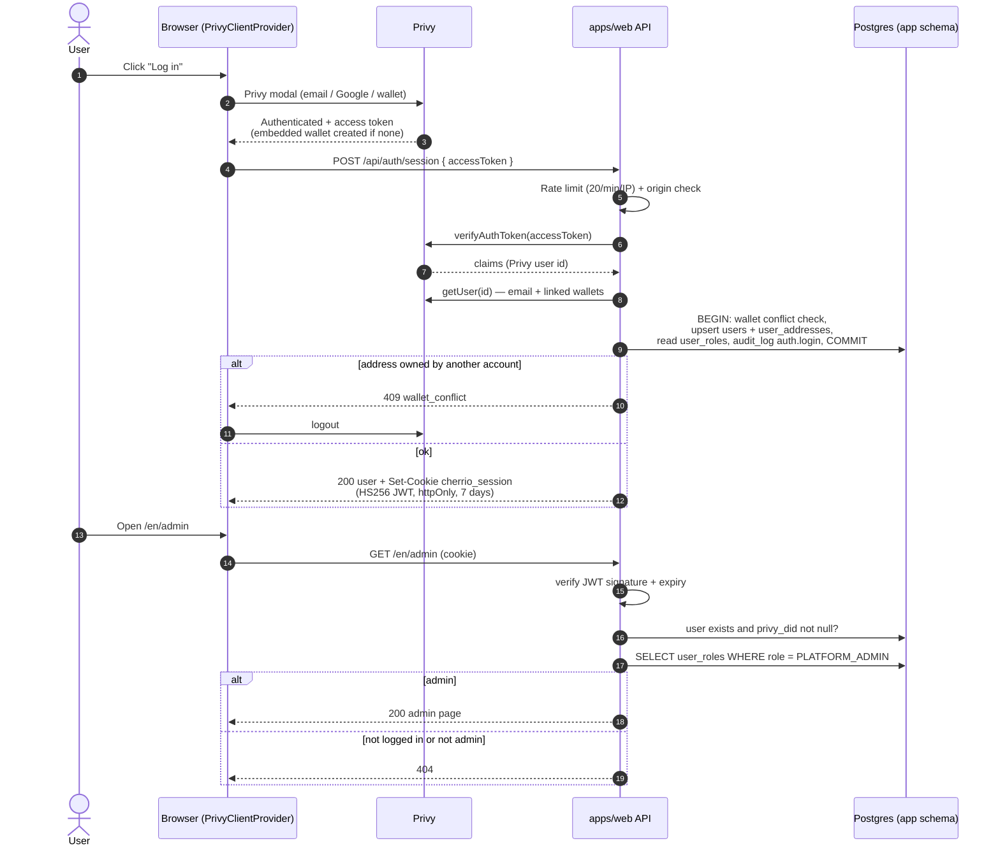

# 04 — Web app and authentication

The web app (`apps/web`) is a Next.js App Router application that serves the public site, the logged-in account area and the (placeholder) admin area for each environment. It uses next-intl for every user-facing string and the "brutal ledger" design system from `packages/ui`. Login is handled entirely by **Privy** (email, Google, external wallets): the browser obtains a Privy access token, the server verifies it once at `/api/auth/session`, creates or updates the user in Postgres, syncs the user's wallets from Privy server-side, and issues its own signed, httpOnly session cookie. Admin rights are never taken from the cookie; they are re-read from the database on every check. Today the landing page, login, the account page (profile, wallets, GDPR delete), the admin placeholder and the health endpoint are live on dev; the public campaign list and campaign pages read published campaigns and their donations (TASK-011a); Charity Market Cap and Emergency Pool pages are coming-soon placeholders.

Last updated: 2026-10-07

Status legend: **Live on dev** = running on https://dev.cherr.io · **Built (not deployed)** = code merged, not running on a server · **Planned** = described in docs, no code yet.

---

## 1. Application structure

Status: **Live on dev.**

| Path | What |
|---|---|
| `apps/web/src/app/[locale]/` | Localised pages (App Router, one `[locale]` segment) |
| `apps/web/src/app/api/` | Route handlers (not localised): `auth/*`, `health` |
| `apps/web/src/app/robots.txt/route.ts` | prod: `User-agent: *` `Allow: /` (search engines and AI crawlers may read public pages, David 2026-10-04); elsewhere `Disallow: /` for `*` and by name for AI crawlers (`src/lib/security/robots.ts`). The admin area is never listed (TASK-035) |
| `apps/web/src/middleware.ts` | next-intl locale routing for pages; skips `/api` and `/robots.txt`; adds `X-Robots-Tag: noindex, nofollow` on every non-prod response; on **every** environment adds `X-Robots-Tag: noindex, nofollow, noarchive, nosnippet` and `Cache-Control: private, no-store` to `/admin`, `/<locale>/admin/**` and `/api/admin/**` (`src/lib/security/admin-area.ts`, TASK-035) |
| `apps/web/src/app/[locale]/admin/layout.tsx` | One guard for the admin area (TASK-035): `requireRole("PLATFORM_ADMIN")` → `notFound()` before any admin page renders; `robots` metadata noindex. Every page keeps its own check |
| `apps/web/src/app/[locale]/not-found.tsx` + `[...rest]/page.tsx` | The one 404 page under a locale ("This page does not exist"): unknown URLs and the admin area for non-admins render the same page with the same status, so the admin area cannot be told apart from a missing page (TASK-035) |
| `apps/web/src/lib/auth/` | `session.ts` (JWT cookie, `getSession`, `requireUser`, `requireRole`), `privy.ts` (Privy server client), `user-helpers.ts` (default display name, wallet and email extraction) |
| `apps/web/src/lib/security/` | `origin.ts` (per-environment origin check), `rate-limit.ts` (in-memory sliding window, client IP) |
| `apps/web/src/lib/db.ts` | `getDb()` — pooled client via PgBouncer (`DATABASE_URL`); `getDirectDb()` — direct client (`DATABASE_URL_DIRECT`) for GDPR erasure |
| `apps/web/src/components/` | `AppHeader`, `AppFooter`, `ThemeToggle`, `ComingSoon`, `auth/PrivyClientProvider` |
| `apps/web/src/lib/campaigns/landing.ts` | Landing campaigns (TASK-037): hero = the live campaign whose deadline comes first, grid = the next live ones (max 4); since TASK-047 built on `listLiveCampaigns` (the first 5 live campaigns through the partial deadline index, same order as `/campaigns`) + `countPublicCampaigns` |
| `apps/web/src/components/campaigns/PublicCampaignCard.tsx` | One published campaign as a card, shared by `/campaigns` and the landing |
| `apps/web/messages/en.json` | All UI strings |
| `apps/web/scripts/check-design.ts` | `pnpm check:design` — fails on hard-coded hex colours, Tailwind `rounded-*` classes and non-intl JSX strings |

Build and runtime: Next.js 15 with `output: "standalone"`, React 19, Tailwind 4; workspace packages `@cherrio/ui`, `@cherrio/shared`, `@cherrio/db` are transpiled. Fonts (Archivo, Archivo Black, IBM Plex Mono) are self-hosted through `next/font`. The theme (light/dark) comes from a `theme` cookie rendered server-side as `data-theme`, so there is no flash. Images are built in GitHub Actions only and deployed with Kamal (service `cherrio-web-<env>`).

Sources: `apps/web/src/**`, `apps/web/next.config.mjs`, `apps/web/package.json`, `docs/tasks/TASK-007.feedback.md`, `docs/tasks/TASK-025.feedback.md`.

---

## 2. Internationalisation

Status: **Live on dev.**

- next-intl from day one, English only at launch (ADR-016). `src/i18n/routing.ts`: `locales: ["en"]`, `defaultLocale: "en"`; pages live under `/en/...`.
- `src/i18n/request.ts` loads `messages/<locale>.json`; unknown locales fall back to the default; the layout returns 404 for a locale not in the list.
- No hard-coded user-facing strings: plurals use ICU syntax (e.g. donor and days-left counts), and `check:design` flags JSX text and `aria-label` / `title` / `alt` / `placeholder` literals. Even database content uses message keys (`emergency_subpools.name_key`).

Sources: `apps/web/src/i18n/routing.ts`, `apps/web/src/i18n/request.ts`, `apps/web/src/app/[locale]/layout.tsx`, `apps/web/scripts/check-design.ts`, `docs/03-DECISIONS.md` (ADR-016).

---

## 2a. Display currency (ADR-040) — **Live on dev** (TASK-031, 2026-10-03)

Visitors can see amounts in another currency. This is display only: on-chain amounts, the database and all money logic stay in USDC (`bigint`, 6 decimals) and EUR targets (ADR-036).

| Part | How it works |
|---|---|
| Currencies | `packages/shared/src/display-currency.ts`: EUR plus 29 ECB currencies (fiat), and USDC, BTC, ETH, POL (crypto). Shown decimals: 2 (0 for JPY, KRW, ISK, HUF, IDR), BTC 8, ETH 6 |
| Selector | `components/CurrencySelect.tsx` in the header (desktop) and in the mobile menu (which closes after a choice): the design system's Select with the groups "Currencies" and "Crypto", accessible name "Currency". Fiat names from `Intl.DisplayNames`, crypto names from `messages/en.json` (`fx.crypto`). A choice calls `PUT /api/preferences/currency` and refreshes the page |
| Default | Without a cookie, the browser's languages decide (`navigator.languages` in the selector, `Accept-Language` on the server; both use `currencyForLanguages`). The first tag with a known region wins (`de-CH` → CHF, `sl-SI` → EUR, `en-GB` → GBP); then a language that means one currency (`ja` → JPY, `sl` → EUR); else USD |
| Choice | Cookie `cherrio_currency` (1 year, `SameSite=Lax`, `Secure` outside local, not httpOnly because the selector reads it; not secret). For a logged-in user also `users.display_currency`; at login (`POST /api/auth/session`) a stored choice is written into the cookie, so it follows the user to another device |
| Amounts | Server components `UsdcAmount` and `EurAmount` (`components/Amount.tsx`). In another currency they show "≈ CHF 11,265 (€12,000)": the converted value, then the exact original in brackets. **Converted values from 1,000 on are shown in whole units** (`formatCurrencyAmount`, `WHOLE_UNITS_FROM` in `lib/fx/display.ts`; David 2026-10-05, TASK-045 part 2) — "≈ 5,495,542 POL" instead of "≈ 5,495,542.06 POL"; below 1,000 the currency's decimals stay ("≈ 20.28 POL", "≈ 0.2200125 BTC"). The original in brackets is never rounded. In the original currency (EUR for a EUR target, USDC for a USDC amount) or without a usable rate, they show only the original. EUR is converted through USD with the current ECB rate (display only; an approved campaign's own snapshot is unchanged and shown separately). The math is `bigint` (rates × 10¹⁸, `usdc × 10³⁰ ÷ usdPerUnit18`), rounded half-up at the shown decimals; formatting uses `Intl.NumberFormat` with a decimal string, so no float is involved. Used today on the admin campaign list and detail (target, snapshot target) and on the organisation's campaign page; the public campaign pages (TASK-011) will use the same components |
| Rates | `lib/fx/sources.ts`, `lib/fx/rates.ts`. **ECB:** the daily file, all currencies (`ECB_RATES_URL` honoured only with `APP_ENV=local`). **CoinGecko:** `api.coingecko.com/api/v3/simple/price` for bitcoin, ethereum and polygon-ecosystem-token in USD, keyless (an optional `COINGECKO_DEMO_API_KEY` is sent as `x-cg-demo-api-key`; `COINGECKO_URL` only with `APP_ENV=local`). Prices are read from the JSON text as written (exponents handled), never through a float, and must lie in a sanity band (e.g. BTC 100 – 100,000,000 USD). USD and USDC are always 1 USD |
| Refresh | Lazy, when a page needs rates. ECB at most hourly, CoinGecko at most every 5 minutes; the fetch runs **after the response** (`after()` from `next/server`), so pages do not wait — except on first use, when the table is empty (5 s timeout per source). A failed fetch is logged (`[fx] … refresh failed`, message only) and retried after 60 s at the earliest per container; old values stay. Rows are cached 30 s per container (an empty table is never cached) |
| Staleness | A fiat rate whose ECB date is more than 7 days old, or a crypto price fetched more than 1 hour ago, is not used: the original amount is shown alone |
| Credit | Footer: "Exchange rates: ECB euro reference rates; crypto prices by CoinGecko. Converted amounts are approximate." |

Sources: ADR-040, `docs/tasks/TASK-031-display-currency.md`, `packages/shared/src/display-currency.ts`, `apps/web/src/lib/fx/*.ts`, `apps/web/src/components/{Amount,CurrencySelect}.tsx`, `apps/web/src/app/api/preferences/currency/route.ts`.

## 3. Design system "brutal ledger"

Status: **Live on dev.**

ADR-022 (rev. 2) defines one structure with two layers:

- **Structure everywhere:** square corners (radius 0), 3px ink borders, hard offset shadows, brand palette only, cherry-500 as the brand UI colour (ink text on it); state is shown by fill style + glyph + word, never colour alone.
- **v1.1 (ADR-041, TASK-032, Live on dev):**
  - Cherry for wayfinding: a 6px cherry top rule on the header, the active nav item (`aria-current`), eyebrows with a cherry dash, section headings with a cherry bar (`.ch-section-heading`, also on app page titles), key figures and links in `wayfinding-text`.
  - Section bands (`.ch-band-tint`, `.ch-band-raised`, full-bleed without page overflow); on the landing page: steps tint → campaigns ground → Charity Market Cap raised → Emergency Pool dark with a cherry edge.
  - Status colours (`success-*`, `warning-*`) only in chips, notices and the verified mark; the new chip `in-review` is used for campaigns in review and pending KYB applications.
  - Tokens: `cherry-50/100`, `success-700/50`, `warning-700/50`, `status-success-fill`, `on-status-success`, `wayfinding-text`. A test checks every text/background pair for WCAG AA in both themes.
  - Rules: `packages/ui/design-system/README.md`.
- **Human layer** (default, donors): full-colour photos, EUR without decimals, Archivo sans, sentence case, no Web3 words.
- **Proof layer** (`#proof`, ledger pages): IBM Plex Mono, USDC with 2 decimals, addresses, tx links. Every human-layer claim has a `ProofLink` to its evidence.

Implementation in `packages/ui`:

- `design-system/` — export of the design-system artifact (README, `tokens.json`, `tokens.css`, component specs, assets).
- `src/styles/` — `tokens.css` (generated), `theme.css`, `components.css`.
- `src/components/` — `Button`, `StatusChip`, `Field`, `Progress`, `ProofLink`, `CampaignCard`, `MilestoneTrack`, `VoteMeter`, `TrustScore`, `LedgerTable`, `Address`, plus restyled Radix primitives `Dialog`, `DropdownMenu`, `Select`, `Sheet`, `Tabs`, `Tooltip`, `Toast`.
- Light and dark themes; footer is always ink with the white wordmark; header swaps ink/white wordmark by CSS.
- Accessibility: Playwright + axe runs on all pages in both themes (TASK-007, TASK-025).
- **Campaign cards (TASK-045, Live on dev — PR #113):** `.ch-card-body` is one `minmax(0, 1fr)` grid column, so no figure can widen the card (before, "≈ 0.00 POL (0.00 USDC)" at 28px pushed the column and the progress bar past the card's right border). Converted amounts (`components/Amount.tsx` `Converted`) keep "≈ figure" and "(original)" each unbroken but let the original wrap under it. Cards use their own smaller scale — org 13px, title 19/24px, raised 20/24px, target 13px, meta 12px, bar 18px — the campaign page keeps the full scale. `Progress` renders no fill element at 0 % (its 3px right border showed as a stub). Guard: `e2e/campaign-card-layout.spec.ts`.
- **Page container (TASK-041, Live on dev — PR #106):** `.ch-container` (account, admin, organisation-form and notification pages) is `max-width: 1440px`, centred, with the same side gutters as the public pages — 64px, 24px at ≤ 1024px. Until TASK-041 the class was used by 21 pages but defined nowhere, so those pages ran from edge to edge. A Vitest guard (`src/__tests__/design-classes.test.ts`) fails when a component uses a `ch-*` class that `components.css` / `theme.css` does not define.

Sources: `docs/03-DECISIONS.md` (ADR-022), `packages/ui/design-system/README.md`, `packages/ui/src/**`, `docs/tasks/TASK-007.feedback.md`.

---

## 4. Pages

| Route | What | Status |
|---|---|---|
| `/en` | Landing page (demo campaigns show a "Demo" tag, TASK-038a), rendered per request (`force-dynamic`): hero with the live campaign whose deadline comes first (cover, progress, "Donate to this campaign" → campaign page, proof link → `#proof`), or "The first campaigns open soon" + "Start a campaign" when nothing is live; how it works; "Campaigns raising now" = the next live campaigns (max 4, same card as `/campaigns`) with an empty-state text (none / none live / only the hero) and "See all campaigns"; Charity Market Cap teaser without a ranking (no sample organisations until trust scores exist); Emergency Pool band. Ended campaigns only on `/campaigns`. The TASK-007 fixtures and the non-working cause filters are removed (TASK-037). | Live on dev (PR #97, Deploy run 37263699073) |
| `/en/account` | Profile (display name, anonymous-donations toggle), linked wallets (link, unlink, primary/type badges), **Add money** under the wallets when the user has a CHERR.IO smart account (**Live on dev**, TASK-036a, PR #95, Deploy run 37233679418, ADR-051 — `components/funding/AddMoney.tsx`; mode from `fundingModeFromEnv`: test network → Circle faucet link + the full smart-account address with a copy button; `FUNDING_ONRAMP=sandbox|production` → amount in whole euros, minimum 20 €, "Add money with a card" opens Privy's funding flow `useAddFunds` with USDC on Polygon to the smart account; mainnet with `off` → no box), "Delete my account" dialog. Redirects to `/en` when logged out | Live on dev |
| `/en/admin` | Admin home (**Live on dev**, TASK-029 §1; organisations tile and link added in §3): counts — organisations waiting for review, campaigns waiting for review, approved campaigns not yet published, live campaigns — with links to the KYB and campaign queues; the admin's user id. Reached from the header menu ("Admin", shown only to `PLATFORM_ADMIN`). **404** for anyone else (existence is hidden). Full admin panel: TASK-021 | Live on dev |
| `/en/organizations/new` | Organisation application form (**Built**, TASK-008b-2): organisation data, causes, payout address, and one upload slot per document (each file is uploaded on selection through `POST /api/files/kyb` and can be removed). Validated in the browser and on the server with the same zod schema; errors are shown per field. `?organization=<id>` prefills the form from the user's last rejected application ("Submit again"; register and number fixed). Redirects to `/en` when logged out | Built |
| `/en/account/organization` | The user's applications, one card per organisation: status (waiting for review / verified / not accepted), the reviewer's note and "Submit again" after a rejection, and "Register an organisation" when none is pending. Linked from `/en/account`. Redirects to `/en` when logged out | Built |
| `/en/admin/kyb` | KYB review queue (**Built**, TASK-008c-2): pending applications, oldest first — organisation, country, register and number, submitted at, claim or new. Linked from `/en/admin`. **404** for anyone who is not `PLATFORM_ADMIN` | Built |
| `/en/admin/kyb/[submissionId]` | One application: applicant (display name, email), the submitted data — next to what is on CHERR.IO now when they differ (claim, resubmission) —, the payout address in full (checksummed), documents (kind, size, short SHA-256, download through `GET /api/admin/files/:id`), earlier applications of the organisation with their notes, and the decision. **Approve** opens a dialog that shows the payout address and requires its last 6 characters; **Reject** requires a note (10–1,000 characters). **404** for non-admins | Built |
| `/en/account/campaigns` | Campaigns of the organisations the user administers, with status; "Start a campaign" when one of them is verified (**Live on dev**, TASK-010a). Redirects to `/en` when logged out | Live on dev |
| `/en/account/notifications` | **Email notifications** (**Live on dev** (TASK-033e part 3, PR #88, Deploy run 37220283985), ADR-048): where emails go now ("Emails go to …" / "no address" / "switched off"), the on/off switch, the login email, and a contact address with double opt-in ("Leave an email" for wallet-only users; "Another address" otherwise; **"Change address"** once a contact address is confirmed — entering that same address again answers `same_as_contact` and sends no link (**Live on dev**, TASK-033f, PR #93, Deploy run 37229731748); pending link valid 24 h; remove); **Proof of Charity points** (status, reward, votes). Linked from `/en/account` and, when no email would be sent, from "My donations". Redirects to `/en` when logged out | Live on dev |
| `/en/notifications/confirmed`, `/en/notifications/unsubscribe` | Pages behind the email links (**Live on dev** (TASK-033e part 3, PR #88, Deploy run 37220283985)), `noindex`: the result of a confirmation (`?ok=1` / `0`); "Stop emails from CHERR.IO" with a button — opening the link changes nothing (link scanners), the button POSTs the token | Live on dev |
| `/en/account/donations` | "My donations" (**Live on dev**, TASK-033b part 3b, PR #79, Deploy run 37201641944): campaigns the user's addresses gave to, state, amount per address and the next step (vote, refund, pool) linking to the campaign's lifecycle panel; "N votes are waiting". Redirects to `/en` when logged out | Live on dev |
| `/en/account/campaigns/new`, `/en/account/campaigns/[id]` | Campaign draft form: organisation, title, story (plain text), cause, country, target in whole euros, duration; after the first save also the cover image and "Submit for review". Editable only as `DRAFT` or `REJECTED` (with the reviewer's note); otherwise a read-only view with the status. A campaign of an organisation the user does not administer is a 404. **Built** (TASK-030): a "Photos, videos and documents" section in every status — add/remove gallery images (up to 10), YouTube/Vimeo links (up to 3) and PDFs (up to 5, ≤ 20 MB); a note says everything is public at once. **Live on dev** (TASK-033c part 2, PR #81, Deploy run 37205432138): once `DEPLOYED`, the lifecycle panel (state + "Finish the campaign" / "Pay out" / "Count the votes", the same component as on the campaign page) and **"Evidence for donors"** (`EvidenceManager.tsx`) — for the open round: public note, up to 10 files with Private/Public choice, list with download (private, audited) / open (public) / remove, "Seal and submit to the blockchain" (seal → `submitEvidence(bundleHash)` from the payout wallet; "Connect the campaign's payout wallet (0x…)" when it is not connected); a sealed draft offers "Submit to the blockchain" and "Reopen to make changes"; then "Submitted evidence" per round with "On the blockchain" and the fingerprint | Live on dev |
| `/en/admin/campaigns` | All campaigns (**Built**, TASK-029 §3): tabs Waiting for review (default, oldest submission first), Approved — waiting to be published (oldest approval first, with "not published yet" / "transaction sent"), Live, Not accepted, Drafts, All — each with its count; search by title or organisation; country filter; 50 per page with keyset pagination ("Next page" / "First page"). Filter state lives in the URL. Links to the campaign and to its organisation. **404** for anyone who is not `PLATFORM_ADMIN` | Built |
| `/en/admin/guardian` | **Chain actions** (**Live on dev**, TASK-033d part 2, PR #84, Deploy run 37214386912): deployed campaigns waiting for CHERR.IO on chain — SUCCEEDED without a payout plan ("Set the payout plan"), NEEDS_REVIEW ("Decide the vote"), FROZEN ("Frozen — unfreeze or reject"), and the **manual fallbacks** (**Live on dev**, TASK-033f, PR #93, Deploy run 37229731748, ADR-050): LIVE 7 days past the deadline ("Finish — nobody did for 7 days"), VOTING 7 days past `voteEnd` ("Count the votes — nobody did for 7 days"), FAILED/REJECTED not swept after `settlementStart + snap_refund_sweep_delay` ("Move unclaimed refunds to the Emergency Pool") — oldest due first (`loadGuardianQueue(db, now)`), linking to the campaign's `#chain-actions`. A tile "Campaigns waiting for a chain action" and a button on `/en/admin` ("—" while the indexer views are missing). **404** for non-admins | Live on dev |
| `/en/admin/organizations` | All organisations (**Built**, TASK-029 §3): tabs by verification status with counts; search by name, legal name or register number (literal, case-insensitive); source and country filters; campaign count per organisation; 50 per page, keyset pagination; state in the URL. **404** for non-admins | Built |
| `/en/admin/organizations/[id]` | One organisation: data (incl. checksummed payout address), members with role and email, verification applications (links to `/en/admin/kyb/[id]`), campaigns (links). **404** for non-admins | Built |
| `/en/admin/campaigns/[id]` | One submitted campaign: organisation (or "Individual (Cherrion) — no organisation" for a campaign with `org_id` null; list and page use a left join since fix PR #112) and starter, all fields, the payout address that will be copied (full, checksummed), cover image, **media** (**Built**, TASK-030: gallery, video links and PDFs, each with a "Remove" button behind a confirmation dialog — a takedown), story (escaped plain text); after approval the snapshot (ECB rate, rate date, target in USDC, beneficiary, offchain id), then **Publish on Polygon** (**Live on dev**, TASK-010c): "Publish on Polygon" signs with the operator wallet connected through Privy, "Check status" links; once `DEPLOYED`, the contract address, transaction and time with a link to the block explorer. Loading the page links an approved campaign the indexer already has. **Approve** opens a confirmation dialog with the payout address; **Reject** requires a note (10–1,000 characters). Drafts are visible to admins too (read-only; decisions only for `PENDING_REVIEW`). **On the blockchain — CHERR.IO actions** (**Live on dev**, TASK-033d part 2, PR #84, Deploy run 37214386912), once `DEPLOYED`: the indexed state, payout plan, raised / paid out, payments made and, for a vote, turnout vs. the campaign's own quorum and the yes share; `GuardianPanel.tsx` with the admin's connected wallets and their Operator/Guardian roles (read through `/api/rpc`), **Set the payout plan** (suggestion from `suggestPayoutMode`, one payment disabled for individuals, optional note), **Decide the vote** / **Frozen campaign** (`resolve(true|false)`, note required; on FROZEN the approve button is "Unfreeze — continue where it stopped"), **Freeze the campaign** (note + confirmation), **CHERR.IO steps in** (**Live on dev**, TASK-033f, PR #93, Deploy run 37229731748, ADR-050: the one due fallback — **Finish the campaign** / **Count the votes** / **Move to the Emergency Pool** (confirmation required) — from `dueFallbacks`; no role, the first connected admin wallet signs; note optional); each action: note → `POST …/chain-actions`, wallet signs (`sendLifecycle`), hash → `POST …/chain-actions/sent`, receipt, refresh. Below: the fundraiser's evidence of every round (`listAdminEvidence`; private files via the audited `GET /api/admin/files/:id`) and **Notes and transactions** (`listChainActionLog`). **404** for non-admins | Live on dev |
| `/en/admin/demo` | **Demo campaigns** (TASK-038a/040a, ADR-052/053; only when `APP_ENV` is `local` or `dev` — **404** on uat/prod and for non-admins; linked from `/en/admin` only where allowed): form "Create demo organisations and campaigns" (new demo organisations 0–5, campaigns per organisation 1–5, at most 10 per batch, state approved / in review, payout wallet = the admin's own test wallet, duration mixed 1/3/7/14/21/30 days or all 1 day) → `POST /api/admin/demo-campaigns`; list of demo campaigns with organisation, duration, cover and status (in review → open to approve / waiting to be published / publishing / published → public page), each linking to `/en/admin/campaigns/[id]` where "Publish on Polygon" works as for any approved campaign. **Publish all** (TASK-038c): "Publish all N demo campaigns" (the oldest-first list's first 10 `APPROVED` demo campaigns) runs the shared browser flow `lib/campaigns/publish-flow.ts` (`publishFlow`: prepare → operator wallet → `createCampaign` → `…/publish/sent` → receipt → link, the same flow as the single button, which now uses it too) for one campaign after another; the operator wallet is found once per round (`publishBatch`); a rejected signature or no operator wallet stops the round, other failures are listed and the next campaign follows; progress "Campaign 2 of 5 — <title>: Confirm in your wallet…" and a summary. **Covers** (TASK-038b): right after a batch is created the form generates a cover for each new campaign, one after another ("Generating cover 2 of 5 with FLUX.2 [pro] on fal.ai…"), with the model chosen in the form under **Cover images** — FLUX.2 [pro] (default, cheaper) or Nano Banana Pro (TASK-043); the same choice sits above "Generate N missing covers"; the list shows a Cover column and a "Generate N missing covers" button; without `FAL_KEY` the page says covers are not set up and campaigns stay without a cover | Live on dev (038a: PR #98, Deploy run 37265306067; 038b: PR #100, Deploy run 37266417255; 038c: PR #101, Deploy run 37267484818) |
| `/en/admin/emergency-pool` | **Emergency Pool sub-pools** (TASK-046; **404** for non-admins; button "Emergency Pool sub-pools" on `/en/admin`): table of `app.emergency_subpools` left-joined with `chain.pool` (`loadSubpools`, `lib/admin/subpools.ts`) — theme name (`pool.<slug>.name`), id, "On the blockchain" Yes / Not yet, balance in USDC; "N themes are not on the blockchain yet". For each missing theme (id > 0) a row with **"Create on the blockchain"** (accessible name "Create “<theme>” on the blockchain"): the Operator's external wallet (`AdminWalletGate`, roles read through `/api/rpc`) sends `EmergencyPool.createSubPool(id)` after a simulation (`sendCreateSubPool`, `lib/admin/subpool-client.ts`; `PoolAlreadyExists` → "already done", `NotOperator` → "not the Operator"), then `POST /api/admin/emergency-pool/subpools/sent` records it; the table shows the pool once the indexer has seen `SubPoolCreated` (about a minute). No Operator wallet → "Creating a sub-pool needs the Operator role…". The EmergencyPool address comes from the deployment (`emergencyPoolAddress`; `LOCAL_EMERGENCY_POOL_ADDRESS` on local). Without the indexer views: "The blockchain data is not available right now" | Live on dev (TASK-046, PR #117; after sending, the theme shows "Sent — waiting for the indexer" until the table shows it — fix #119) |
| `/en/admin/contracts` | **Live on dev** (TASK-034b, PR #71, ADR-046): contract admin console. Shows network, PlatformConfig and timelock addresses, the timelock delay, the connected wallets' roles (proposer / executor / canceller on the timelock, operator / guardian on PlatformConfig), every PlatformConfig value in human units with the raw on-chain value; a form with the contract's bounds (percent, number + minutes/hours/days, USDC, address) → review table (now → new, human + raw) → `scheduleBatch` signed in the admin's wallet → recorded via `POST /api/admin/contracts/changes`; scheduled changes with their on-chain state (waiting until … / ready / done / unset) → Apply (`executeBatch`) or Cancel; history. Reads in the browser through `/api/rpc` (no server-side chain reads, ADR-026) — including the role check, the fee estimate and the receipt wait around each write, so the admin's wallet answers only `eth_chainId` and `eth_sendTransaction` (PR #73, Live on dev 2026-10-04, Deploy run 37191159969: MetaMask's Amoy RPC failed these reads on dev and the console showed "Something went wrong" before MetaMask opened). A receipt that cannot be read in time shows "Transaction sent, but its confirmation could not be read yet" instead of an error, and the list is reloaded; every failed write is logged as `[contracts] write` in the browser console; without a proposer wallet the review offers a Safe Transaction Builder JSON. Linked from the admin home. `APP_ENV=local` uses `LOCAL_TIMELOCK_ADDRESS` + `LOCAL_PLATFORM_CONFIG_ADDRESS` (E2E). Owner guide: `docs/guides/owner/` | Live on dev |
| `/en/dev/ui` | Component gallery; renders only when `APP_ENV` is `local` or `dev`, 404 on uat/prod | Live on dev |
| `/en/campaigns` | Public campaign list (**Live on dev**, TASK-011a, PR #50): every `DEPLOYED` campaign with a linked contract as a `CampaignCard` (cover, organisation + verified mark, state chip, raised vs target in the display currency, donors, days left). Live campaigns first (soonest deadline), then ended ones (latest end). 24 per page, `?page=` (clamped). A notice replaces the figures when the `chain` views are missing. **Filters (TASK-039 Live on dev; shop-style layout TASK-042 Built):** `?cause=` and `?country=`, each repeatable (`?country=SI&country=HR`, also `a,b`); several values in one group match any of them, the two groups combine; unknown values are ignored (max 50 per group). Wide screens: a sticky **sidebar** "Filters" (`components/campaigns/CampaignFilters.tsx`) with collapsible groups (`
`, open by default, a badge with the number chosen) of checkboxes with counts — options sorted by count, the first 6 shown plus every chosen one, "Show all N" / "Show fewer", a search box (accent-insensitive) when a group has more than 8 options, so hundreds of causes or countries stay usable (`lib/campaigns/filter-options.ts`). A tick changes at once (local state) and replaces the URL (`router.replace`, no scroll); the server renders the new list. Without JavaScript the form submits with "Apply". At ≤ 1024px the sidebar is replaced by a **"Filters (n)" button** that opens the same groups in a bottom sheet (`Sheet side="bottom"`) with "Clear all" and "Show N campaigns". Above the results: the count and the **active filters as removable tags** ("Remove filter: Slovenia") + "Clear all". Facets: cause counts within the chosen countries, country counts within the chosen causes. No match → "No campaigns match these filters." + "Show all campaigns". The pager keeps the filters | Live on dev (filters: PR #105, Deploy 37275960895) |
| `/en/campaigns/[slug]` | Campaign page (**Live on dev**, TASK-011a, PR #50), layout per the design system: cover, title and story (8 columns; grid areas `main`/`story`, since 2026-10-03 the story sits beside the panel) + sticky panel (4 columns: cherry key figure = raised, "raised of the … target" line, Progress bar with the 10 % line but **no figures row** (since 2026-10-03, David's option A: the raised amount is shown once), meta "N% raised · donors · days left", ProofLink to `#proof`); state chip, organisation, cause, country, title; story (plain text), gallery, videos (`youtube-nocookie.com` / Vimeo `dnt=1` iframes, ADR-039), public PDFs; "How your money is protected" (tint band: escrow, 10 % rule, payout rule by `payout_mode`); `#proof` "Every donation, on the blockchain": contract `Address` + explorer link and a `LedgerTable` of donations (newest first, 50 per page, `?donations=`) with the donor per ADR-043 (display name, "Anonymous" when `anonymous_donations`, otherwise a short address), USDC amount, UTC time and the tx link. `generateMetadata`: title, description (story, 160 chars), `og:image` cover. 404 for unknown slugs and campaigns that are not `DEPLOYED`. The donate panel (TASK-011b, below) sits in the sticky panel while the campaign is live **Evidence (Live on dev, TASK-033c part 3, PR #82, Deploy run 37206528284, ADR-047):** once a round's hash is on chain, a section `#evidence` "How the money was used" per round — note, public files (open), private files as type, size and SHA-256 only (no link), the fingerprint and a link to `GET /api/evidence/:bundleId/manifest`; drafts never show; the lifecycle panel links "See the evidence" while a vote is open or in review. **Add money (Live on dev, TASK-036a, PR #95, Deploy run 37233679418):** when a CHERR.IO wallet (smart account) holds too little USDC for the donation, the panel shows the "Add money" box under the error (faucet on test networks; card top-up with a suggested amount = missing EUR + 5 %, at least 20 €, when the onramp is on). | Live on dev |
| `/en/licences` | Licences and third-party notices (**Built**, 2026-10-03): our code is MIT, the brand is excluded, plus the notices the Reown/WalletConnect and MetaMask SDK licences require, with links to the licence texts and `THIRD_PARTY_NOTICES.md`. Linked from the footer ("Licences"). Texts: `messages/en.json` → `licences.*` | Built |
| `/en/terms`, `/en/privacy` | Terms of Service and Privacy Policy (**Live on dev**, TASK-044, PR #109, Deploy 37291440690, ADR-054): `components/legal/LegalPage.tsx` renders `legal.<doc>` from next-intl (sections via `t.raw`), shows "Last updated" and a **draft 0.1 notice (under legal review)**; linked from the footer. Version and date: `LEGAL_VERSION` / `LEGAL_DATE` | Live on dev |
| `/en/charity-market-cap` | Coming soon | Placeholder |
| `/en/emergency-pool` | Coming soon | Placeholder |
| `/en/how-it-works` | Coming soon (the header link points to the landing section `#how-it-works`) | Placeholder |
| `/en/about` | Coming soon | Placeholder |
| `/en/docs` | Coming soon | Placeholder |
| Org pages, public API `/api/v1/*` (OpenAPI), `llms.txt`, sitemap | Described in Architecture §4.1 | Planned |

The campaign pages read the indexer's `chain.*` views through `apps/web/src/lib/campaigns/public.ts` (see `03-data-and-indexer.md` §2.5). The list filters (TASK-039) are `parseCampaignFilters` (URL → validated `{ cause?, country? }`), `listPublicCampaigns(db, { page, cause, country })` (the filter goes into the count, the chain query and the app-only fallback alike) and `listCampaignFacets(db, filters)` (two `group by` queries over `app.campaigns`, no chain data).

Component changes for these pages (TASK-011a): `CampaignCard` gets `href` (the whole card is one link via a stretched title link; hover shift, focus ring) and `children` (replace the built-in Progress); `Progress` gets `raisedLabel` / `targetLabel` / `barLabel` (and, since 2026-10-03, `showFigures` — `false` hides the raised/target row where those figures are already shown, as on the campaign panel) so the server passes `UsdcAmount` / `EurAmount` (the bar ratio stays USDC raised / USDC target); `LedgerTable` gets `fromDisplay` per row (a name instead of the truncated address), `txAriaLabel`, `explorerBase: null` (no links on a local chain) and is now a focusable, named scroll region (`regionLabel`; fixes the keyboard-scroll axe finding). Texts: `messages/en.json` → `campaignPage.*`.

### 4.1 Donate panel (Live on dev, TASK-011b, PR #55)

Shown inside the campaign panel only while the on-chain state is `LIVE` and the deadline has not passed (`state === "live"`). Client component `components/campaigns/DonatePanel.tsx`; rules in two pure modules with unit tests:

- **Amount** (`lib/campaigns/donate.ts`): a field in **EUR** (quick amounts €10 / €25 / €50 / €100, default €25) converted to USDC with the display rate for EUR (`app.fx_rates`, ADR-040), `bigint` and rounded down (`cents × 10⁴ × usdPerEur18 ÷ 10¹⁸`). Without a usable EUR rate the field is in USDC. Minimum €1 and 1 USDC ("The minimum donation is €1."). Above what the campaign still needs, the panel says "only N USDC will be taken": it **approves exactly that amount** and passes the typed amount to `donate()` (the contract checks the minimum against the passed amount and clips the transfer). "Details" shows the exact USDC amount, the rate, the minimum and the network-fee note.
- **Failure preference**: "Refund to me" (default) or "Send it to the Emergency Pool" with an optional theme (`listDonationThemes`; "Wherever it is needed most" = pool 0).
- **Wallet**: through Privy (`useWallets`): an external wallet first, else the embedded wallet. Logged out → the button reads "Log in to donate" and opens the Privy login. No wallet → a notice. Without Privy (CI, local) the panel says donating is unavailable — except that with `APP_ENV=local` a Playwright test may inject a fake EIP-1193 wallet on `window.__cherrioE2eWallet` (ignored in every deployed environment).
- **Transaction** (`lib/campaigns/donate-client.ts`, viem over the wallet's provider, no RPC key on the server): switch chain → check chain id, `state() == LIVE`, deadline → read `config()`, `usdc()`, `minDonation()`, `remaining()` → USDC `balanceOf` / `allowance` → `approve(campaign, exact)` only when the allowance is lower (waits for the receipt) → `donate(amount, pref, subPoolId)` → wait for the receipt → success with a ProofLink to the transaction; the page refreshes (`router.refresh()`), the new ledger row appears once the indexer has it. Fees: Polygon minimum tip 30 gwei (`polygonFees`). **Never an unlimited approve** (`approvalAmount()`, pinned by a test).
- **Errors** map to fixable messages: wrong network, campaign ended, below minimum, not enough USDC (on a testnet with a link to Circle's faucet), no POL for the fee, cancelled in the wallet, timeout (the transaction link stays visible), rejected by the chain.
- **"Your donation"** (logged in, wallet ready): `GET /api/donations/[campaign]` → total over the user's linked addresses and the current preference; "Change" calls `setPreference(pref, subPoolId)` from the wallet that donated (another wallet → "connect the wallet you donated with").
- **Mobile** (≤ 640 px): a fixed cherry bottom bar "Donate to this campaign" jumps to `#donate`. Converted amounts in the panel may wrap (they used to widen the page on a phone). A Field's input shrinks with its column (`.ch-field` uses `minmax(0, 1fr)`; it used to stick out of the panel in a ~1000 px window). An external wallet shows two prompts per donation (approve, then donate); TASK-011c makes it one for CHERR.IO wallets.
- External wallets pay their own gas in POL; wallets created by CHERR.IO donate through a sponsored smart account (§4.2). Texts: `campaignPage.donate.*`, `campaignPage.yourDonation.*`, `pool.*`.

### 4.2 Smart account and sponsored gas (Live on dev — TASK-011c, PR #63, Deploy run 37143720768; proven 2026-10-04: David's sponsored donation from a Google/email login, tx `0x9ce75d63…`)

For a user whose wallet was **created by CHERR.IO** (Privy embedded wallet, email/Google login) the donor address is the wallet's **ERC-4337 smart account** (Privy smart wallets, type "Alchemy smart wallets"), and the network fee is paid by the Alchemy Gas Manager policy. Users with an external wallet keep §4.1 unchanged (two prompts, own POL).

- **Browser RPC = our own origin (since PR #65):** the chain passed to Privy uses `https://<env host>/api/rpc` as its RPC. Privy's smart-wallet client computes the account address with an `eth_call` (`getSenderAddress` on EntryPoint v0.6) through the chain RPC; with the public `rpc-amoy.polygon.technology` that call failed in the browser (CORS / network error), so no smart account was ever created and the panel fell back to the embedded wallet after 8 s (David's test, 2026-10-03). `POST /api/rpc` (`lib/chain/rpc-proxy.ts`) forwards **read-only** methods (`eth_call`, `eth_getCode`, `eth_estimateGas`, fee and receipt reads … — no `eth_sendRawTransaction`, no `eth_getLogs`) to the first working upstream: optional `RPC_URL`, then publicnode, then the official Polygon RPC (network error, timeout or 5xx → next); only our own origin (`verifyOrigin`), 300 calls/min per IP, ≤ 20 calls per batch, body ≤ 64 KB; upstream URLs never appear in responses.
- **Provider:** `PrivyClientProvider` wraps the app in `SmartWalletsProvider` (`@privy-io/react-auth/smart-wallets`, peer `permissionless`). The bundler URL, the paymaster URL and the Gas Manager policy ID live in the **Privy dashboard** of each Privy app, not in code or env — no new env var.
- **Which account donates** (`PrivyDonate` in `DonatePanel.tsx`): an external wallet first; otherwise the smart account from `useSmartWallets().client`. Privy creates the smart account a moment after login; until then the panel says "Preparing your wallet…" for up to 8 s (`SMART_ACCOUNT_WAIT_MS`), then falls back to the embedded wallet itself (§4.1, needs POL) — this only happens when smart wallets are not enabled for the Privy app.
- **One step:** `donateWithSmartAccount()` (`lib/campaigns/donate-client.ts`) runs the same checks as §4.1 (shared `prepareDonation()`: chain, LIVE + deadline, minimum, what will be taken, USDC balance **of the smart account**, allowance) through the embedded wallet's EIP-1193 provider (reads only), then sends `[approve(campaign, exact)?, donate(amount, pref, subPoolId)]` as **one user operation** (`smartWalletClient.sendTransaction({ calls })`); approve is left out when the allowance already covers the amount. Still never an unlimited approve (`approvalAmount()`). The step text reads "Confirm your donation — one step, no network fee…"; "Details" says "No network fee: CHERR.IO pays it for wallets created here." "Change" in "Your donation" sends `setPreference` as a sponsored user operation too.
- **Sponsorship refused** (policy limit reached, policy off, or "AA21 didn't pay prefund"): `toDonateFailure()` → `sponsorship_refused` → "The free network fee is not available right now. Nothing was taken. Please try again later, or donate from a wallet of your own." The spec's "offer the non-sponsored path if the account holds POL" is **not built** (see TASK-011c feedback, deviations).
- **Not enough USDC** in the smart account → the message names the donation account's address (and links Circle's faucet on a testnet): USDC must be sent to the smart account, not to the embedded signer.
- **Address sync:** Privy lists the smart account as a `smart_wallet` linked account (its React SDK links it with a signed message right after creating the client). `extractWalletsFromPrivyUser()` stores it as `SMART_ACCOUNT` in `app.user_addresses` (read server-side from Privy, never from the browser). `WalletSync` in the provider (`lib/auth/wallet-sync.ts`, since PR #65) compares every wallet and smart-wallet address Privy reports in the browser (plus the smart-account client's address) with the stored ones and calls `POST /api/auth/wallets/sync` when one is missing — tries at 0, 2, 5, 10, 20 s per set of missing addresses, starting again when Privy links the smart account. This also adds the **embedded wallet** that Privy creates seconds after a first login (before, the account page needed a reload). The donor list (ADR-043) and "Your donation" then find donations from it.
- **Account page:** while Privy is still creating them it says "Your wallet is being created…" / "Your donation account is being prepared…" and the rows appear without a reload; the smart account shows the badge "Donation account" with "Your donations come from this address. To donate, send USDC on Polygon here — CHERR.IO pays the network fee."; the embedded signer (when a smart account exists) says "Signs for your donation account. Do not send money to this address."
- **E2E:** the fake wallet on `window.__cherrioE2eWallet` gets an optional `sendCalls` (honoured only with `APP_ENV=local`) so the smart-account path is tested end to end with a mocked bundler.

**My donations (Live on dev, TASK-033b part 3b, PR #79, Deploy run 37201641944)** — `/[locale]/account/donations` (session; redirects to the home page without one): `listMyCampaignDonations` → per campaign title (link), public state chip and, per own address, "X USDC from 0x…" with the next step (Vote now / Get your money back (amount) / Send … to the Emergency Pool → links to the campaign's `#lifecycle` panel, where the action happens; or "You voted yes/no", "Settled"); a "N votes are waiting" notice. Header (`AppHeader.tsx`): account menu entry "My donations" and, for a logged-in user, a "● N" count on the account button (screen readers: "N votes waiting") from `GET /api/me/donations`, fetched on login and on each navigation.

**Lifecycle panel (Live on dev, TASK-033b part 3a, PR #78, Deploy run 37200474703)** — `components/campaigns/LifecyclePanel.tsx` replaces the donate panel on the campaign page once the campaign is past LIVE (or LIVE past its deadline). Server-side `loadLifecycle` → `lifecycleJson` as the first render; the client then loads `GET /api/lifecycle/:campaign` (with the caller's positions) and refreshes it every 5 s for up to 2 min after a confirmed transaction (indexer lag), then `router.refresh()`. Stages from `lib/campaigns/lifecycle-view.ts` `panelView`: ending → "Finish the campaign"; awaiting-plan; release-wait (with "Payout possible from …") / release-due → "Pay out"; voting (vote end, turnout vs. the campaign's **own** quorum, yes share vs. its approval; per own address Approve payment N / Reject, or "You voted …") / vote-over → "Count the votes"; needs-review; paying; completed; failed / rejected (per own address "Get your money back (amount)" or "Send … to the Emergency Pool", or "Done"); frozen. Signers (`components/campaigns/lifecycle-signers.ts`): every connected external wallet plus the CHERR.IO smart account (sponsored `sendCalls`); a donor action is offered only from the address that donated ("connect the wallet you donated with (0x…)" otherwise); finalize / closeVote / release from any signer, the smart account first. Reads and simulations through `/api/rpc` (`retryCount: 0`); the E2E wallet locally. Addresses shown checksummed.

**Lifecycle actions (Built, TASK-033b part 2; `submitEvidence` TASK-033c part 2)** — `lib/campaigns/lifecycle-client.ts` `sendLifecycle(provider, account, {chainId, campaign, action}, {reader?, sendCalls?})` for `vote(approve)`, `claimRefund`, `settleToPool(donor)`, `finalize`, `closeVote`, `release`, `submitEvidence(bundleHash)` (beneficiary only; `NotBeneficiary` → `not_beneficiary`, `NotPaying` → `already_done`): checks the wallet's chain, **simulates the call from the sending address** through the reader (the app passes its `/api/rpc` client; PR #73 lesson), so a call the contract would refuse never reaches the wallet; then a smart account sends one sponsored user operation (`sendCalls`), an external wallet `writeContract` with Polygon fees. Reverts map to fixable codes (`not_due`, `already_done`, `vote_ended`, `already_voted`, `not_a_donor`, `already_settled`, `wrong_preference`, `swept`, `payout_mode_not_set`, `frozen`, …). Votes, refunds and pool settlements must come from the address that donated (ADR-008). No transport retries on the wallet client (a revert is final). **Admin chain actions (Live on dev, TASK-033d part 1, PR #83):** the same helper sends `setPayoutMode(mode)` (operator), `resolve(approve)` and `freeze()` (Guardian) from the admin's wallet; `NotOperator` → `not_operator`, `NotGuardian` → `not_guardian`, `IndividualCannotBeSingle` → `individual_single`, `PayoutModeAlreadySet` / `CannotFreeze` / `CannotResolve` → `already_done`. `resolve` keeps its own refusal on a frozen campaign (it is the call meant for that state) instead of the generic `frozen`. **Manual fallback (Live on dev, TASK-033f, PR #93):** `sweepUnclaimed()`; `SweepDelayNotReached` → `not_due`, `PoolNotConfigured` → `pool_not_configured`.

Sources (donate panel): `apps/web/src/components/campaigns/DonatePanel.tsx`, `apps/web/src/lib/campaigns/{donate,donate-client}.ts`, `apps/web/src/app/api/donations/[campaign]/route.ts`, `docs/tasks/TASK-011b.feedback.md`.

Sources (campaign pages): `apps/web/src/app/[locale]/campaigns/page.tsx`, `[slug]/page.tsx`, `apps/web/src/lib/campaigns/public.ts`, `apps/web/src/components/campaigns/public-display.ts`, `packages/ui/src/components/{CampaignCard,Progress,LedgerTable}.tsx`, `docs/tasks/TASK-011a.feedback.md`, `docs/tasks/TASK-039.feedback.md`.

The organisation pages use three components added to `packages/ui` for them — `Textarea`, `CheckboxGroup` and `FileField` (tokens only, 3px ink border, radius 0; READMEs in `packages/ui/design-system/components/`). Country is chosen with a searchable select (`apps/web/src/components/SearchableSelect.tsx`: ARIA combobox, type to filter, accents ignored, the ISO code also matches; no new dependency). Forms and account/admin sections use `.ch-panel` (full-width bordered box); `.ch-card` is only the 360 px campaign card. After a failed submit the first invalid field is focused and a summary ("Please fix the N fields marked above.") appears at the button. Moments in time are shown in the viewer's time zone (`LocalDateTime`: UTC on the server render, the browser's zone after mounting); the ECB rate date stays a UTC day. After logout on `/account`, `/admin` or `/organizations/new` the browser goes to the home page. Admin lists share `apps/web/src/lib/admin/listing.ts`: the cursor is the sort timestamp as UTC text with microseconds (Postgres precision; a JS Date would lose it and skip or repeat rows that share a millisecond) plus the row id as the tie-breaker; a malformed cursor in the URL shows the first page; search text is escaped for ILIKE. Header menu for a logged-in user: My account, My organisation, My campaigns, and Admin for `PLATFORM_ADMIN`. Country names come from `Intl.DisplayNames` in the page's locale; every other text is in `messages/en.json` (`organizations.form.*`, `account.organization.*`).

Sources: `apps/web/src/app/[locale]/**`, `apps/web/src/components/AppHeader.tsx`, `apps/web/src/components/ComingSoon.tsx`, `docs/tasks/TASK-025.feedback.md`, `docs/CHEATSHEET.md` §1, `docs/02-ARCHITECTURE.md` §4.1.

---

## 5. Authentication (ADR-024)

Status: **Live on dev** (TASK-025, live on dev 2026-10-01). ADR-024 supersedes the RainbowKit / SIWE / Auth.js parts of ADR-003 and of Architecture §3.

### 5.1 Login in the browser

- `PrivyClientProvider` wraps the app in `[locale]/layout.tsx`. The **Privy App ID is read at runtime** on the server (`PRIVY_APP_ID`) and passed to the client provider — it is not baked into the image, so one image per commit works in any environment. Without an App ID (CI, local tests) the provider renders an "unavailable" auth context.
- Login methods, in this order: **email, Google, wallet** (MetaMask, detected wallets, Coinbase Wallet, Rainbow, WalletConnect; Privy performs SIWE for external wallets). Default and only supported chain: Polygon Amoy on dev/uat, Polygon mainnet on prod.
- **Terms and Privacy at sign-in (TASK-050, ADR-054):** `PrivyProvider` gets `legal: privyLegalConfig(window.location.origin, locale)` (`lib/auth/legal-links.ts`), so the Privy window's footer shows Privy's own line with links to `<origin>/<locale>/terms` and `<origin>/<locale>/privacy` of the current environment (overrides the Privy dashboard setting). The sentence is Privy's English text, not next-intl. Which Terms version a user accepted is not recorded. Built — PR pending.
- An **embedded wallet** is created on login for users without a wallet (`createOnLogin: "users-without-wallets"`). Its ERC-4337 smart account (Privy smart wallets) is the donor address, with gas sponsored by the Alchemy Gas Manager policy (§4.2, TASK-011c).
- When Privy reports an authenticated user, the provider calls `POST /api/auth/session` with the Privy access token (once per Privy user id). If the server refuses (401/403/409/429/500) it logs Privy out again and shows a toast, so Privy and the app never disagree about being logged in. Logging out calls `DELETE /api/auth/session` and then Privy logout.

### 5.2 Server token verification and user upsert (`POST /api/auth/session`)

1. Rate limit per client IP (§5.8) → 429 with `Retry-After`.
2. Origin check (§5.7) → 403.
3. Body must contain `accessToken` → 400.
4. `privy.verifyAuthToken(accessToken)` with `@privy-io/server-auth` → 401 if invalid or expired.
5. `privy.getUser(userId)` — the full Privy record is fetched **server-side**; email and wallets come from it, never from the client.
6. One DB transaction:
   - **Conflict check:** if any of the user's wallet addresses is already in `user_addresses` for a user with a different `privy_did` → 409 `wallet_conflict`.
   - Find the user by `privy_did`; update email / locale, or create the user with a pseudonymous display name `Supporter XXXX` (4 random characters — never the email or address).
   - Insert missing addresses (`EMBEDDED` or `EXTERNAL`); the first one becomes primary if the user has none.
   - Read the user's roles from `user_roles`.
   - Write `audit_log` `auth.login` (with IP).
7. Sign the session cookie and return the user (id, display name, email, anonymous flag, locale, roles).

### 5.3 Session cookie

| Property | Value |
|---|---|
| Name | `cherrio_session` |
| Content | JWT, **HS256** via `jose`, claims `sub` = user id and `roles`; signed with `SESSION_SECRET` |
| Lifetime | **7 days** (`exp` and cookie `maxAge`) |
| Flags | `httpOnly`, `sameSite=lax`, `path=/`, `secure` everywhere except `APP_ENV=local` |

`getSession()` verifies the signature and expiry **and** checks in Postgres that the user still exists and has a `privy_did` — an erased user's cookie is treated as logged out immediately. Outside `local`, a DB error also means "no session". Without `SESSION_SECRET` the app throws in dev/uat/prod (a fixed test key is used only in `local`).

### 5.4 Roles

- The only platform role is `PLATFORM_ADMIN` in `app.user_roles`. Organisation roles live in `org_members` (not used by any page yet).
- The cookie carries `roles` for display only. `requireRole("PLATFORM_ADMIN")` always **re-reads** `user_roles` from the database (`WHERE user_id = … AND role = …`) and throws `FORBIDDEN` otherwise.
- **Admin guard:** `/en/admin` calls `requireRole` and returns Next.js `notFound()` (404) for logged-out users and non-admins, so the page's existence is not revealed. An admin without the second factor gets the enrolment / code screen (below).
- **grant-admin CLI:** `packages/db/src/grant-admin.ts`, bundled into the web image as `packages/db/dist/grant-admin.mjs`. It looks up the given wallet address in `user_addresses` and inserts `PLATFORM_ADMIN` idempotently. It never creates placeholder users: if the address has not logged in yet it exits 1 with "User has not logged in yet — log in with this wallet first, then rerun." Run it with `docker exec <web container> node packages/db/dist/grant-admin.mjs <address>` on the server or `pnpm --filter @cherrio/db grant-admin <address>` locally (CHEATSHEET §1).
- **Admin second factor (ADR-056, TASK-049) — Live on dev (part a PR #134, Deploy 37571087627; part b PR #135, Deploy 37573310590).** `requireRole("PLATFORM_ADMIN")` = role re-read from the DB **and** `hasValidMfa()` (throws `MFA_REQUIRED`; every caller answers 404). `requirePlatformAdminRole()` (role only) is used only by the MFA routes and the admin layout (a test fails if anything else uses it). The admin layout renders `components/admin/AdminMfaGate.tsx` instead of the page: "Set up your authenticator" (QR, key in text, first code, recovery codes once) without a confirmed factor, "Confirm it is you" (6-digit or recovery code) without a valid cookie. Logout (`DELETE /api/auth/session`) clears `cherrio_admin_mfa`. Reset: `packages/db/dist/reset-admin-mfa.mjs <address>` (in the web image, like grant-admin). Own TOTP instead of Privy MFA. `app.admin_mfa` (one row per user: AES-256-GCM secret, `confirmed_at`, `last_used_step`, SHA-256 hashes of 10 recovery codes). `lib/auth/totp.ts` (RFC 6238 SHA-1, 6 digits, 30 s, ±1 step; base32; HKDF keys from `SESSION_SECRET`), `lib/auth/admin-mfa.ts` (enrol / confirm / verify, cookie `cherrio_admin_mfa`, JWT bound to user + enrolment id, 12 h). Routes `POST /api/admin/mfa/enroll` (QR as SVG data URL + key in text; `409 already_enrolled` once confirmed), `/confirm` `{ code }` (recovery codes once + cookie), `/verify` `{ code }` (TOTP or recovery code + cookie) — role-only check `requirePlatformAdminRole` (404 otherwise), origin check, 10 attempts / 15 min per user (429). Audit `admin.mfa_enrolled`, `admin.mfa_verified`.

### 5.5 Wallet sync from Privy (`POST /api/auth/wallets/sync`)

Called by the client after Privy's link-wallet success callback and after unlinking. The server reads the user's `privy_did`, fetches the **current** Privy record server-side (client-supplied addresses are never trusted) and reconciles `user_addresses` in one transaction:

- any Privy address that belongs to another user → 409 `wallet_conflict` (the client shows a toast);
- addresses no longer linked in Privy are deleted; new ones are inserted;
- if no primary address remains, the first one becomes primary;
- `audit_log` `wallets.synced`.

### 5.6 Account page and GDPR delete

- `/en/account` is server-rendered from the DB (user, addresses, roles) and redirects to `/en` without a session.
- Profile edits go to `PATCH /api/auth/user` (zod: `displayName` 2–40 characters trimmed, `anonymousDonations` boolean) and write `audit_log` `user.updated`.
- **Delete my account** → `DELETE /api/auth/account`:
  1. `eraseUser(directDb, userId)` in one transaction over the direct connection (what it deletes and nulls: `03-data-and-indexer.md` §2.4). On failure → 500 and nothing else happens.
  2. `privy.deleteUser(privyDid)`. On success `audit_log` `account.deleted`; on failure a server warning and `audit_log` `account.privy_delete_failed` — the user still gets success, because the app data is already erased.
  3. The session cookie is deleted.

### 5.7 Origin checks

Every mutating auth route (`POST`/`DELETE /api/auth/session`, `POST /api/auth/wallets/sync`, `PATCH /api/auth/user`, `DELETE /api/auth/account`) calls `verifyOrigin()`. The `Origin` header (or, if absent, the `Referer`) must equal the environment's single origin: `https://dev.cherr.io`, `https://uat.cherr.io`, `https://app.cherr.io` (prod, ADR-042), or `http://localhost:3000` (plus any localhost / 127.0.0.1 port when `APP_ENV=local`). Outside `local`, a request with neither header is rejected (403).

### 5.8 Rate limiting

In-memory sliding window per container (`MemoryRateLimiter`), applied to `POST /api/auth/session`: **20 requests per minute per client IP**. The client IP is the **last** entry of `X-Forwarded-For` (appended by kamal-proxy), then `X-Real-IP`. Expired entries are pruned every 100 checks or above 10,000 keys. Limits are per container, not shared across instances. Private file uploads (`POST /api/files/kyb`, **Built**) have their own limiter: **30 requests per minute per user**, and at most **2 uploads at a time per container** (the third gets 503 with `Retry-After: 5`), because a file is held in memory. Campaign media routes (**Built**, TASK-030) share a limiter of **30 requests per minute per user**; uploads also use the 2-at-a-time slot. The request body limit of the Next.js server is raised to 21 MB (`middlewareClientMaxBodySize` in `next.config.mjs`) so a 20 MB PDF fits. The display-currency route (**Built**, TASK-031) allows 30 changes per minute per client IP. Broader API rate limiting (per IP and per user, Architecture §6) is Planned.

### 5.9 `/api/health`

Used by kamal-proxy as the health check and by the deploy job's smoke test. Not behind the locale middleware.

1. `validateAuthEnv()` (`@cherrio/shared`): in dev/uat/prod `PRIVY_APP_ID`, `PRIVY_APP_SECRET` and `SESSION_SECRET` must be present and valid.
2. `DATABASE_URL` must be set (checked explicitly, because `getDb()` would otherwise fall back to the direct URL and hide a broken PgBouncer). In `local` without it the DB check is skipped.
3. `select 1` through `getDb()` (PgBouncer) with a 2-second timeout (below kamal-proxy's 3-second health-check timeout).

| HTTP | Body | Meaning |
|---|---|---|
| 200 | `{"status":"ok","db":"ok",…}` | healthy |
| 200 | `{"status":"ok","db":"skipped",…}` | `local` without `DATABASE_URL` |
| 500 | `error: "auth_config_error"` | Privy / session secrets missing or invalid |
| 503 | `error: "db_config_error"` | `DATABASE_URL` not set (dev/uat/prod) |
| 503 | `error: "db_unreachable"` | `select 1` through PgBouncer failed or exceeded 2 s |

Every response also carries `env`, `sha` (git SHA of the image) and `timestamp`. Details are logged server-side only (`[Health] …`), never the connection string. On an error status Kamal keeps the previous container running.

Sources: `apps/web/src/components/auth/PrivyClientProvider.tsx`, `apps/web/src/app/[locale]/layout.tsx`, `apps/web/src/app/api/auth/**/route.ts`, `apps/web/src/app/api/health/route.ts`, `apps/web/src/lib/auth/*.ts`, `apps/web/src/lib/security/*.ts`, `apps/web/src/lib/db.ts`, `apps/web/src/app/[locale]/account/*`, `apps/web/src/app/[locale]/admin/page.tsx`, `packages/db/src/grant-admin.ts`, `packages/db/src/gdpr.ts`, `docs/03-DECISIONS.md` (ADR-024), `docs/tasks/TASK-025-auth.md`, `docs/tasks/TASK-025.feedback.md`, `docs/CHEATSHEET.md` §1.

---

## 6. Login → session → role check

Sources: as in §5.

---

## 7. API routes

| Method | Path | Auth | Purpose |
|---|---|---|---|
| POST | `/api/auth/session` | Privy access token in body; origin check; rate limit 20/min/IP | Verify the token, upsert user and wallets, set `cherrio_session`. Returns the same user shape as `GET /api/auth/user`, including `addresses` (missing until 2026-10-02, which crashed the account page after a login) |
| DELETE | `/api/auth/session` | origin check; session optional | Log out: audit `auth.logout` if a session exists, delete the cookie |
| GET | `/api/auth/user` | session cookie | Current user with roles and addresses (401 without session) |
| PATCH | `/api/auth/user` | session cookie; origin check | Update display name (2–40 chars) and anonymous-donations flag |
| POST | `/api/auth/wallets/sync` | session cookie; origin check | Re-read linked wallets from Privy and reconcile `user_addresses` (409 on conflict) |
| DELETE | `/api/auth/account` | session cookie; origin check | GDPR erasure (`eraseUser`), Privy `deleteUser`, delete cookie |
| POST | `/api/files/kyb` | session cookie; origin check; 30/min/user; 2 concurrent per container | Upload one private KYB document (multipart: `file`, `kind`). `Content-Length` required (411), at most 10 MB + 64 KB of framing (413); PDF/JPEG/PNG by magic bytes; encrypted before storage (ADR-033); at most 10 unattached files per user (409). Returns `{ id, kind, sizeBytes }` |
| DELETE | `/api/files/kyb/:id` | session cookie; origin check | Uploader only, only while the file is not part of a submitted application (404 / 409). The row is marked deleted first, then the object is deleted |
| POST | `/api/admin/demo-campaigns` | `PLATFORM_ADMIN` re-read from the DB; **404** for everyone else **and whenever `APP_ENV` is not `local`/`dev`**; origin check | ADR-052 + ADR-053 (TASK-040a). Body `{ newOrganizations: 0–5, campaignsPerOrganization: 1–5, state: "APPROVED" \| "PENDING_REVIEW", payoutAddress, durationMode: "mixed" \| "short" }` (strict); more than 10 campaigns → **409** `batch_too_large`. For `APPROVED` fetches the ECB rate first (503 `rate_unavailable`). One transaction: repairs the ADR-052 organisation "CHERR.IO Demo" if present (demo flag, synthetic member, non-demo members removed, its campaigns re-assigned to the member); creates `newOrganizations` demo organisations from `lib/demo/orgs.ts` (18 invented) — each with a synthetic member (`users.is_demo`, no Privy DID) as `ORG_ADMIN`, an `APPROVED` KYB submission submitted by the member and reviewed by the acting admin, `payout_address` = the wallet entered — or, with 0, uses existing demo organisations with free places (max 5 active campaigns each, 409 `no_demo_organizations` if none); then campaigns from `lib/demo/pool.ts` (59 invented, the organisation's causes first) **started by the organisation's member**, `is_demo = true`, either `PENDING_REVIEW` (no snapshot; the admin approves them in Admin → Campaigns like real ones) or `APPROVED` (ECB snapshot, `offchain_id`, `beneficiary_address`, `reviewer_id` = the admin). The admin never becomes a member, so the four-eyes rule of review and publishing applies unchanged. Audit `demo.campaigns_created`. **201** `{ organizationIds, created: [{ id, slug, title, durationDays, organizationId }] }` |
| POST | `/api/admin/emergency-pool/subpools/sent` | `PLATFORM_ADMIN` re-read from the DB; **404** for everyone else; origin check (403 `forbidden`) | TASK-046. Body `{ poolId (≥ 1), txHash }` (400 `validation_failed` otherwise); **404** when the id is not a row of `app.emergency_subpools`. Writes audit `pool.subpool_create.sent` (`entity_type` `emergency_subpool`, data `{ poolId, slug, txHash }` lower-case). **200** `{ ok: true }`. The chain itself refuses non-operators and duplicates |
| POST | `/api/admin/demo-campaigns/:id/cover` | as `/api/admin/demo-campaigns`; **404** also for a campaign that is not a demo campaign | TASK-038b, ADR-052 §4. A campaign that already has a cover → **201** `{ status: "done", url }` (no second paid image). Otherwise submits to fal's queue API with the chosen model (body `{ model }`, TASK-043, `lib/demo/cover-models.ts`; unknown or missing → default): **`flux-2-pro`** (default, cheaper) → `POST https://queue.fal.run/fal-ai/flux-2-pro` with `image_size landscape_4_3`, `jpeg`; **`nano-banana-pro`** → `POST https://queue.fal.run/fal-ai/nano-banana-pro` with `num_images 1`, `aspect_ratio 4:3`, `resolution 1K`, `jpeg`; both with header `Authorization: Key $FAL_KEY` and the prompt from the pool entry's `scene` — documentary photo, no text, no logos, no identifiable faces → **202** `{ status: "pending", requestId, model }`. **503** `not_configured` without `FAL_KEY`, `generation_failed` when fal refuses |
| POST | `/api/admin/demo-campaigns/:id/cover/check` | as above | Body `{ requestId, model }` (UUID, else 400; the model picks the queue URL). Asks fal for the status; `IN_QUEUE`/`IN_PROGRESS` → **202** pending; `COMPLETED` → reads the result, downloads `images[0].url` (https only, no credentials sent to the CDN, ≤ the cover size limit), re-encodes with `processCoverImage` (WebP, ≤ 1600 px, no metadata), stores `campaigns/<id>/<24 hex>.webp` in the public bucket, inserts the COVER row and audits `demo.cover_generated` (data: model endpoint, request id, key) → **201** `{ status: "done", url }`; anything else → 503 `generation_failed`. The queue design keeps every request far below kamal-proxy's 30 s response timeout |
| GET | `/api/admin/files/:id` | `PLATFORM_ADMIN` re-read from the DB; **404** for everyone else | Decrypted file as an attachment (`no-store`, `nosniff`); every download writes `audit_log` `private_file.download` before the file is sent |
| POST | `/api/organizations` | session cookie; origin check; 10/min/user | Submit an organisation for verification (JSON, validated by `organizationApplicationSchema` from `@cherrio/shared`; the documents are ids of files uploaded before). One transaction: new organisation, claim of an unclaimed imported one, or resubmission after a rejection → `org_members` (`ORG_ADMIN`) → `kyb_submissions` (`PENDING`) → attach the files → `audit_log` (`organization.apply` / `organization.claim`). 409 with a code when refused (`application_pending`, `organization_exists`, `resubmission_not_allowed`, `files_invalid`); nothing is written then |
| POST | `/api/admin/kyb/:submissionId/approve` | `PLATFORM_ADMIN` re-read from the DB (**404** for everyone else); origin check | Approve a pending application. Body: the last 6 characters of the payout address, typed by the reviewer; refused if they do not match. One transaction: submission `APPROVED` (`reviewer_id`, `reviewed_at`), the application is applied to the organisation row, `kyb_status = APPROVED`; for a claim also `source = REGISTERED`, `claimed_by_user_id`, and other `ORG_ADMIN`s whose own applications were all rejected are removed. Audit `kyb.approve` |
| POST | `/api/admin/kyb/:submissionId/reject` | as above | Reject with a note (10–1,000 characters, shown to the applicant, not copied to `audit_log`). New organisation → `REJECTED`; claim → organisation back to `NONE` and the claimant's membership removed; an organisation approved earlier stays `APPROVED`. Audit `kyb.reject` |
| POST | `/api/campaigns` · PATCH `/api/campaigns/:id` · POST `/api/campaigns/:id/submit` | session cookie; origin check; 10/min/user; `ORG_ADMIN` of an `APPROVED` organisation (anyone else: 404) | Create and edit a campaign draft (`campaignDraftSchema` from `@cherrio/shared`), and send it to review. Edits only as `DRAFT` / `REJECTED`; the slug follows the title until the first submit, then stays; submit needs a cover and is refused when the organisation already has 5 campaigns in review, approved or live. Audit `campaign.submit`. **Live on dev** (TASK-010a) |
| POST | `/api/campaigns/:id/cover` | as above; `Content-Length` required; 2 uploads at a time per container | One cover image: JPEG/PNG/WebP by magic bytes, ≤ 5 MB, re-encoded to WebP (max 1600 px wide) without metadata, stored in the public bucket under `campaigns/<id>/<random>.webp`; replacing deletes the old object. **Live on dev** (TASK-010a) |
| POST | `/api/campaigns/:id/media/images` | session cookie; origin check; 30/min/user; `ORG_ADMIN` of the campaign's organisation (anyone else: 404); `Content-Length` required; 2 uploads at a time per container | One gallery image, the cover pipeline (JPEG/PNG/WebP by magic bytes, ≤ 5 MB, re-encoded to WebP without metadata), key `campaigns/<id>/g-<random>.webp`. 409 `too_many_images` above 10. Any status. Audit `campaign.media_add`. **Built** (TASK-030) |
| POST | `/api/campaigns/:id/media/documents` | as above | One public PDF, stored **unchanged** (no re-encode), only if it starts with `%PDF-`, ≤ 20 MB (413 above), key `campaigns/<id>/d-<random>.pdf`, served as `application/pdf` inline. The label is the file name without its path and without control or bidi characters, at most 120 characters, always ending in `.pdf` (`document.pdf` when empty); the stored object itself is always served as `document.pdf`. 409 `too_many_documents` above 5. **Built** (TASK-030) |
| POST | `/api/campaigns/:id/media/videos` | as above; JSON `{ url }` | A YouTube or Vimeo link. Only `https`, exact hosts (`youtube.com`, `www./m./music.youtube.com`, `youtu.be`, `youtube-nocookie.com`, `vimeo.com`, `player.vimeo.com`), a valid id (YouTube 11 characters, Vimeo digits); anything else is 400 `video_url_invalid`. Stores only the id. 409 `too_many_videos` above 3. **Built** (TASK-030) |
| GET | `/api/campaigns/:id/evidence` | session cookie; `ORG_ADMIN` of the campaign's organisation (anyone else: 404) | Milestone evidence for the fundraiser (TASK-033c, ADR-047): `{ openRound, bundles[], unsealAfterSeconds }` — every bundle (drafts too) with note, hash, `sealedAt`, `onChain` and files (visibility, type, size, SHA-256, public URL). `openRound` is the round evidence can be added for now (PAYING, milestones, payment 1 or 2 out, nothing on chain for it), else null. **Built** |
| PUT | `/api/campaigns/:id/evidence` | as the media routes; JSON `{ note }` (≤ 2,000 characters, trimmed) | Sets the public note of the open round's draft. 409 `evidence_not_open` / `evidence_sealed` / `evidence_on_chain`. Audit `campaign.evidence_note`. **Built** |
| POST | `/api/campaigns/:id/evidence/files?visibility=private\|public` | as the media uploads (30/min/user, `Content-Length`, 2 upload slots) | One file, ≤ 10 MB. Private: PDF/JPEG/PNG by magic bytes, encrypted (ADR-033). Public: PDF unchanged or an image re-encoded to WebP without metadata. 409 `too_many_files` (10), `evidence_duplicate` (same SHA-256), `evidence_sealed`, `evidence_on_chain`, `evidence_not_open`; the stored object is removed again on any refusal. Audit `campaign.evidence_add`. **Built** |
| GET / DELETE | `/api/campaigns/:id/evidence/files/:fileId` | session; `ORG_ADMIN` (GET: anyone else 404) | GET: a private file decrypted, as an attachment, audited (`private_file.download`). DELETE: removes a file of the open, unsealed draft (404 `evidence_file_not_found`). **Built** |
| POST / DELETE | `/api/campaigns/:id/evidence/seal` | as the media routes | POST: builds the canonical manifest and returns `{ round, bundleHash, manifest }` (calling it again returns the same seal; 409 `evidence_empty` without files). DELETE: reopens the draft — 409 `evidence_unseal_wait` within 10 minutes of sealing, `evidence_on_chain` once the chain has the round. Audit `campaign.evidence_seal` / `_unseal`. **Built** |
| GET | `/api/evidence/:bundleId/manifest` | public | The exact manifest text (`application/json`) of a bundle whose hash is in `chain.vote_round` for its round; its SHA-256 is the `bundleHash` of `EvidenceSubmitted`. Drafts and mismatches: 404. **Built** |
| DELETE | `/api/campaigns/:id/media/:mediaId` | as above | The organisation removes one item (never the cover; 404 for the cover or an unknown id). The row is deleted, then the object. Audit `campaign.media_remove`. **Built** (TASK-030) |
| POST | `/api/admin/campaigns/:id/chain-actions` | `PLATFORM_ADMIN` re-read from the DB (**404** for everyone else); origin check | Admin chain actions (TASK-033d, ADR-035), step 1 before the wallet opens. Body `{ action: "setPayoutMode", mode: 0\|1, note? }`, `{ action: "resolve", approve, note }` or `{ action: "freeze", note }`, or a fallback `{ action: "finalize" | "closeVote" | "sweepUnclaimed", note? }` (**Live on dev**, TASK-033f, PR #93, Deploy run 37229731748, ADR-050) — the note (10–2,000 characters) is required for `resolve` and `freeze` (the contract's `freeze()` takes no reason, so the reason lives here). Checked against the indexed `chain.campaign` state with the contract's rules (`setPayoutMode` only `SUCCEEDED` without a mode and never SINGLE for an individual; `resolve` only `NEEDS_REVIEW`/`FROZEN`; `freeze` only `LIVE`/`SUCCEEDED`/`PAYING`/`VOTING`/`NEEDS_REVIEW`; the fallbacks only when `dueFallbacks` says so — `finalize` `LIVE` and now ≥ deadline + 7 days, `closeVote` `VOTING` and now ≥ `voteEnd` + 7 days, `sweepUnclaimed` `FAILED`/`REJECTED`, not swept, now ≥ `settlementStart` + the campaign's `snap_refund_sweep_delay`; unknown snapshot → never). Writes audit `chain.<action>.requested` (note, state, round, contract) and returns `{ requestId }`. 409 `not_deployed` / `wrong_state`, 503 `chain_unavailable`. **Live on dev** (part 1, PR #83, Deploy run 37212648342) |
| POST | `/api/admin/campaigns/:id/chain-actions/sent` | as above; JSON `{ requestId, txHash }` | Step 2, after the wallet returned a hash: audit `chain.<action>.sent` linked to the request (not re-checked: the indexer may not have seen the transaction yet). 404 for an unknown request. **Live on dev** (part 1, PR #83, Deploy run 37212648342) |
| DELETE | `/api/admin/campaigns/:id/media/:mediaId` | `PLATFORM_ADMIN` re-read from the DB (**404** for everyone else); origin check | Takedown of one item by a platform admin, in any status. Audit `campaign.media_takedown`. **Built** (TASK-030) |
| POST | `/api/admin/campaigns/:id/approve` | `PLATFORM_ADMIN` re-read from the DB (**404** for everyone else); origin check; empty JSON body | Approve a `PENDING_REVIEW` campaign. The ECB rate is fetched first, outside the transaction (503 `rate_unavailable` if it cannot be fetched — nothing is written); then one transaction: USDC target (floor), 409 `target_below_minimum` under 100 USDC, beneficiary from the organisation's payout address (409 `organization_not_approved` if the organisation is no longer verified), random `offchain_id`, `APPROVED`. Returns `{ campaignId, eurUsdRate, rateAt, targetUsdc }`. Audit `campaign.approve` (ids, rate, rate date, target). **Live on dev** (TASK-010b) |
| POST | `/api/admin/campaigns/:id/reject` | as above | Reject with a note (10–1,000 characters, shown to the organisation, not copied to `audit_log`) → `REJECTED`; the organisation can edit and submit again. Audit `campaign.reject`. **Live on dev** (TASK-010b) |
| GET | `/api/lifecycle/:campaign` | public; with a session also the caller's positions | **Built** (TASK-033b part 2): the campaign contract's lifecycle (state, payout mode, snapshot, current round, tally vs. its own quorum/approval, due actions finalize/closeVote/release with `releaseAt`) and, for a logged-in user, each linked address's position and next action (`vote` / `voted` / `refund` / `pool` / `settled` / `none`). 400 malformed address, 404 unknown campaign; bigints as strings; `no-store` |
| GET / PUT | `/api/me/notifications` | session cookie (401 without); PUT: origin check, 30/min per IP | **Live on dev** (PR #88) (TASK-033e part 3): `{ emailEnabled, loginEmail, contactEmail, pendingEmail, pendingUntil, sendsTo }`; PUT `{ emailEnabled }` (audit `notifications.email_enabled`) |
| POST / DELETE | `/api/me/notifications/email` | as above | **Live on dev** (PR #88): POST `{ email }` starts the double opt-in — stores the SHA-256 of a random token, queues an `EMAIL_CONFIRM` row for the worker (raw token only there, removed once sent); 400 `email_invalid`, 409 `same_as_login`, 429 `too_many_requests` (3 per hour per user). DELETE removes the contact (and pending) address. Audited |
| GET | `/api/notifications/confirm?token=` | public (the token is the credential) | **Live on dev** (PR #88): confirms the pending address if the token matches and is under 24 h old (a second click on the same link still says confirmed); 303 to `<public origin>/en/notifications/confirmed?ok=1|0` — the public origin is the environment's fixed one (`getExpectedOrigin`; behind kamal-proxy `request.url` is `http://0.0.0.0:3000`), the request origin only in `local` |
| POST | `/api/notifications/unsubscribe?token=` | public, no origin check (RFC 8058 one-click from mail clients); 30/min per IP | **Live on dev** (PR #88): `email_enabled = false` for the token's user; 404 `unknown_token`. Audit `notifications.unsubscribed` |
| GET | `/api/me/donations` | session cookie (401 without) | **Built** (TASK-033b part 2): "My donations" — every campaign the user's addresses donated to, with lifecycle, positions and next actions, plus `votesWaiting`; 503 `chain_unavailable` without the views; `no-store` |
| GET | `/api/donations/:campaign` | session cookie (401 without); 400 for a malformed address | "Your donation" (TASK-011b): the user's own donations to that campaign contract, per linked address — `{ donations: [{ address, donated (USDC units as a string), preference: "REFUND" \| "EMERGENCY_POOL", subPoolId }] }`, `no-store`; 503 `chain_unavailable` without the indexer views. Only the session's own rows. **Live on dev** (TASK-011b, PR #55) |
| POST | `/api/admin/campaigns/:id/publish/prepare` | as the review routes; empty body | The `createCampaign` parameters for an `APPROVED` campaign (`offchainId`, checksummed `beneficiary`, `target`, `deadline`, `beneficiaryType` 0), the chain id, factory, PlatformConfig and the predicted clone address; stores `deadline`. 409 `not_approved`, `self_review`, `contracts_unavailable` (no deployment for `APP_ENV`, e.g. local). **Live on dev** (TASK-010c) |
| POST | `/api/admin/campaigns/:id/publish/sent` | as above; body `{ txHash }` (0x + 64 hex) | Stores the transaction hash (lowercase) — "publishing". 409 `not_prepared` before a prepare. Audit `campaign.publish_sent`. **Live on dev** (TASK-010c) |
| POST | `/api/admin/campaigns/:id/publish/check` | as above; empty body | Links the campaign from `chain.campaign` (see `03-data-and-indexer.md` §2.5). Returns `{ status: "DEPLOYED", address }` or `{ status: "APPROVED", onChain: "not_found" | "mismatch" | "indexer_unavailable", publishing }`. Audit `campaign.deployed` / `campaign.link_mismatch` (once). **Live on dev** (TASK-010c) |
| PUT | `/api/preferences/currency` | origin check; 30/min per client IP; session optional | Body `{ currency }`, one of the display currencies (else 400 `currency_not_supported`). Sets the cookie `cherrio_currency`; with a session also `users.display_currency`. Display only (ADR-040). **Built** (TASK-031) |
| GET | `/api/health` | none | Auth env + DB (via PgBouncer) health, see §5.9 |
| GET | `/robots.txt` | none | `Allow: /` on prod (AI crawlers included); `Disallow: /` elsewhere, AI crawlers also by name; never mentions `/admin` (TASK-035) |
| — | `/api/v1/*` public read API | — | Planned (Architecture §4.1) |

Status of all listed routes: Live on dev, except the three file routes (**Built**, TASK-008a-2), `POST /api/organizations` (**Built**, TASK-008b-1) — no page uses these four yet; used by the application form (TASK-008b-2, **Built**) —, the two review routes (**Built**, TASK-008c-1; called by the admin pages of TASK-008c-2) and `/api/v1/*` (Planned).

Rules of `POST /api/organizations`: one pending application per user (checked in the transaction and by a unique index); an organisation that is `PENDING` or `APPROVED`, registered by someone else, or an imported one that is already claimed is refused with the same code and no detail about who holds it; a claim or a resubmission never changes the public organisation row before approval (the data is stored with the submission, see `03-data-and-indexer.md` §2.4); files must be the applicant's own, unattached and not deleted, with exactly one registration extract and one authorisation, at most one statute and two others — otherwise the whole submit is refused. Registry `NONE` has no duplicate check. Error texts: next-intl `organizations.errors.<code>`.

Review rules (both routes): only a `PENDING` submission can be decided (`not_pending` otherwise); a reviewer who submitted the application or is a member of the organisation in any role is refused (`self_review`), in the server logic; an application whose stored data is not valid cannot be approved (`application_invalid`). Removed memberships are audited as `organization.member_removed`. "Submit again" after a rejected claim is a new claim (the API accepts the organisation id for an imported, unclaimed organisation in `NONE`). Error texts: next-intl `admin.kyb.errors.<code>`.

Campaign review rules (both routes, TASK-010b): only `PENDING_REVIEW` can be decided (`not_pending`; a decided campaign never triggers an ECB request); a reviewer who is a member of the organisation in any role, or who started the campaign, is refused (`self_review`). The ECB URL is fixed (`https://www.ecb.europa.eu/stats/eurofxref/eurofxref-daily.xml`); `ECB_RATES_URL` overrides it only with `APP_ENV=local` (tests and E2E). The answer must contain a USD rate of the form `d.dddd` (≤ 8 decimals, between 0.5 and 3.0) and a rate date at most 7 days old. Error texts: next-intl `admin.campaigns.errors.<code>`.

Sources (campaign review): `apps/web/src/app/api/admin/campaigns/**/route.ts`, `apps/web/src/lib/campaigns/review.ts`, `review-route.ts`, `ecb.ts`, `docs/tasks/TASK-010b.feedback.md`.

Sources (organisations): `apps/web/src/app/api/admin/kyb/**/route.ts`, `apps/web/src/lib/organizations/review.ts`, `review-route.ts`, `own-applications.ts`, `docs/tasks/TASK-008c1.feedback.md`, `apps/web/src/app/api/organizations/route.ts`, `apps/web/src/lib/organizations/*.ts`, `packages/shared/src/organizations.ts`, `docs/tasks/TASK-008b1.feedback.md`.

| GET | `/api/admin/contracts/changes` | `PLATFORM_ADMIN` re-read from the DB (**404** for everyone else) | **Live on dev** (TASK-034a): recorded timelock config changes, newest first, with their `{key, from, to}` lines |
| POST | `/api/admin/contracts/changes` | `PLATFORM_ADMIN` (404 otherwise); origin check | **Live on dev** (TASK-034a): records a `scheduleBatch` the admin has just signed. The server recomputes the operation id from the arguments and accepts only this environment's chain and timelock, only the `PlatformConfig` address as target, only known setters with in-bounds values, each parameter once (400 `wrong_chain` / `wrong_timelock` / `foreign_target` / `unknown_call` / `operation_mismatch`; 409 `duplicate`; 503 `not_configured` where there is no deployment, e.g. local). Audit `contracts.change_scheduled` |
| POST | `/api/admin/contracts/changes/:id/executed` · `/cancelled` | `PLATFORM_ADMIN` (404 otherwise); origin check | **Live on dev** (TASK-034a): records the admin's `executeBatch` / `cancel` transaction hash; a change is closed once (409 `already_closed`). Audit `contracts.change_executed` / `contracts.change_cancelled` |

File routes return only an error code (`{ "error": "file_too_large" }`); the text for the user is the next-intl message `files.errors.<code>`. `next.config.mjs` sets `experimental.middlewareClientMaxBodySize: "11mb"`: the middleware runs for `/api/*` and by default keeps only the first 10 MB of a request body, which cuts a 10 MB file with its multipart framing.

Sources (file routes): `apps/web/src/app/api/files/kyb/**/route.ts`, `apps/web/src/app/api/admin/files/[id]/route.ts`, `apps/web/src/lib/files/*.ts`, `apps/web/next.config.mjs`, `apps/web/messages/en.json`, `docs/tasks/TASK-008a2.feedback.md`.

Sources: `apps/web/src/app/api/**/route.ts`, `apps/web/src/app/robots.txt/route.ts`, `docs/02-ARCHITECTURE.md` §4.1.

**Sanctioned countries (Live on dev, TASK-044, PR #109, Deploy 37291440690, ADR-054):** the organisation application and campaign forms list `ALLOWED_COUNTRY_CODES` (all ISO codes except BY, CU, IR, KP, RU, SY); the shared zod schemas reject the sanctioned codes; `approveSubmission` (KYB) and `approveCampaign` refuse a sanctioned organisation or campaign country with `409 sanctioned_country`; `components/admin/SanctionedCountryNotice.tsx` warns on the KYB, organisation and campaign admin pages.
