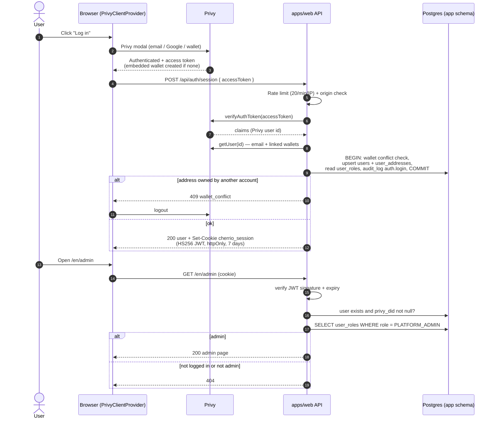

# 04 — Web app and authentication

The web app (`apps/web`) is a Next.js App Router application that serves the public site, the logged-in account area and the (placeholder) admin area for each environment. It uses next-intl for every user-facing string and the "brutal ledger" design system from `packages/ui`. Login is handled entirely by **Privy** (email, Google, external wallets): the browser obtains a Privy access token, the server verifies it once at `/api/auth/session`, creates or updates the user in Postgres, syncs the user's wallets from Privy server-side, and issues its own signed, httpOnly session cookie. Admin rights are never taken from the cookie; they are re-read from the database on every check. Today the landing page, login, the account page (profile, wallets, GDPR delete), the admin placeholder and the health endpoint are live on dev; campaign, Charity Market Cap and Emergency Pool pages are coming-soon placeholders.

Last updated: 2026-10-02

Status legend: **Live on dev** = running on https://dev.cherr.io · **Built (not deployed)** = code merged, not running on a server · **Planned** = described in docs, no code yet.

---

## 1. Application structure

Status: **Live on dev.**

| Path | What |
|---|---|
| `apps/web/src/app/[locale]/` | Localised pages (App Router, one `[locale]` segment) |
| `apps/web/src/app/api/` | Route handlers (not localised): `auth/*`, `health` |
| `apps/web/src/app/robots.txt/route.ts` | `Disallow: /` everywhere except prod |
| `apps/web/src/middleware.ts` | next-intl locale routing for pages; skips `/api` and `/robots.txt`; adds `X-Robots-Tag: noindex, nofollow` on every non-prod response |
| `apps/web/src/lib/auth/` | `session.ts` (JWT cookie, `getSession`, `requireUser`, `requireRole`), `privy.ts` (Privy server client), `user-helpers.ts` (default display name, wallet and email extraction) |
| `apps/web/src/lib/security/` | `origin.ts` (per-environment origin check), `rate-limit.ts` (in-memory sliding window, client IP) |
| `apps/web/src/lib/db.ts` | `getDb()` — pooled client via PgBouncer (`DATABASE_URL`); `getDirectDb()` — direct client (`DATABASE_URL_DIRECT`) for GDPR erasure |
| `apps/web/src/components/` | `AppHeader`, `AppFooter`, `ThemeToggle`, `ComingSoon`, `auth/PrivyClientProvider` |
| `apps/web/src/fixtures/landing.ts` | Typed sample data for the landing page (bigint money values) — no real data yet |
| `apps/web/messages/en.json` | All UI strings |
| `apps/web/scripts/check-design.ts` | `pnpm check:design` — fails on hard-coded hex colours, Tailwind `rounded-*` classes and non-intl JSX strings |

Build and runtime: Next.js 15 with `output: "standalone"`, React 19, Tailwind 4; workspace packages `@cherrio/ui`, `@cherrio/shared`, `@cherrio/db` are transpiled. Fonts (Archivo, Archivo Black, IBM Plex Mono) are self-hosted through `next/font`. The theme (light/dark) comes from a `theme` cookie rendered server-side as `data-theme`, so there is no flash. Images are built in GitHub Actions only and deployed with Kamal (service `cherrio-web-<env>`).

Sources: `apps/web/src/**`, `apps/web/next.config.mjs`, `apps/web/package.json`, `docs/tasks/TASK-007.feedback.md`, `docs/tasks/TASK-025.feedback.md`.

---

## 2. Internationalisation

Status: **Live on dev.**

- next-intl from day one, English only at launch (ADR-016). `src/i18n/routing.ts`: `locales: ["en"]`, `defaultLocale: "en"`; pages live under `/en/...`.
- `src/i18n/request.ts` loads `messages/<locale>.json`; unknown locales fall back to the default; the layout returns 404 for a locale not in the list.
- No hard-coded user-facing strings: plurals use ICU syntax (e.g. donor and days-left counts), and `check:design` flags JSX text and `aria-label` / `title` / `alt` / `placeholder` literals. Even database content uses message keys (`emergency_subpools.name_key`).

Sources: `apps/web/src/i18n/routing.ts`, `apps/web/src/i18n/request.ts`, `apps/web/src/app/[locale]/layout.tsx`, `apps/web/scripts/check-design.ts`, `docs/03-DECISIONS.md` (ADR-016).

---

## 3. Design system "brutal ledger"

Status: **Live on dev.**

ADR-022 (rev. 2) defines one structure with two layers:

- **Structure everywhere:** square corners (radius 0), 3px ink borders, hard offset shadows, brand palette only, cherry-500 as the only UI colour (ink text on it); state is shown by fill style + glyph + word, never colour alone.
- **Human layer** (default, donors): full-colour photos, EUR without decimals, Archivo sans, sentence case, no Web3 words.
- **Proof layer** (`#proof`, ledger pages): IBM Plex Mono, USDC with 2 decimals, addresses, tx links. Every human-layer claim has a `ProofLink` to its evidence.

Implementation in `packages/ui`:

- `design-system/` — export of the design-system artifact (README, `tokens.json`, `tokens.css`, component specs, assets).
- `src/styles/` — `tokens.css` (generated), `theme.css`, `components.css`.
- `src/components/` — `Button`, `StatusChip`, `Field`, `Progress`, `ProofLink`, `CampaignCard`, `MilestoneTrack`, `VoteMeter`, `TrustScore`, `LedgerTable`, `Address`, plus restyled Radix primitives `Dialog`, `DropdownMenu`, `Select`, `Sheet`, `Tabs`, `Tooltip`, `Toast`.
- Light and dark themes; footer is always ink with the white wordmark; header swaps ink/white wordmark by CSS.
- Accessibility: Playwright + axe runs on all pages in both themes (TASK-007, TASK-025).

Sources: `docs/03-DECISIONS.md` (ADR-022), `packages/ui/design-system/README.md`, `packages/ui/src/**`, `docs/tasks/TASK-007.feedback.md`.

---

## 4. Pages

| Route | What | Status |
|---|---|---|
| `/en` | Landing page (hero with featured card, how it works, campaign grid, Charity Market Cap teaser, Emergency Pool band) — fed by **fixtures**, not live data | Live on dev |
| `/en/account` | Profile (display name, anonymous-donations toggle), linked wallets (link, unlink, primary/type badges), "Delete my account" dialog. Redirects to `/en` when logged out | Live on dev |
| `/en/admin` | Admin home (**Built**, TASK-029 fixes): counts — organisations waiting for review, campaigns waiting for review, approved campaigns not yet published, live campaigns — with links to the KYB and campaign queues; the admin's user id. Reached from the header menu ("Admin", shown only to `PLATFORM_ADMIN`). **404** for anyone else (existence is hidden). Full admin panel: TASK-021 / TASK-029 §3 | Built |
| `/en/organizations/new` | Organisation application form (**Built**, TASK-008b-2): organisation data, causes, payout address, and one upload slot per document (each file is uploaded on selection through `POST /api/files/kyb` and can be removed). Validated in the browser and on the server with the same zod schema; errors are shown per field. `?organization=<id>` prefills the form from the user's last rejected application ("Submit again"; register and number fixed). Redirects to `/en` when logged out | Built |
| `/en/account/organization` | The user's applications, one card per organisation: status (waiting for review / verified / not accepted), the reviewer's note and "Submit again" after a rejection, and "Register an organisation" when none is pending. Linked from `/en/account`. Redirects to `/en` when logged out | Built |
| `/en/admin/kyb` | KYB review queue (**Built**, TASK-008c-2): pending applications, oldest first — organisation, country, register and number, submitted at, claim or new. Linked from `/en/admin`. **404** for anyone who is not `PLATFORM_ADMIN` | Built |
| `/en/admin/kyb/[submissionId]` | One application: applicant (display name, email), the submitted data — next to what is on CHERR.IO now when they differ (claim, resubmission) —, the payout address in full (checksummed), documents (kind, size, short SHA-256, download through `GET /api/admin/files/:id`), earlier applications of the organisation with their notes, and the decision. **Approve** opens a dialog that shows the payout address and requires its last 6 characters; **Reject** requires a note (10–1,000 characters). **404** for non-admins | Built |
| `/en/account/campaigns` | Campaigns of the organisations the user administers, with status; "Start a campaign" when one of them is verified (**Live on dev**, TASK-010a). Redirects to `/en` when logged out | Live on dev |
| `/en/account/campaigns/new`, `/en/account/campaigns/[id]` | Campaign draft form: organisation, title, story (plain text), cause, country, target in whole euros, duration; after the first save also the cover image and "Submit for review". Editable only as `DRAFT` or `REJECTED` (with the reviewer's note); otherwise a read-only view with the status. A campaign of an organisation the user does not administer is a 404 | Live on dev |
| `/en/admin/campaigns` | Campaign review queue (**Live on dev**, TASK-010b): campaigns in `PENDING_REVIEW`, oldest submission first — title, organisation, target in euros, submitted at. Second list "Approved — waiting to be published" (`APPROVED`, oldest approval first, with "not published yet" / "transaction sent"). Linked from `/en/admin`. **404** for anyone who is not `PLATFORM_ADMIN` | Live on dev |
| `/en/admin/campaigns/[id]` | One submitted campaign: organisation and starter, all fields, the payout address that will be copied (full, checksummed), cover image, story (escaped plain text); after approval the snapshot (ECB rate, rate date, target in USDC, beneficiary, offchain id), then **Publish on Polygon** (**Live on dev**, TASK-010c): "Publish on Polygon" signs with the operator wallet connected through Privy, "Check status" links; once `DEPLOYED`, the contract address, transaction and time with a link to the block explorer. Loading the page links an approved campaign the indexer already has. **Approve** opens a confirmation dialog with the payout address; **Reject** requires a note (10–1,000 characters). A draft that was never submitted is a 404. **404** for non-admins | Live on dev |
| `/en/dev/ui` | Component gallery; renders only when `APP_ENV` is `local` or `dev`, 404 on uat/prod | Live on dev |
| `/en/campaigns` | Coming soon | Placeholder |
| `/en/charity-market-cap` | Coming soon | Placeholder |
| `/en/emergency-pool` | Coming soon | Placeholder |
| `/en/how-it-works` | Coming soon (the header link points to the landing section `#how-it-works`) | Placeholder |
| `/en/about` | Coming soon | Placeholder |
| `/en/docs` | Coming soon | Placeholder |
| Campaign detail, donate flow, org pages, public API `/api/v1/*` (OpenAPI), `llms.txt`, sitemap | Described in Architecture §4.1 | Planned |

No page reads the indexer's `chain.*` views yet (see `03-data-and-indexer.md`).

The organisation pages use three components added to `packages/ui` for them — `Textarea`, `CheckboxGroup` and `FileField` (tokens only, 3px ink border, radius 0; READMEs in `packages/ui/design-system/components/`). Country is chosen with a searchable select (`apps/web/src/components/SearchableSelect.tsx`: ARIA combobox, type to filter, accents ignored, the ISO code also matches; no new dependency). Forms and account/admin sections use `.ch-panel` (full-width bordered box); `.ch-card` is only the 360 px campaign card. After a failed submit the first invalid field is focused and a summary ("Please fix the N fields marked above.") appears at the button. Moments in time are shown in the viewer's time zone (`LocalDateTime`: UTC on the server render, the browser's zone after mounting); the ECB rate date stays a UTC day. After logout on `/account`, `/admin` or `/organizations/new` the browser goes to the home page. Header menu for a logged-in user: My account, My organisation, My campaigns, and Admin for `PLATFORM_ADMIN`. Country names come from `Intl.DisplayNames` in the page's locale; every other text is in `messages/en.json` (`organizations.form.*`, `account.organization.*`).

Sources: `apps/web/src/app/[locale]/**`, `apps/web/src/components/AppHeader.tsx`, `apps/web/src/components/ComingSoon.tsx`, `docs/tasks/TASK-025.feedback.md`, `docs/CHEATSHEET.md` §1, `docs/02-ARCHITECTURE.md` §4.1.

---

## 5. Authentication (ADR-024)

Status: **Live on dev** (TASK-025, live on dev 2026-10-01). ADR-024 supersedes the RainbowKit / SIWE / Auth.js parts of ADR-003 and of Architecture §3.

### 5.1 Login in the browser

- `PrivyClientProvider` wraps the app in `[locale]/layout.tsx`. The **Privy App ID is read at runtime** on the server (`PRIVY_APP_ID`) and passed to the client provider — it is not baked into the image, so one image per commit works in any environment. Without an App ID (CI, local tests) the provider renders an "unavailable" auth context.
- Login methods, in this order: **email, Google, wallet** (MetaMask, detected wallets, Coinbase Wallet, Rainbow, WalletConnect; Privy performs SIWE for external wallets). Default and only supported chain: Polygon Amoy on dev/uat, Polygon mainnet on prod.
- An **embedded wallet** is created on login for users without a wallet (`createOnLogin: "users-without-wallets"`). ERC-4337 smart accounts and gas sponsorship: Planned (TASK-011).
- When Privy reports an authenticated user, the provider calls `POST /api/auth/session` with the Privy access token (once per Privy user id). If the server refuses (401/403/409/429/500) it logs Privy out again and shows a toast, so Privy and the app never disagree about being logged in. Logging out calls `DELETE /api/auth/session` and then Privy logout.

### 5.2 Server token verification and user upsert (`POST /api/auth/session`)

1. Rate limit per client IP (§5.8) → 429 with `Retry-After`.
2. Origin check (§5.7) → 403.
3. Body must contain `accessToken` → 400.
4. `privy.verifyAuthToken(accessToken)` with `@privy-io/server-auth` → 401 if invalid or expired.
5. `privy.getUser(userId)` — the full Privy record is fetched **server-side**; email and wallets come from it, never from the client.
6. One DB transaction:
   - **Conflict check:** if any of the user's wallet addresses is already in `user_addresses` for a user with a different `privy_did` → 409 `wallet_conflict`.
   - Find the user by `privy_did`; update email / locale, or create the user with a pseudonymous display name `Supporter XXXX` (4 random characters — never the email or address).
   - Insert missing addresses (`EMBEDDED` or `EXTERNAL`); the first one becomes primary if the user has none.
   - Read the user's roles from `user_roles`.
   - Write `audit_log` `auth.login` (with IP).
7. Sign the session cookie and return the user (id, display name, email, anonymous flag, locale, roles).

### 5.3 Session cookie

| Property | Value |
|---|---|
| Name | `cherrio_session` |
| Content | JWT, **HS256** via `jose`, claims `sub` = user id and `roles`; signed with `SESSION_SECRET` |
| Lifetime | **7 days** (`exp` and cookie `maxAge`) |
| Flags | `httpOnly`, `sameSite=lax`, `path=/`, `secure` everywhere except `APP_ENV=local` |

`getSession()` verifies the signature and expiry **and** checks in Postgres that the user still exists and has a `privy_did` — an erased user's cookie is treated as logged out immediately. Outside `local`, a DB error also means "no session". Without `SESSION_SECRET` the app throws in dev/uat/prod (a fixed test key is used only in `local`).

### 5.4 Roles

- The only platform role is `PLATFORM_ADMIN` in `app.user_roles`. Organisation roles live in `org_members` (not used by any page yet).
- The cookie carries `roles` for display only. `requireRole("PLATFORM_ADMIN")` always **re-reads** `user_roles` from the database (`WHERE user_id = … AND role = …`) and throws `FORBIDDEN` otherwise.
- **Admin guard:** `/en/admin` calls `requireRole` and returns Next.js `notFound()` (404) for logged-out users and non-admins, so the page's existence is not revealed.
- **grant-admin CLI:** `packages/db/src/grant-admin.ts`, bundled into the web image as `packages/db/dist/grant-admin.mjs`. It looks up the given wallet address in `user_addresses` and inserts `PLATFORM_ADMIN` idempotently. It never creates placeholder users: if the address has not logged in yet it exits 1 with "User has not logged in yet — log in with this wallet first, then rerun." Run it with `docker exec <web container> node packages/db/dist/grant-admin.mjs <address>` on the server or `pnpm --filter @cherrio/db grant-admin <address>` locally (CHEATSHEET §1).
- **Planned** (TASK-021): Architecture §3 also asks for a fresh Privy MFA before admin actions; not implemented.

### 5.5 Wallet sync from Privy (`POST /api/auth/wallets/sync`)

Called by the client after Privy's link-wallet success callback and after unlinking. The server reads the user's `privy_did`, fetches the **current** Privy record server-side (client-supplied addresses are never trusted) and reconciles `user_addresses` in one transaction:

- any Privy address that belongs to another user → 409 `wallet_conflict` (the client shows a toast);
- addresses no longer linked in Privy are deleted; new ones are inserted;
- if no primary address remains, the first one becomes primary;
- `audit_log` `wallets.synced`.

### 5.6 Account page and GDPR delete

- `/en/account` is server-rendered from the DB (user, addresses, roles) and redirects to `/en` without a session.
- Profile edits go to `PATCH /api/auth/user` (zod: `displayName` 2–40 characters trimmed, `anonymousDonations` boolean) and write `audit_log` `user.updated`.
- **Delete my account** → `DELETE /api/auth/account`:
  1. `eraseUser(directDb, userId)` in one transaction over the direct connection (what it deletes and nulls: `03-data-and-indexer.md` §2.4). On failure → 500 and nothing else happens.
  2. `privy.deleteUser(privyDid)`. On success `audit_log` `account.deleted`; on failure a server warning and `audit_log` `account.privy_delete_failed` — the user still gets success, because the app data is already erased.
  3. The session cookie is deleted.

### 5.7 Origin checks

Every mutating auth route (`POST`/`DELETE /api/auth/session`, `POST /api/auth/wallets/sync`, `PATCH /api/auth/user`, `DELETE /api/auth/account`) calls `verifyOrigin()`. The `Origin` header (or, if absent, the `Referer`) must equal the environment's single origin: `https://dev.cherr.io`, `https://uat.cherr.io`, `https://cherr.io`, or `http://localhost:3000` (plus any localhost / 127.0.0.1 port when `APP_ENV=local`). Outside `local`, a request with neither header is rejected (403).

### 5.8 Rate limiting

In-memory sliding window per container (`MemoryRateLimiter`), applied to `POST /api/auth/session`: **20 requests per minute per client IP**. The client IP is the **last** entry of `X-Forwarded-For` (appended by kamal-proxy), then `X-Real-IP`. Expired entries are pruned every 100 checks or above 10,000 keys. Limits are per container, not shared across instances. Private file uploads (`POST /api/files/kyb`, **Built**) have their own limiter: **30 requests per minute per user**, and at most **2 uploads at a time per container** (the third gets 503 with `Retry-After: 5`), because a file is held in memory. Broader API rate limiting (per IP and per user, Architecture §6) is Planned.

### 5.9 `/api/health`

Used by kamal-proxy as the health check and by the deploy job's smoke test. Not behind the locale middleware.

1. `validateAuthEnv()` (`@cherrio/shared`): in dev/uat/prod `PRIVY_APP_ID`, `PRIVY_APP_SECRET` and `SESSION_SECRET` must be present and valid.
2. `DATABASE_URL` must be set (checked explicitly, because `getDb()` would otherwise fall back to the direct URL and hide a broken PgBouncer). In `local` without it the DB check is skipped.
3. `select 1` through `getDb()` (PgBouncer) with a 2-second timeout (below kamal-proxy's 3-second health-check timeout).

| HTTP | Body | Meaning |
|---|---|---|
| 200 | `{"status":"ok","db":"ok",…}` | healthy |
| 200 | `{"status":"ok","db":"skipped",…}` | `local` without `DATABASE_URL` |
| 500 | `error: "auth_config_error"` | Privy / session secrets missing or invalid |
| 503 | `error: "db_config_error"` | `DATABASE_URL` not set (dev/uat/prod) |
| 503 | `error: "db_unreachable"` | `select 1` through PgBouncer failed or exceeded 2 s |

Every response also carries `env`, `sha` (git SHA of the image) and `timestamp`. Details are logged server-side only (`[Health] …`), never the connection string. On an error status Kamal keeps the previous container running.

Sources: `apps/web/src/components/auth/PrivyClientProvider.tsx`, `apps/web/src/app/[locale]/layout.tsx`, `apps/web/src/app/api/auth/**/route.ts`, `apps/web/src/app/api/health/route.ts`, `apps/web/src/lib/auth/*.ts`, `apps/web/src/lib/security/*.ts`, `apps/web/src/lib/db.ts`, `apps/web/src/app/[locale]/account/*`, `apps/web/src/app/[locale]/admin/page.tsx`, `packages/db/src/grant-admin.ts`, `packages/db/src/gdpr.ts`, `docs/03-DECISIONS.md` (ADR-024), `docs/tasks/TASK-025-auth.md`, `docs/tasks/TASK-025.feedback.md`, `docs/CHEATSHEET.md` §1.

---

## 6. Login → session → role check

Sources: as in §5.

---

## 7. API routes

| Method | Path | Auth | Purpose |
|---|---|---|---|
| POST | `/api/auth/session` | Privy access token in body; origin check; rate limit 20/min/IP | Verify the token, upsert user and wallets, set `cherrio_session`. Returns the same user shape as `GET /api/auth/user`, including `addresses` (missing until 2026-10-02, which crashed the account page after a login) |
| DELETE | `/api/auth/session` | origin check; session optional | Log out: audit `auth.logout` if a session exists, delete the cookie |
| GET | `/api/auth/user` | session cookie | Current user with roles and addresses (401 without session) |
| PATCH | `/api/auth/user` | session cookie; origin check | Update display name (2–40 chars) and anonymous-donations flag |
| POST | `/api/auth/wallets/sync` | session cookie; origin check | Re-read linked wallets from Privy and reconcile `user_addresses` (409 on conflict) |
| DELETE | `/api/auth/account` | session cookie; origin check | GDPR erasure (`eraseUser`), Privy `deleteUser`, delete cookie |
| POST | `/api/files/kyb` | session cookie; origin check; 30/min/user; 2 concurrent per container | Upload one private KYB document (multipart: `file`, `kind`). `Content-Length` required (411), at most 10 MB + 64 KB of framing (413); PDF/JPEG/PNG by magic bytes; encrypted before storage (ADR-033); at most 10 unattached files per user (409). Returns `{ id, kind, sizeBytes }` |
| DELETE | `/api/files/kyb/:id` | session cookie; origin check | Uploader only, only while the file is not part of a submitted application (404 / 409). The row is marked deleted first, then the object is deleted |
| GET | `/api/admin/files/:id` | `PLATFORM_ADMIN` re-read from the DB; **404** for everyone else | Decrypted file as an attachment (`no-store`, `nosniff`); every download writes `audit_log` `private_file.download` before the file is sent |
| POST | `/api/organizations` | session cookie; origin check; 10/min/user | Submit an organisation for verification (JSON, validated by `organizationApplicationSchema` from `@cherrio/shared`; the documents are ids of files uploaded before). One transaction: new organisation, claim of an unclaimed imported one, or resubmission after a rejection → `org_members` (`ORG_ADMIN`) → `kyb_submissions` (`PENDING`) → attach the files → `audit_log` (`organization.apply` / `organization.claim`). 409 with a code when refused (`application_pending`, `organization_exists`, `resubmission_not_allowed`, `files_invalid`); nothing is written then |
| POST | `/api/admin/kyb/:submissionId/approve` | `PLATFORM_ADMIN` re-read from the DB (**404** for everyone else); origin check | Approve a pending application. Body: the last 6 characters of the payout address, typed by the reviewer; refused if they do not match. One transaction: submission `APPROVED` (`reviewer_id`, `reviewed_at`), the application is applied to the organisation row, `kyb_status = APPROVED`; for a claim also `source = REGISTERED`, `claimed_by_user_id`, and other `ORG_ADMIN`s whose own applications were all rejected are removed. Audit `kyb.approve` |
| POST | `/api/admin/kyb/:submissionId/reject` | as above | Reject with a note (10–1,000 characters, shown to the applicant, not copied to `audit_log`). New organisation → `REJECTED`; claim → organisation back to `NONE` and the claimant's membership removed; an organisation approved earlier stays `APPROVED`. Audit `kyb.reject` |
| POST | `/api/campaigns` · PATCH `/api/campaigns/:id` · POST `/api/campaigns/:id/submit` | session cookie; origin check; 10/min/user; `ORG_ADMIN` of an `APPROVED` organisation (anyone else: 404) | Create and edit a campaign draft (`campaignDraftSchema` from `@cherrio/shared`), and send it to review. Edits only as `DRAFT` / `REJECTED`; the slug follows the title until the first submit, then stays; submit needs a cover and is refused when the organisation already has 5 campaigns in review, approved or live. Audit `campaign.submit`. **Live on dev** (TASK-010a) |
| POST | `/api/campaigns/:id/cover` | as above; `Content-Length` required; 2 uploads at a time per container | One cover image: JPEG/PNG/WebP by magic bytes, ≤ 5 MB, re-encoded to WebP (max 1600 px wide) without metadata, stored in the public bucket under `campaigns/<id>/<random>.webp`; replacing deletes the old object. **Live on dev** (TASK-010a) |
| POST | `/api/admin/campaigns/:id/approve` | `PLATFORM_ADMIN` re-read from the DB (**404** for everyone else); origin check; empty JSON body | Approve a `PENDING_REVIEW` campaign. The ECB rate is fetched first, outside the transaction (503 `rate_unavailable` if it cannot be fetched — nothing is written); then one transaction: USDC target (floor), 409 `target_below_minimum` under 100 USDC, beneficiary from the organisation's payout address (409 `organization_not_approved` if the organisation is no longer verified), random `offchain_id`, `APPROVED`. Returns `{ campaignId, eurUsdRate, rateAt, targetUsdc }`. Audit `campaign.approve` (ids, rate, rate date, target). **Live on dev** (TASK-010b) |
| POST | `/api/admin/campaigns/:id/reject` | as above | Reject with a note (10–1,000 characters, shown to the organisation, not copied to `audit_log`) → `REJECTED`; the organisation can edit and submit again. Audit `campaign.reject`. **Live on dev** (TASK-010b) |
| POST | `/api/admin/campaigns/:id/publish/prepare` | as the review routes; empty body | The `createCampaign` parameters for an `APPROVED` campaign (`offchainId`, checksummed `beneficiary`, `target`, `deadline`, `beneficiaryType` 0), the chain id, factory, PlatformConfig and the predicted clone address; stores `deadline`. 409 `not_approved`, `self_review`, `contracts_unavailable` (no deployment for `APP_ENV`, e.g. local). **Live on dev** (TASK-010c) |
| POST | `/api/admin/campaigns/:id/publish/sent` | as above; body `{ txHash }` (0x + 64 hex) | Stores the transaction hash (lowercase) — "publishing". 409 `not_prepared` before a prepare. Audit `campaign.publish_sent`. **Live on dev** (TASK-010c) |
| POST | `/api/admin/campaigns/:id/publish/check` | as above; empty body | Links the campaign from `chain.campaign` (see `03-data-and-indexer.md` §2.5). Returns `{ status: "DEPLOYED", address }` or `{ status: "APPROVED", onChain: "not_found" | "mismatch" | "indexer_unavailable", publishing }`. Audit `campaign.deployed` / `campaign.link_mismatch` (once). **Live on dev** (TASK-010c) |
| GET | `/api/health` | none | Auth env + DB (via PgBouncer) health, see §5.9 |
| GET | `/robots.txt` | none | `Allow: /` on prod, `Disallow: /` elsewhere |
| — | `/api/v1/*` public read API | — | Planned (Architecture §4.1) |

Status of all listed routes: Live on dev, except the three file routes (**Built**, TASK-008a-2), `POST /api/organizations` (**Built**, TASK-008b-1) — no page uses these four yet; used by the application form (TASK-008b-2, **Built**) —, the two review routes (**Built**, TASK-008c-1; called by the admin pages of TASK-008c-2) and `/api/v1/*` (Planned).

Rules of `POST /api/organizations`: one pending application per user (checked in the transaction and by a unique index); an organisation that is `PENDING` or `APPROVED`, registered by someone else, or an imported one that is already claimed is refused with the same code and no detail about who holds it; a claim or a resubmission never changes the public organisation row before approval (the data is stored with the submission, see `03-data-and-indexer.md` §2.4); files must be the applicant's own, unattached and not deleted, with exactly one registration extract and one authorisation, at most one statute and two others — otherwise the whole submit is refused. Registry `NONE` has no duplicate check. Error texts: next-intl `organizations.errors.<code>`.

Review rules (both routes): only a `PENDING` submission can be decided (`not_pending` otherwise); a reviewer who submitted the application or is a member of the organisation in any role is refused (`self_review`), in the server logic; an application whose stored data is not valid cannot be approved (`application_invalid`). Removed memberships are audited as `organization.member_removed`. "Submit again" after a rejected claim is a new claim (the API accepts the organisation id for an imported, unclaimed organisation in `NONE`). Error texts: next-intl `admin.kyb.errors.<code>`.

Campaign review rules (both routes, TASK-010b): only `PENDING_REVIEW` can be decided (`not_pending`; a decided campaign never triggers an ECB request); a reviewer who is a member of the organisation in any role, or who started the campaign, is refused (`self_review`). The ECB URL is fixed (`https://www.ecb.europa.eu/stats/eurofxref/eurofxref-daily.xml`); `ECB_RATES_URL` overrides it only with `APP_ENV=local` (tests and E2E). The answer must contain a USD rate of the form `d.dddd` (≤ 8 decimals, between 0.5 and 3.0) and a rate date at most 7 days old. Error texts: next-intl `admin.campaigns.errors.<code>`.

Sources (campaign review): `apps/web/src/app/api/admin/campaigns/**/route.ts`, `apps/web/src/lib/campaigns/review.ts`, `review-route.ts`, `ecb.ts`, `docs/tasks/TASK-010b.feedback.md`.

Sources (organisations): `apps/web/src/app/api/admin/kyb/**/route.ts`, `apps/web/src/lib/organizations/review.ts`, `review-route.ts`, `own-applications.ts`, `docs/tasks/TASK-008c1.feedback.md`, `apps/web/src/app/api/organizations/route.ts`, `apps/web/src/lib/organizations/*.ts`, `packages/shared/src/organizations.ts`, `docs/tasks/TASK-008b1.feedback.md`.

File routes return only an error code (`{ "error": "file_too_large" }`); the text for the user is the next-intl message `files.errors.<code>`. `next.config.mjs` sets `experimental.middlewareClientMaxBodySize: "11mb"`: the middleware runs for `/api/*` and by default keeps only the first 10 MB of a request body, which cuts a 10 MB file with its multipart framing.

Sources (file routes): `apps/web/src/app/api/files/kyb/**/route.ts`, `apps/web/src/app/api/admin/files/[id]/route.ts`, `apps/web/src/lib/files/*.ts`, `apps/web/next.config.mjs`, `apps/web/messages/en.json`, `docs/tasks/TASK-008a2.feedback.md`.

Sources: `apps/web/src/app/api/**/route.ts`, `apps/web/src/app/robots.txt/route.ts`, `docs/02-ARCHITECTURE.md` §4.1.
