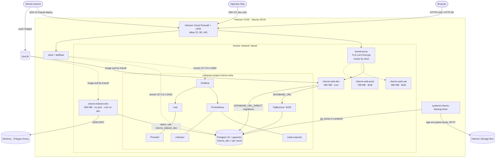

# 05 — Infrastructure and environments

CHERR.IO runs on a single Hetzner Cloud VPS that hosts three environments (dev, uat, prod) side by side. The host has two layers. The first is a **shared infrastructure layer** started with `docker compose` (project `cherrio-infra`): one Postgres 16 + pgvector instance holding three databases, PgBouncer, and the monitoring stack. The second is an **application layer** deployed with **Kamal 2** destinations: one web service and one indexer service per environment, plus later workers. One kamal-proxy terminates TLS and is the only component that publishes ports (80/443). Images are built only in GitHub Actions and pulled from GHCR. Today **dev is live** (web app and indexer); uat and prod are configured but not deployed. All server configuration is code in `infra/` and `config/`.

Last updated: 2026-10-02

Status legend used in this document: **Live on dev** = running on the server for the dev environment · **Built** = code/config in the repo, not running on the server yet · **Planned** = described in specs/ADRs, not built.

---

## 1. Hosting

| Item | Value | Status |
|---|---|---|
| Provider | Hetzner Cloud | Live on dev |
| Server type | CX33 — 4 vCPU (shared), 8 GB RAM, 80 GB SSD | Live on dev |
| OS | Ubuntu 26.04, timezone UTC, locale `en_US.UTF-8`, hostname `cherrio-1` | Live on dev |
| Swap | 4 GB swap file, `vm.swappiness=10`, `vm.overcommit_memory=1` | Live on dev |
| Login user | `deploy` (non-root, member of `docker`, passwordless sudo for Phase 1); root SSH login disabled | Live on dev |
| Docker | Docker Engine from Docker's official apt repo; daemon log rotation `json-file`, `max-size 10m`, `max-file 3`, `live-restore true` | Live on dev |
| Automatic updates | `unattended-upgrades`, security origin only, no automatic reboot | Live on dev |
| Server paths | `/opt/cherrio/infra` (synced copy of repo `infra/`), `/opt/cherrio/secrets` (mode 700), `/opt/cherrio/backups` | Live on dev |
| Emergency access | Hetzner Cloud Console web terminal | Live on dev |
| Upgrade path | Rescale to CX43 (16 GB) when memory > 80 % sustained; later prod on its own VPS (only the Kamal host changes) | Planned |

The server IP address is intentionally not reproduced here; see `docs/CHEATSHEET.md` §2.

Host bootstrap is `infra/provision/provision.sh` (idempotent, `--dry-run`), followed by `harden-ssh.sh` and `protect-ssh.sh` (see `06-security.md`). Infra files reach the server with `infra/sync.sh` (rsync, dry-run by default, `--live` to transfer; never overwrites the generated `pgbouncer/` directory).

Sources: `docs/02-ARCHITECTURE.md` §5, ADR-021 in `docs/03-DECISIONS.md`, `infra/README.md`, `infra/provision/provision.sh`, `infra/sync.sh`, `docs/tasks/TASK-024.feedback.md`, `docs/CHEATSHEET.md` §2.

---

## 2. Environments

| | dev | uat | prod |
|---|---|---|---|
| Git branch | `dev` | `uat` | `main` |
| Domains | `dev.cherr.io` (architecture also lists `api.dev.cherr.io`) | `uat.cherr.io` (+ `api.uat.cherr.io` in architecture) | `cherr.io`; `app.cherr.io`, `api.cherr.io` commented out until go-live |
| Chain | Polygon Amoy (chain id 80002) | Polygon Amoy, **separate** contract deployment | Polygon mainnet |
| Contracts | `amoy-dev` deployed 2026-10-01 | `amoy-uat` deployed at the first dev → uat promotion | mainnet deployment with Safe + 48 h timelock |
| Database / role | `cherrio_dev` / `cherrio_dev` | `cherrio_uat` / `cherrio_uat` | `cherrio_prod` / `cherrio_prod` |
| Data rules | seed data, reset allowed | seed + test data, **never prod personal data** | real data |
| Deploy trigger | push to `dev` (automatic) | push to `uat` (automatic) | manual `workflow_dispatch` only |
| Indexing | `noindex` (`X-Robots-Tag: noindex, nofollow`, `robots.txt` `Disallow: /`) | same as dev | indexed |
| `/en/dev/ui` gallery | 200 | 404 | 404 |
| Status | **Live on dev** (web) | **Built** (config only; not deployed) | **Built** (config only; not live) |

Rules that apply to every environment:

- Each environment has its own database and role in the shared Postgres, its own secrets (GitHub Environment), and is planned to have its own Privy app, Sumsub level, Transak env, Alchemy app, storage bucket, Redis, indexer and worker. Today dev uses Privy app "CHERR.IO dev"; uat/prod Privy App IDs are placeholders in their Kamal destination files.
- Environment values (URLs, chain IDs, contract addresses) are never hard-coded; `packages/shared` resolves chain and addresses by `APP_ENV` (`local|dev|uat|prod`).
- Contracts are never deployed by CI. David deploys per environment with Foundry scripts; addresses go to `packages/contracts/deployments/{amoy-dev,amoy-uat,polygon}.json`.
- Basic auth (or a Privy allow-list) in front of dev/uat is **Planned** in the architecture; today only `noindex` is in place.

Sources: `docs/02-ARCHITECTURE.md` §5.1, ADR-020, ADR-024, ADR-025, `docs/00-MANIFEST.md` §3, `config/deploy.{dev,uat,prod}.yml`, `.github/workflows/deploy.yml`, `docs/tasks/TASK-022.feedback.md`, `docs/tasks/TASK-025-auth.md`, `docs/CHEATSHEET.md` §1, §7.

---

## 3. Shared infrastructure (`docker compose`, project `cherrio-infra`)

Defined in `infra/shared/compose.yml`, run from `/opt/cherrio/infra/shared` with `--env-file /opt/cherrio/secrets/infra.env`. All services join the external Docker network **`kamal`** so Kamal apps reach them by container name. Every service has a `mem_limit` and `restart: unless-stopped`.

| Service | Image | Memory limit | Notes | Status |
|---|---|---|---|---|
| `postgres` | `pgvector/pgvector:pg16` | 1.5 GB | `shared_buffers=1GB`, `effective_cache_size=3GB`, `work_mem=8MB`, `maintenance_work_mem=256MB`, `max_connections=100`; databases `cherrio_dev`, `cherrio_uat`, `cherrio_prod`, each with `vector` extension; published on **loopback only** (`127.0.0.1:5432`) for SSH-tunnel access | Live on dev |
| `pgbouncer` | `pgbouncer/pgbouncer:1.23.1` | 64 MB | transaction pooling on `:6432`, `auth_type = scram-sha-256`; config generated by `ensure-databases.sh` into `/opt/cherrio/infra/pgbouncer/` (mounted read-only); not published | Live on dev |
| `prometheus` | `prom/prometheus:v3.1.0` | 384 MB | 15-day retention; scrapes itself, node-exporter, cAdvisor; alert rules for disk, memory, container restarts, Postgres down, container near memory limit (alert delivery not configured yet) | Live on dev |
| `node-exporter` | `prom/node-exporter:v1.8.2` | 64 MB | host metrics | Live on dev |
| `cadvisor` | `gcr.io/cadvisor/cadvisor:v0.49.1` | 128 MB | container metrics | Live on dev |
| `grafana` | `grafana/grafana:11.4.0` | 192 MB | published on `127.0.0.1:3000` only; sign-up off; provisioned Prometheus + Loki data sources and a "Host & containers" dashboard | Live on dev |
| `loki` | `grafana/loki:3.3.1` | 256 MB | 7-day retention | Live on dev |
| `promtail` | `grafana/promtail:3.3.1` | 96 MB | ships Docker container logs and syslog to Loki; migration to Grafana Alloy is a TODO | Live on dev |

Connection paths inside the `kamal` network:

- App traffic → PgBouncer `cherrio-infra-pgbouncer-1:6432` (`DATABASE_URL`).
- Migrations, GDPR erase and the indexer → Postgres directly `cherrio-infra-postgres-1:5432` (`DATABASE_URL_DIRECT`). Ponder uses LISTEN/NOTIFY and cannot use PgBouncer transaction pooling (ADR-026).

`infra/shared/ensure-databases.sh` (idempotent, `--dry-run`) creates/updates roles, databases, connection limits, the `vector` extension, the indexer roles and the PgBouncer config. A real run **restarts PgBouncer**, so all environments drop their DB connections for a few seconds.

Sources: `infra/shared/compose.yml`, `infra/shared/ensure-databases.sh`, `infra/shared/prometheus/*.yml`, `infra/shared/loki/loki.yml`, `infra/shared/promtail/promtail.yml`, `infra/README.md`, `docs/CHEATSHEET.md` §2–§4, `docs/tasks/TASK-024.feedback.md`.

---

## 4. Applications (Kamal 2)

Kamal 2.12.0 is installed in the deploy workflow. kamal-proxy replaces Traefik (ADR-005). Kamal only pulls images (`builder.remote: false`); it never builds on the server.

### 4.1 Web service — one per environment

| Item | Value |
|---|---|
| Config | `config/deploy.yml` (base) + `config/deploy.<env>.yml` |
| Service names | `cherrio-web-dev`, `cherrio-web-uat`, `cherrio-web-prod` (suffix lets all three coexist) |
| Image | `ghcr.io/datavallis-cherr-io/cherrio/web:sha-<7 chars>` (Next.js standalone, `node:22-alpine`, non-root user `nextjs`) |
| Proxy | kamal-proxy, `ssl: true` (Let's Encrypt), routes by `Host`, app port 3000, healthcheck `GET /api/health` every 3 s, timeout 3 s, response timeout 30 s |
| Memory | dev 384 MB, uat 384 MB, prod 768 MB |
| Env (clear) | `APP_ENV`, `NODE_ENV=production`, `PRIVY_APP_ID` (runtime, ADR-024); dev also `S3_ENDPOINT`, `S3_REGION`, `S3_BUCKET` |
| Env (secret) | `DATABASE_URL`, `DATABASE_URL_DIRECT`, `PRIVY_APP_SECRET`, `SESSION_SECRET`; dev also `S3_ACCESS_KEY_ID`, `S3_SECRET_ACCESS_KEY`, `PRIVATE_FILES_KEY` |
| Retention | `retain_containers: 3`; container logs `json-file` 10 MB × 3 |
| Status | dev **Live on dev**; uat and prod **Built** |

`/api/health` returns `200 {"status":"ok","db":"ok",…}` only when the auth env is valid and `select 1` through PgBouncer answers within 2 s; otherwise kamal-proxy keeps the previous container.

### 4.2 Indexer service — one per environment

| Item | Value |
|---|---|
| Config | `config/indexer.yml` (base) + `config/indexer.<env>.yml` (only `indexer.dev.yml` exists) |
| Service name | `cherrio-indexer-dev` (network alias of the same name) |
| Image | `ghcr.io/datavallis-cherr-io/cherrio/indexer:sha-<7 chars>` (`Dockerfile.indexer`, production deps only, non-root user `indexer`) |
| Command | `ponder start --schema chain_${GIT_SHA7} --views-schema chain` (`GIT_SHA7` is baked in at build time) |
| Proxy / ports | **none** — `proxy: false`, no published port; reachable only on the `kamal` network at port 42069 |
| Health | Docker `HEALTHCHECK` on `/health`; readiness (`/ready`) checked by the deploy job |
| Memory | 384 MB, `NODE_OPTIONS=--max-old-space-size=288` |
| DB | role `cherrio_indexer_dev`, direct Postgres, never PgBouncer; tables in `chain_<sha7>`, read views in `chain`, RPC cache in `ponder_sync` (ADR-026) |
| RPC | Alchemy (Polygon Amoy), pay-as-you-go plan. The free tier (10-block `eth_getLogs` ranges, compute-unit throttling) stalled the first backfill; each environment needs a paid RPC plan with `eth_getLogs` ranges of at least ~1,000 blocks. One GitHub secret per chain: `PONDER_RPC_URL_80002` (Amoy, set for dev) and `PONDER_RPC_URL_137` (Polygon mainnet; the deploy job already passes it, the secret itself is created when prod gets an indexer). |
| Status | **Live on dev** since 2026-10-01 (TASK-026; GitHub Actions run 36923510353: deploy → ready → reconcile → prune green). uat/prod need their own destination file, role password and secrets. |

### 4.3 Private file storage (ADR-033)

| Item | Value | Status |
|---|---|---|
| Provider | Hetzner Object Storage (S3 API), **one private bucket per environment**; no public access, no CORS, no presigned URLs. Files are encrypted by the web app before upload, so the bucket only ever holds ciphertext | dev: **Built** (bucket `cherrio-private-dev`, location `nbg1`, configured in `config/deploy.dev.yml`; first used by the deploy that carries TASK-008a-2). uat/prod: Planned |
| Object layout | `kyb/<orgId or "unassigned">/<fileId>` for documents; `check/` for the deploy check (a canary object per key version and short-lived probe objects) | Built |
| Deploy check | After the smoke tests the deploy job runs `node apps/web/dist/files.mjs check` in a container of the new version: bucket reachable, write/read/delete of a probe object, and the canary must decrypt with `PRIVATE_FILES_KEY` (it is created on the first run). A failure fails the job. Skipped for a destination whose `config/deploy.<env>.yml` has no `S3_BUCKET` | Built |
| Local and CI | `adobe/s3mock` on `127.0.0.1:9090`, bucket `cherrio-private-local` (`docker-compose.dev.yml`; service container in the CI job that runs the web tests). It accepts any credentials and keeps nothing after a restart | Built |
| Backup of the bucket | none | Planned before mainnet (see `06-security.md` §11) |

### 4.4 Other services

| Service | Status |
|---|---|
| `worker` (BullMQ) ×3, dev/uat 192 MB, prod 384 MB | Planned |
| Redis accessory per env (`maxmemory` 64/64/256 MB) | Planned |
| `mcp` (prod only) | Planned |

Sources: `config/deploy*.yml`, `config/indexer*.yml`, `Dockerfile`, `Dockerfile.indexer`, `.github/workflows/deploy.yml`, `.github/workflows/ci.yml`, `docker-compose.dev.yml`, `apps/web/src/lib/files/check.ts`, ADR-005, ADR-024, ADR-026, ADR-033, `docs/tasks/TASK-008a2.feedback.md`, `docs/tasks/TASK-022.feedback.md`, `docs/tasks/TASK-026.feedback.md`, `docs/CHEATSHEET.md` §1, §10, `docs/02-ARCHITECTURE.md` §5.

---

## 5. Memory budget (8 GB RAM + 4 GB swap)

Every container has a memory limit. The table is the planned budget for all three environments fully deployed.

| Component | Budget | Status today |
|---|---|---|
| Postgres (shared, `shared_buffers` 1 GB) | 1.5 GB | Live on dev |
| web ×3 (dev/uat 384 MB, prod 768 MB) | 1.5 GB | dev live; uat/prod built |
| indexer ×3 (256–384 MB) | 1.0 GB | dev live (384 MB); uat/prod built |
| worker ×3 (dev/uat 192 MB, prod 384 MB) | 0.8 GB | Planned |
| mcp (prod) | 0.15 GB | Planned |
| Redis ×3 (maxmemory 64/64/256 MB) | 0.4 GB | Planned |
| kamal-proxy + PgBouncer | 0.1 GB | Live on dev |
| Monitoring stack | 0.9 GB | Live on dev |
| OS + Docker | 0.6 GB | Live on dev |
| **Total** | **≈ 6.95 GB** | |

Retention that protects memory and disk: Loki 7 days, Prometheus 15 days, Kamal keeps the last 3 images/containers per service, weekly `docker image prune` (manual runbook).

Sources: `docs/02-ARCHITECTURE.md` §5, `infra/README.md` "Memory budget", `infra/shared/compose.yml`, `config/deploy.*.yml`, `config/indexer.dev.yml`.

---

## 6. Connection budget (Postgres `max_connections = 100`)

Every role has a hard `CONNECTION LIMIT`, so one environment cannot starve another. Numbers are set by `infra/shared/ensure-databases.sh` and `infra/shared/indexer-role.sql`.

| Per environment | Connections | Where set |
|---|---|---|
| Web role `cherrio_<env>` — limit | **18** | `ALTER ROLE … CONNECTION LIMIT 18` |
| — PgBouncer pool | 14 | `default_pool_size` |
| — PgBouncer reserve | 2 | `reserve_pool_size` |
| — direct (migrations, GDPR erase) | 2 | remainder of the role limit |
| Indexer role `cherrio_indexer_<env>` — limit | **10** | `indexer-role.sql` |
| — Ponder | ≤ 5 pooled + 1 LISTEN (5 at start, 2 idle measured) | `poolConfig.max: 5` |
| — old + new version during a deploy | 7 measured locally (worst case 12) | Kamal starts new before stopping old |
| — reconcile, prune | 1 each | deploy job |

| Total | Connections |
|---|---|
| 3 environments × (18 + 10) | 84 |
| Superuser, backup (`pg_dump`), maintenance | 6 |
| **Sum** | **90 of 100** |

Additional per-role settings: `statement_timeout = 30s` on `cherrio_dev` and `cherrio_uat` (not on prod); `CONNECT` on each database revoked from `PUBLIC`. Status: **Live on dev** — the new `ensure-databases.sh` (web-role limits, PgBouncer pool 14/2, indexer role) was run on the server before the first indexer deploy (TASK-026).

Sources: `infra/README.md` "Database roles and connection budget", `infra/shared/ensure-databases.sh`, `infra/shared/indexer-role.sql`, `docs/tasks/TASK-026.feedback.md`, `docs/CHEATSHEET.md` §10.

---

## 7. Backups

| Layer | Details | Status |
|---|---|---|
| Hetzner server backups | Daily whole-server snapshot, 7-day retention. Per **ADR-023** this is the official backup until mainnet (testnet phase holds no real data). | Live on dev |
| Off-site encrypted DB dumps | `infra/backups/backup.sh` via systemd `cherrio-backup.timer` (daily 02:30 UTC, `Persistent=true`, up to 5 min random delay) runs as `deploy`: `pg_dump -Fc` **inside** the Postgres container → encrypt with **age** (public key only on the server) → `rclone` upload to a Hetzner Storage Box (SFTP) → keep 3 local copies, delete remote dumps older than 56 days. `cherrio_prod` daily, `cherrio_uat` on Sundays, `cherrio_dev` not backed up. Optional failure webhook. | Built and installed on the server (TASK-024); ADR-023 still requires it to be confirmed before mainnet |
| Restore | `infra/backups/restore.sh` — default target `cherrio_restore_test`; restoring to `cherrio_prod` requires `--i-know-this-is-prod`; `--stdin` mode (standard): decrypt on the operator's Mac, pipe plaintext over SSH, so the age private key never touches the server; `--counts <db>` prints row counts | Built |
| Restore drill | Monthly (first Sunday) per `infra/backups/RESTORE-DRILL.md`. First drill 2026-09-29 passed with 0 user tables (pre-migrations). A drill with real tables is an open carry-over. | Partially done |
| Before mainnet | Off-site dump confirmed + restore drill with real data (TASK-023) | Planned |

ADR-023 explains why snapshots alone are not enough for prod: single provider/account, whole-server restore only, 7-day retention.

Sources: ADR-023, `infra/backups/backup.sh`, `infra/backups/cherrio-backup.{service,timer}`, `infra/backups/install-backups.sh`, `infra/backups/restore.sh`, `infra/backups/RESTORE-DRILL.md`, `docs/CHEATSHEET.md` §5, §9, `docs/tasks/TASK-024.feedback.md`, `docs/tasks/README.md` "Carry-overs".

---

## 8. Networking

- **Only kamal-proxy publishes public ports: 80 and 443.** Inbound firewall allows 22, 80, 443 only.
- **Databases are never published to the internet.** PgBouncer, Prometheus, Loki and the indexer publish nothing. Postgres and Grafana are bound to `127.0.0.1` on the host and are reached only through an SSH tunnel. Redis (planned) must not be published either.
- Docker bypasses UFW for published ports; this is why the rule "publish nothing except via kamal-proxy" matters and why the Hetzner Cloud Firewall (which acts before the host OS) is part of the design.
- Two firewall layers: **UFW** on the host (default deny incoming; allow 22/80/443) — Live on dev; **Hetzner Cloud Firewall** (inbound 22/80/443, all else deny) — created manually by David, **confirmation still open** in the cheat sheet.
- Internal service discovery: all containers share the Docker network `kamal` (`cherrio-infra-postgres-1`, `cherrio-infra-pgbouncer-1`, `cherrio-indexer-dev`, …).
- From outside, `https://dev.cherr.io/sql` and `/graphql` must return the web app's 404 (indexer endpoints are internal).

Sources: `docs/02-ARCHITECTURE.md` §5, `infra/README.md` "Hetzner Cloud Firewall", "Grafana access", "Postgres access via tunnel", `infra/shared/compose.yml`, `infra/provision/provision.sh` step 6, `config/indexer.yml`, `docs/CHEATSHEET.md` §2, §3, §9, §10.3, `docs/tasks/TASK-024.feedback.md`.
