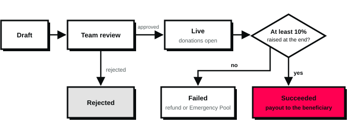
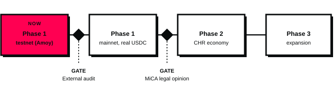

---
# Source of the CHERR.IO whitepaper. Edit this file, then run `npm run build` in docs/whitepaper (see README.md).
# Derived from docs/01-PRODUCT-SPEC.md and docs/03-DECISIONS.md; if they disagree, the ADRs win and this file must be updated.
title: Whitepaper
headline: Transparent charitable giving, proven on the blockchain
version: "2.0"
date: October 2026
publisher: Data Vallis d.o.o., Slovenia
website: cherr.io
filename: CHERR.IO-Whitepaper-v2.0.pdf
---

# About this document {.abstract}

**Transparent charitable giving on Polygon.** Version 2.0 replaces whitepaper v1.3/1.4.1 (2018). It describes the platform as it is being rebuilt today: donations in USDC on Polygon, escrow per campaign, payouts approved by donors, and a public trust ranking of charities. The 2018 token sale and team sections have been removed. This document may be amended.

## 1. The idea

CHERR.IO lets anyone verify where a donation went, and lets donors decide when a charity gets paid. People have always helped each other, and roughly a third of people worldwide give to charity every year. Charities have embraced the internet, but donors still hesitate for the same three reasons.

- **Overhead.** Donors dislike paying for administration and advertising, because it feels like money that never reaches the cause.
- **Distance.** Giving to a large charity rarely feels like it makes a difference.
- **Trust.** Charities operate like businesses, with their own agendas, and fraud is hard to detect from the outside.

CHERR.IO is a platform for charitable organizations and individual fundraisers. It expands their reach, makes fundraising cheaper and rebuilds donor trust with transparency built in.

- Every donation is recorded on a public blockchain (Polygon) and can be audited by anyone.
- Funds wait in a smart-contract escrow per campaign. They can only go to the beneficiary, back to donors, or to the Emergency Pool.
- Charities without a strong track record are paid in three tranches. Each later tranche is released only after donors approve the evidence of spending.
- A public **Charity Market Cap** ranks organizations by a published, versioned Trust Score.
- The community promotes campaigns and is rewarded for it through **Proof of Charity** points, replacing much of the paid advertising a campaign would otherwise need.

Donations are made in USDC, a dollar-backed stablecoin, so charities receive a stable value. Donors who have never used crypto can pay by card and never need to see a wallet address.

::: stats
- **10%** of the target raised makes a campaign successful
- **3** payout steps for new fundraisers or low-rated charities
- **24 h** donor vote before each later step is released
- **1%** is the only platform fee in Phase 1
:::

## 2. Why "Cherry"? {.feature}

Cherries are loved because they are sweet and because they announce the coming of summer. They grow in pairs or triplets, tightly bound to their siblings, the way the CHERR.IO community is connected within itself and with the rest of the world.

Cherry pits are resilient. They survive temperatures of −30 °C and still grow into tall, strong trees that blossom in spring. CHERR.IO aims to do the same for people in distress: help them return joy and purpose to their lives. And just as cherries become jam, desserts and juice, the platform aims to support many forms of aid.

## 3. Market

Charitable giving in the United States alone reached $617.2 billion in 2025, and crypto donations passed $1 billion in 2024. CHERR.IO targets the overlap: mainstream donors who want proof of impact, and crypto holders who want to give.

| Figure | Value | Source |
| --- | --- | --- |
| Total US charitable giving, 2025 | $617.2 billion (+5.7%) | [Giving USA 2026, via Candid](https://candid.org/blogs/philanthropy-trends-giving-usa/) |
| Share given by individuals, 2025 | 64% ($394.2 billion) | [Giving USA 2026, via Candid](https://candid.org/blogs/philanthropy-trends-giving-usa/) |
| Total US charitable giving, 2024 | $592.5 billion | [Giving USA 2025](https://givingusa.org/giving-usa-2025-u-s-charitable-giving-grew-to-592-50-billion-in-2024-lifted-by-stock-market-gain) |
| Crypto donations, 2024 | over $1 billion, a record year | [The Giving Block, 2025 report](https://thegivingblock.com/annual-report/ar25/) |
| Forbes Top 100 charities accepting crypto | 70% | [The Defiant](https://thedefiant.io/news/tradfi-and-fintech/crypto-donations-surpass-usd1-billion-in-2024-marking-major-growth) |

The figures are for the US because it publishes the most complete data. The Charity Market Cap launches with organizations from the Slovenian, UK and US public registries.

## 4. Platform overview

CHERR.IO runs on Polygon PoS, an Ethereum-compatible network with low fees, and handles all money in native USDC. Campaign targets are set in euros for clarity and converted to USDC when a campaign is approved. The platform is built in two phases: Phase 1 delivers transparent fundraising and donor-approved payouts; Phase 2 adds the CHR token mechanics.

| Actor | What they do | Verification |
| --- | --- | --- |
| Donor | Gives USDC by wallet or card, votes on milestones, rates organizations | None needed |
| Cherrion | Any registered user; earns Proof of Charity points, promotes campaigns | None (Level 1 on registration) |
| Organization | Registered charity that runs campaigns | Manual KYB by the CHERR.IO team |
| Individual fundraiser | Cherrion raising funds for themselves or someone else | Identity check (KYC) and team approval |
| Guardian | Can freeze a suspicious campaign; cannot move funds elsewhere | Multisig, bounded powers |

Organizations are the main audience. Cherrions are the bridge to the outside world: they share campaigns, verify evidence and keep the system honest.

## 5. Campaign lifecycle

A campaign succeeds if it raises at least 10% of its target by the deadline; otherwise each donor gets a refund or sends their share to the Emergency Pool.

1. **Creation.** The starter writes the story, picks a cause and country, sets a euro target and a duration of 7 to 90 days, and uploads supporting documents. Documents stay in private storage.
2. **Review.** Organizations must have passed KYB. Individuals must pass an identity check (KYC). The CHERR.IO team approves or rejects each campaign.
3. **Approval.** The euro target is converted to a USDC target at the current rate; the rate, its source and the time are stored. A dedicated escrow contract is deployed for the campaign.
4. **Live.** Anyone can donate USDC (minimum 1 USDC). A donation larger than the remaining target is clipped to it. Each donor chooses what happens to their money if the campaign fails: refund (default) or the Emergency Pool. They can change this choice until the campaign ends.
5. **End.** The campaign ends when the target is reached or the deadline passes, whichever comes first.
   - Raised ≥ 10% of target: **succeeded**, payout begins (section 6).
   - Raised < 10%: **failed**. Donors claim refunds, or their share goes to the Emergency Pool. Refunds not claimed within 180 days are moved to the general Emergency Pool.

Organizations can run several campaigns in parallel (by default up to 5 in Phase 1). In Phase 2, an activation step with CHR is added between approval and live (section 10).

## 6. Payouts and fraud protection

A successful campaign pays out either in one transfer or in three equal tranches, depending on the beneficiary's track record. Funds can only ever go to the beneficiary, back to donors, or to the Emergency Pool.

| Beneficiary | Payout mode |
| --- | --- |
| Organization with community rating ≥ 4.0 (of 5) | Single payout |
| Organization's first campaign (no rating yet) | Single payout, supervised: the Guardian may freeze it before release if fraud is suspected |
| Organization with rating below 4.0 | Three milestones |
| Individual fundraiser | Always three milestones (Phase 1) |

**How milestones work.** The amount after fees is split into three equal tranches.

1. Tranche 1 is released automatically when the campaign succeeds.
2. The beneficiary submits evidence of spending: invoices, transaction proofs and a short video report. The files go to private storage; their SHA-256 fingerprint is recorded on-chain, so nobody can swap them later.
3. Donors vote for 24 hours. Each donor's vote weighs as much as they donated, which makes buying votes with self-donations expensive.
4. The vote passes if at least 50% of the donated amount takes part and at least 51% of the cast weight approves. Tranche 2 is then released, and the same vote repeats for tranche 3.
5. If turnout is too low, the campaign moves to review and the Guardian decides. If donors reject, the remaining tranches go back to donors pro rata, as refund or to the Emergency Pool, following each donor's choice.

**Ratings.** After a campaign completes, each donor can rate the organization from 1 to 5, once per campaign. The ratings feed the Trust Score (section 8) and decide the payout mode of the next campaign.

::: note Guardian powers are bounded
The Guardian can freeze a campaign immediately and resolve frozen or under-review campaigns. It cannot send funds to any other address.
:::

## 7. Emergency Pool

The Emergency Pool is a smart contract that holds money for situations needing a very fast response, such as a natural disaster. Besides the general pool there are thematic sub-pools, for example medical, disasters, animals and climate.

**Money flows in from:**

- failed campaigns, when donors chose the pool instead of a refund;
- rejected milestones, by the same donor choice;
- refunds left unclaimed for 180 days;
- direct donations to a pool or sub-pool.

**Money flows out by vote.** When an emergency arises, a campaign is created and approved for it. The team proposes moving a set USDC amount from a pool into that campaign. Those who contributed to the pool vote for 24 hours, weighted by what they contributed, with the same 50% turnout and 51% approval rule as milestones. If the vote passes, the funds move and count as a donation to the campaign.

## 8. Charity Market Cap and Trust Score

The Charity Market Cap is a public directory that ranks charities by a Trust Score from 0 to 100, in the way market-cap sites rank crypto assets. It lists organizations registered on CHERR.IO and, to start, organizations imported from public registries in Slovenia, the UK and the US.

**Trust Score v1** is a weighted sum of five components, each scored 0 to 1. The formula is public and versioned, and every score shows which version produced it.

| Component | Weight | What it measures |
| --- | --- | --- |
| Community rating | 30% | Donor ratings, smoothed so a few votes cannot swing it (prior 3.5 of 5) |
| Campaign success rate | 25% | Successful campaigns / finished campaigns |
| Milestone approval rate | 20% | Approved milestone votes / decided votes |
| Evidence completeness | 15% | Evidence delivered on time / evidence required |
| Verification | 10% | Verified on CHERR.IO = full; registry listing only = half |

Imported organizations that are not yet on CHERR.IO are capped at 40, because only registry data is known about them. Each one shows a **Claim this organization** button that starts verification. Scores are recalculated after relevant events and nightly. The directory is open to search engines and has a public API.

## 9. Proof of Charity

Proof of Charity rewards every action that helps a campaign or the community with points. It is the engine that lets the community, rather than paid advertising, spread the word. In Phase 1, points are only awarded for events the platform can verify itself, such as on-chain donations and signed votes.

| Action | Points | Phase |
| --- | --- | --- |
| Complete registration | 1,000 (reaches Level 1) | 1 |
| Donate to a live campaign | 100 per 1 USDC (provisional) | 1 |
| Rate an organization after a campaign | 200 | 1 |
| Vote on a milestone | 200 | 1 |
| Pass identity verification | 1,000 | 1 |
| Refer an organization that completes KYB | 3,000 | 1 |
| Lock CHR as a new active Cherrion | 1,000 | 2 |
| Social actions (X, Telegram, Reddit and others) | to be set | 2 |

Each Cherrion has two balances that receive the same points: **Status** and **Reward**.

- **Status** sets the Cherrion level: L1 1,000 · L2 3,000 · L3 6,000 · L4 10,000 · L5 15,000. Every month it resets to the floor of the current level. A Cherrion who earns no points in a month is notified and then moves down one level.
- **Reward** never resets. In Phase 2 it can be converted into CHR at 1,000 points = 1 CHR, with rate limits and a monthly cap, subject to the legal review in section 11.

Social-network points come in Phase 2 with protection against fake accounts. Points for Bitcointalk, Medium and per-IP clicks from the 2018 design have been dropped, because they were easy to farm. Daily caps apply, and the team can void abusive entries with a recorded reason.

## 10. Fees and rewards

In Phase 1 the only fee is 1% of the raised amount, taken at payout; the beneficiary receives 99%. In Phase 2 the full 4% reward model starts and the beneficiary receives 96%. All amounts are paid in USDC.

| Recipient | Phase 1 | Phase 2 | On 10,000 USDC raised (Phase 2) |
| --- | --- | --- | --- |
| Beneficiary | 99% | 96% | 9,600 USDC |
| Cherrions who locked CHR | — | 1.5% | 150 USDC |
| Activators (or the organization if it had none) | — | 1.5% | 150 USDC |
| CHERR.IO platform | 1% | 1% | 100 USDC |

The platform's 1% covers running costs: infrastructure, audits, verification and support.

### Phase 2: activation

Before going live, a campaign can raise an activation amount in CHR worth 1% of its target. Activation is optional for organizations and mandatory for individual fundraisers. Activators commit to promoting the campaign and share the 1.5% activator reward pro rata to their contribution.

- One Cherrion may contribute at most 5% of the activation amount. If the campaign is not activated within 7 days, the cap is lifted and a single "champion" may complete it.
- An organization may pay the whole activation itself, or skip it and receive the 1.5% activator share instead.
- The CHR is returned to activators after the campaign, depending on how much of the target was raised:

| Share of target raised | CHR returned to activators |
| --- | --- |
| 10% | 25% |
| 20% | 30% |
| 30% | 40% |
| 40% | 55% |
| 50% | 75% |
| 60% or more | 100%, plus the activator reward |

### Phase 2: locking

Cherrions can lock CHR in a smart contract for the whole donation phase of campaigns. Lockers share the 1.5% locker reward of every successful campaign pro rata to the amount locked. Example: John locks 1,000 of the 10,000 CHR locked during a campaign, so he receives 10% of the 1.5%, which is 0.15% of the raised amount. The maximum a Cherrion can lock depends on level: L1 1,000 · L2 2,000 · L3 3,000 · L4 4,000 · L5 5,000 CHR. Locked tokens are always returned in full.

### Phase 2: organization deposits

Organizations deposit CHR for three months to unlock more parallel campaigns. The deposit is returned in full afterwards.

| CHR deposited | Parallel campaigns |
| --- | --- |
| 10,000 | 10 |
| 30,000 | 40 |
| 60,000 | 100 |

## 11. The CHR token

CHR is the platform's existing utility token. CHERR.IO keeps it rather than issuing a new one, and this whitepaper makes no offer to sell it. Its role is limited to the Phase 2 mechanics in section 10.

| Network | Contract | Notes |
| --- | --- | --- |
| Ethereum | `0x385Fe0597Fb60c281b54955e7d15C07578cE745b` | Original ERC-20, 18 decimals, verified source |
| Polygon PoS | `0xfcfE798Dfb904f096c8e010F1254710E17AF1F81` | Bridged version; minted only by the official Polygon bridge |

The total supply is 85,105,190.56 CHR after 114.89 million CHR were burned in May 2023. Donations never use CHR: charities always receive USDC.

**What CHR is used for (Phase 2):**

- **Organizations** deposit CHR to run more campaigns in parallel, and may pay a campaign's activation.
- **Cherrions** activate campaigns and lock CHR to share in the rewards of successful campaigns.
- **Active community members** can convert Reward points into CHR.

**What CHR does not give:** ownership of Data Vallis d.o.o. or CHERR.IO, a share of company profits, or decision rights beyond votes the platform explicitly opens to holders.

::: note Legal gate
No CHR will be distributed to the public through points conversion, rewards or liquidity until an independent legal opinion under the EU Markets in Crypto-Assets Regulation (MiCA) confirms how it can be done.
:::

## 12. Transparency, security and privacy

Every rule that moves money is enforced by smart contracts, and every donation, payout and vote is public and auditable on Polygon. Personal data never touches the blockchain.

**Smart contracts**

- Contracts are **not upgradeable**: the code donors trust today cannot be swapped later. Each campaign is its own small escrow contract (a minimal clone of an audited template).
- Every state change emits a public event, so anyone can rebuild the full history from the chain.
- Administrative changes go through a timelock that delays them by 48 hours on mainnet, and the admin role is held by a multisig wallet (Safe). Only the Guardian's freeze acts immediately.
- Contracts are tested with unit, fuzz and invariant tests (including a check that escrow balances always add up), and an external audit is required before mainnet.

**Privacy (GDPR)**

- Invoices, medical records and ID documents are stored in encrypted private storage in the EU. Only their SHA-256 fingerprint goes on-chain, which proves they were not altered without revealing them.
- Identity checks run through a specialized provider (Sumsub); CHERR.IO does not store ID documents.
- Public files on decentralized storage contain only non-personal content, such as campaign photos and stories.
- Personal data can be deleted on request, because it lives only off-chain.

**Operations.** The platform runs on dedicated servers in the EU with monitoring, and off-site encrypted database backups with a tested restore are required before mainnet.

## 13. Donor experience

A donor can give by card in a few clicks without knowing anything about crypto, and still get full on-chain proof.

- **Sign in** with email, Google or an existing wallet such as MetaMask. Users without a wallet get one automatically, secured by their login (Privy).
- **Pay by card** through Transak. It converts the payment into USDC and delivers it to the donor's own wallet; the donor then confirms the donation. The donation is therefore always attributed to the donor, who can vote and rate.
- **No gas fees for donors.** Network fees for donating and voting are sponsored by the platform.
- **Two layers.** By default the site speaks plainly: euros, photos and stories. One click opens the proof layer with USDC amounts, addresses and transaction links for anyone who wants to verify.
- **Optional anonymity.** Donors can appear as anonymous on the site, although the transaction itself stays public on-chain.

## 14. Roadmap

Phase 1 is being built now on the Polygon Amoy test network and goes to mainnet only after an external security audit. Phase 2 starts only after a MiCA legal opinion.

- **Phase 1 — transparent fundraising.** Organization and individual onboarding, campaign approval, USDC donations by wallet or card, single and milestone payouts with donor voting, Emergency Pool with sub-pools, ratings, Proof of Charity points (not yet convertible), Charity Market Cap v1 with registry imports, a public API, an embeddable donate widget and an admin panel.
- **Phase 2 — the CHR economy.** Campaign activation, locking, the 4% reward split, organization deposit tiers, points-to-CHR conversion, social-network points, community vetting of individual campaigns and clearly labelled sponsored listings.
- **Phase 3 — expansion.** Badges, white-label versions for partner charities, and more networks and currencies.

## 15. Case study

A fictional example shows a €40,000 campaign end to end. The exchange rate of 1 EUR = 1.10 USD is illustrative only.

### Campaign started by an organization

Children's Health, a respected regional charity, is short of staff and has no advertising budget. Susan, a seven-year-old girl, needs an urgent €40,000 operation, and her mother has turned to the charity as a last resort.

The charity has already passed verification on CHERR.IO. Ana, a student volunteer with no crypto experience, prepares the campaign: the doctor's reports and the hospital's quote go into private storage, and she writes Susan's story. She sets a target of €40,000 and a duration of 14 days. When the team approves the campaign, the target is fixed at 44,000 USDC and the escrow contract is deployed.

Cherrions share the campaign and earn Proof of Charity points for their own donations, votes and referrals. Most donors pay by card and never see a wallet address. The target is reached in a few days and the campaign ends immediately.

This is the charity's first campaign, so it gets a single payout under supervision.

| | Phase 1 | Phase 2 (with activators and lockers) |
| --- | --- | --- |
| Raised | 44,000 USDC | 44,000 USDC |
| To Children's Health | 43,560 USDC (99%) | 42,240 USDC (96%) |
| To Cherrions who locked CHR | — | 660 USDC (1.5%) |
| To activators | — | 660 USDC (1.5%), plus their CHR activation returned in full |
| To CHERR.IO platform | 440 USDC (1%) | 440 USDC (1%) |

The charity converts the USDC to euros through its own provider and pays the hospital; CHERR.IO does not convert funds. Donors rate Children's Health 4.9 of 5, so its next campaigns also pay out in one transfer as long as its rating stays at 4.0 or above.

### Campaign started by an individual

If Susan's mother has no charity to turn to, she can start the campaign herself. She registers, passes the identity check and uploads the same documents; the CHERR.IO team then approves the campaign. In Phase 2 she would also need activators, and community vetting is added to the team's review.

Fundraising works the same way, but the payout always comes in three milestones. After fees she receives 43,560 USDC as three tranches of 14,520 USDC. The first arrives automatically. Each of the others follows only after donors approve her evidence, such as the hospital invoice and a short video report.

## 16. Origins

CHERR.IO won the overall prize at FutureHack 2018, the first blockchain hackathon held in Davos during the World Economic Forum. On 22 January 2018, teams worked for 48 hours straight on blockchain solutions for the United Nations Sustainable Development Goals (SDGs). The CHERR.IO team from Slovenia proposed its own goal, **Charitable and Humanitarian Aid**, focused on people the world has forgotten. The team later received the Best Overall Award at a United Nations conference on sustainable development in Geneva.

The first CHERR.IO platform followed in 2018 and gathered around 30,000 registered users. The current platform is a clean rebuild by Data Vallis d.o.o. on modern infrastructure. Earlier users are not migrated automatically; they will be invited to join again, so that every account starts with fresh, explicit consent.

The mission stays aligned with the SDGs and their promise to leave no one behind: bring transparency to giving, so that more of every donation reaches the people who need it most.

## 17. Conclusion

Charity is not optional; it is a necessity. Governments rely on it to help the most vulnerable, protect the environment and respond when disaster strikes. Charitable organizations do remarkable work, but they struggle with donor distrust, overhead and reach.

CHERR.IO helps them take the next step:

1. **Donors are involved.** They see where every euro went and decide when a charity gets paid.
2. **Reach is instant.** A campaign can find donors across borders within hours, and anyone can give by card.
3. **Costs fall.** The community promotes campaigns in exchange for recognition and rewards, and transfers cost cents instead of bank and SMS fees.
4. **Trust is measurable.** The Charity Market Cap turns track records into a public, comparable score.

The blockchain does the bookkeeping that no one should have to take on faith. The community does the rest.

> We have an idea for taking an already great part of our civilization and making it better. It was an easy choice, because it was the only thing we could do.

## 18. Legal disclaimer

This whitepaper describes the CHERR.IO project for information only. It does not create any legal relationship with any user or supporter of CHERR.IO, whether or not they are registered on the platform. Use of the platform is governed by its Terms of Service and Privacy Policy.

This document is not a prospectus or a crypto-asset white paper within the meaning of the EU Markets in Crypto-Assets Regulation (MiCA). It is not an offer to sell, or a solicitation of an offer to buy, CHR tokens, securities or any other financial instrument in any jurisdiction. No public offering of CHR is made or planned by this document. CHR gives no ownership, profit-sharing or governance rights in Data Vallis d.o.o.

Features described for Phase 2 and later, including all CHR mechanics, are plans. They may change or not be implemented, and any distribution of CHR depends on a prior legal opinion and applicable regulation. Market figures come from the third-party sources cited; Data Vallis d.o.o. is not liable for deviations from projections or for damages arising from the interpretation of this document.

The content and images of this document are protected by copyright. Reproduction, distribution or alteration without prior written permission of Data Vallis d.o.o. is prohibited, except for brief quotations in reviews and other non-commercial uses permitted by law.

CHERR.IO is operated by Data Vallis d.o.o., Slovenia · cherr.io
